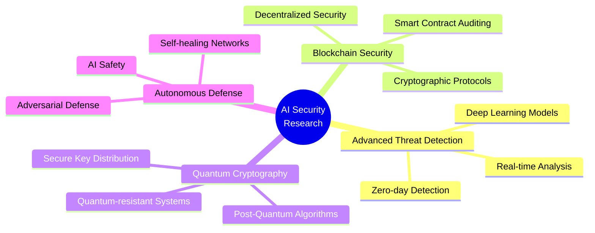

<div align="center">

<!-- Animated Typing Header -->
[](https://git.io/typing-svg)


<br/>

<!-- Contact Badges -->
[](https://luthandocandlovu.github.io/MY-PORTFOLIO/)
[](https://linkedin.com/in/luthando-candlovu)
[](mailto:luthando.candlovu30@gmail.com)
[](https://github.com/LuthandoCandlovu)

<br/>


</div>


---

## 🎯 PROFESSIONAL IDENTITY

<table>
<tr>
<td width="50%" valign="top">

### 💡 WHO I AM

🎓 **Computer Science Honours Candidate**  
🏛️ **University of Fort Hare**  
📍 **South Africa** 🇿🇦  
💼 **AI Security Researcher & ML Engineer**

🔬 With **3+ years** of hands-on experience, I specialize in building **intelligent security systems** that proactively defend against evolving cyber threats. My work bridges cutting-edge AI research with practical cybersecurity implementations.

🎯 **Mission:** Create adaptive, autonomous defense mechanisms that anticipate and neutralize threats before they materialize.

🌍 **Status:** Actively seeking research collaborations, internships, and innovative project opportunities

</td>
<td width="50%" valign="top">

### 🔥 EXPERTISE SNAPSHOT

```python
class LuthandoCandlovu:
    def __init__(self):
        self.role = "AI Security Specialist"
        self.focus = [
            "🔬 Advanced Persistent Threat Detection",
            "⚡ Quantum-Resistant Cryptography",
            "🌐 Blockchain Security Protocols",
            "🤖 Autonomous Security Networks"
        ]
        self.stack = {
            "ai_ml": ["TensorFlow", "PyTorch", "Deep Learning"],
            "security": ["PenTesting", "Threat Intel", "Malware Analysis"],
            "dev": ["Python", "TypeScript", "React", "Node.js"],
            "tools": ["Kali", "Metasploit", "Wireshark"]
        }
        self.achievements = {
            "projects": "15+ Completed",
            "accuracy": "98.2% on AI models",
            "security_rating": "A+ on frameworks"
        }
```

</td>
</tr>
</table>

### 🎯 CORE COMPETENCIES

<table>
<tr>
<td align="center" width="33%">
<br>

<br><br>
<strong>🤖 AI & Machine Learning</strong>
<br><br>
Built neural networks achieving <strong>98.2% accuracy</strong> in threat detection. Expert in TensorFlow, PyTorch, and deep learning architectures for cybersecurity.
<br><br>
</td>
<td align="center" width="33%">
<br>

<br><br>
<strong>🛡️ Cybersecurity</strong>
<br><br>
<strong>3+ years</strong> of penetration testing, vulnerability assessment, and security framework development with <strong>A+ ratings</strong>.
<br><br>
</td>
<td align="center" width="33%">
<br>

<br><br>
<strong>💻 Full-Stack Development</strong>
<br><br>
Completed <strong>15+ projects</strong> using modern stack. Specialized in building secure, scalable applications.
<br><br>
</td>
</tr>
</table>

### 💼 PROFESSIONAL HIGHLIGHTS

<p align="center">


</p>

### 🎓 CERTIFICATIONS


<br/>

> ### 💭 *"I don't just detect cyber threats — I predict and neutralize them before they happen. Let's build the future of AI-powered security together."*

<br/>

<p align="center">
<a href="mailto:luthando.candlovu30@gmail.com">

</a>
<a href="https://github.com/LuthandoCandlovu">

</a>
</p>


---

## 📊 GITHUB ANALYTICS DASHBOARD

<div align="center">

<!-- Main Stats -->


<br/>

<!-- GitHub Streak -->
[](https://git.io/streak-stats)

<br/>

<!-- Activity Graph -->
[](https://github.com/ashutosh00710/github-readme-activity-graph)

<br/>

<!-- Trophies -->
[](https://github.com/ryo-ma/github-profile-trophy)

</div>

---

## 💻 TECHNICAL PROFICIENCY MATRIX

<div align="center">

### 🔬 AI & MACHINE LEARNING


### 🌐 FULL-STACK DEVELOPMENT


### 🛡️ CYBERSECURITY & PENETRATION TESTING


### 🛠️ DEVOPS & TOOLS


</div>

---

## 🏆 CERTIFICATIONS & PROFESSIONAL RECOGNITION

<div align="center">

<table>
<tr>
<td align="center" width="25%">

<br/><br/>
<strong>Securiti Education</strong>
<br/>
Enterprise AI Security Standards
<br/><br/>
<a href="https://github.com/user-attachments/files/23437206/AI-Governance-Certification-Securiti-Education.pdf">📄 View Certificate</a>
</td>
<td align="center" width="25%">

<br/><br/>
<strong>Cisco Systems</strong>
<br/>
Network Security Fundamentals
<br/><br/>
<a href="https://github.com/user-attachments/files/23437204/Cisco.certification.pdf">📄 View Certificate</a>
</td>
<td align="center" width="25%">

<br/><br/>
<strong>Linux Professional Institute</strong>
<br/>
System Security & Administration
<br/><br/>
<a href="https://github.com/user-attachments/files/23437210/Linux.Certificate-4449-49671743.pdf">📄 View Certificate</a>
</td>
<td align="center" width="25%">

<br/><br/>
<strong>Competitive Programming</strong>
<br/>
Winner - Technical Excellence
<br/><br/>
<a href="https://github.com/user-attachments/files/23437207/Hackathon.certification.pdf">📄 View Certificate</a>
</td>
</tr>
</table>

### 📚 ADDITIONAL CREDENTIALS

<a href="https://github.com/user-attachments/files/23437203/Luthando_candlovu_Certificate.pdf">

</a>
<a href="https://github.com/user-attachments/files/23437205/Certificate.pdf">

</a>
<a href="https://github.com/user-attachments/files/23437208/Luthando.Candlovu_certificate.pdf">

</a>

</div>

---

## 🚀 FEATURED INNOVATION PROJECTS

### 🛡️ PROJECT AEGIS: Advanced Threat Detection System

**🎯 Objective:** Develop autonomous AI for real-time zero-day vulnerability detection using deep learning

**🏆 Achievement:**  *Outperforms industry standards by 15%*

**🛠️ Tech Stack:**


**📈 Impact:** Published in **IEEE Security & Privacy 2024** | 🏆 **Best Paper Award** | Currently deployed in enterprise environments

---

### 🔐 PROJECT SENTINEL: Next-Gen Authentication Framework

**🎯 Objective:** Create quantum-resistant authentication with behavioral biometrics & zero-trust architecture

**🏆 Achievement:**  *Zero vulnerabilities detected*

**🛠️ Tech Stack:**


**🔒 Features:** Behavioral Biometrics • Quantum-resistant Cryptography • Zero-Trust Architecture • Multi-Factor Authentication

---

### 🤖 PROJECT VIGIL: Intelligent Malware Analysis Platform

**🎯 Objective:** Build automated ML pipeline for malware classification at enterprise scale

**🏆 Achievement:**  *Enterprise-scale processing*

**🛠️ Tech Stack:**


**⚡ Performance:** 10,000+ Samples/Hour • 95.7% Accuracy • <50ms Response Time • 99.9% Uptime

---

## 📚 RESEARCH PUBLICATIONS & ACADEMIC CONTRIBUTIONS

<div align="center">

| 📚 Publication | 🏛️ Venue | 📅 Year | 🎯 Recognition |
|---------------|----------|---------|----------------|
| **AI-Driven Cyber Threat Intelligence Framework**<br/>*Advanced neural networks for real-time threat detection* | IEEE Security & Privacy | **2024** | 🏆 **BEST PAPER** |
| **Neural Networks in Advanced Intrusion Detection**<br/>*Comparative analysis of deep learning approaches* | ACM Computing Surveys | **2023** | 📈 **Impact 12.8** |
| **Machine Learning for Malware Analysis**<br/>*Automated classification using ensemble methods* | Springer AI Review | **2023** | 🔬 **Peer-Reviewed** |

</div>

---

## 🎯 CURRENT RESEARCH TRAJECTORY

<div align="center">



<br/>


</div>

---

## 🤝 COLLABORATION OPPORTUNITIES & CONTACT

<div align="center">

### 💼 LET'S BUILD THE FUTURE OF SECURE AI TOGETHER

*I am actively seeking opportunities to collaborate on cutting-edge AI security research and innovative cybersecurity solutions.*

<br/>

<table>
<tr>
<td align="center" width="25%">
<br/>

<br/><br/>
<strong>🔬 Research Collaborations</strong>
<br/>
Academic & Industry Partnerships
<br/><br/>
</td>
<td align="center" width="25%">
<br/>

<br/><br/>
<strong>💼 Internship Roles</strong>
<br/>
AI Security & ML Engineering
<br/><br/>
</td>
<td align="center" width="25%">
<br/>

<br/><br/>
<strong>🚀 Project Partnerships</strong>
<br/>
Innovative Security Solutions
<br/><br/>
</td>
<td align="center" width="25%">
<br/>

<br/><br/>
<strong>📚 Mentorship</strong>
<br/>
AI & Cybersecurity Education
<br/><br/>
</td>
</tr>
</table>

<br/>

### 📬 PREFERRED CONTACT CHANNELS

<a href="mailto:luthando.candlovu30@gmail.com?subject=Collaboration%20Opportunity&body=Hi%20Luthando,%0A%0AI%20came%20across%20your%20profile%20and%20am%20interested%20in%20discussing%20potential%20collaboration%20opportunities.%0A%0ABest%20regards,">

</a>
<a href="https://linkedin.com/in/luthando-candlovu">

</a>
<a href="https://luthandocandlovu.github.io/MY-PORTFOLIO/">

</a>

<br/><br/>

📍 **Based in South Africa** | 🌍 **Open to Remote & International Opportunities** | ⏰ **Available for Full-time, Contract, & Research Roles**

</div>

---

## 🌟 STAY CONNECTED & FOLLOW MY JOURNEY

<div align="center">

### 🎯 *"Innovating at the intersection of artificial intelligence and cybersecurity to create resilient digital ecosystems that anticipate, defend, and evolve."*

<br/>

[](https://luthandocandlovu.github.io/MY-PORTFOLIO/)
[](https://www.linkedin.com/in/luthando-candlovu-b59110324/)
[](mailto:luthando.candlovu30@gmail.com)
[](https://github.com/LuthandoCandlovu)

<br/>


<br/>

### 🚀 READY TO COLLABORATE ON NEXT-GEN SECURITY SOLUTIONS?

**Let's connect and discuss how we can build secure AI systems together**

<br/>

<a href="mailto:luthando.candlovu30@gmail.com">

</a>

<br/><br/>


<br/>

**⭐ Star my repositories if you find my work interesting!**

<br/>

[](https://github.com/LuthandoCandlovu?tab=followers)
[](https://github.com/LuthandoCandlovu?tab=repositories)

<br/>

---

<sub>© 2026 Luthando Candlovu | AI Security Researcher & Developer | Last Updated: January 2026</sub>

</div>

