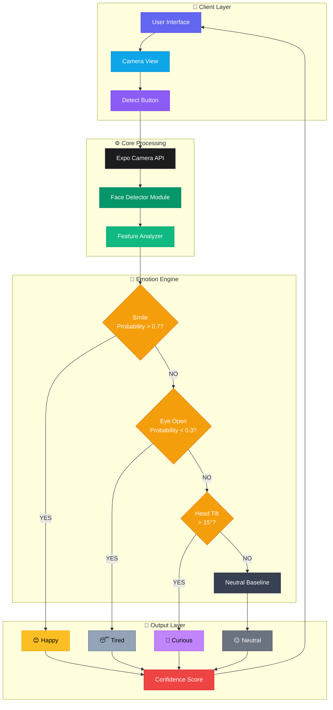
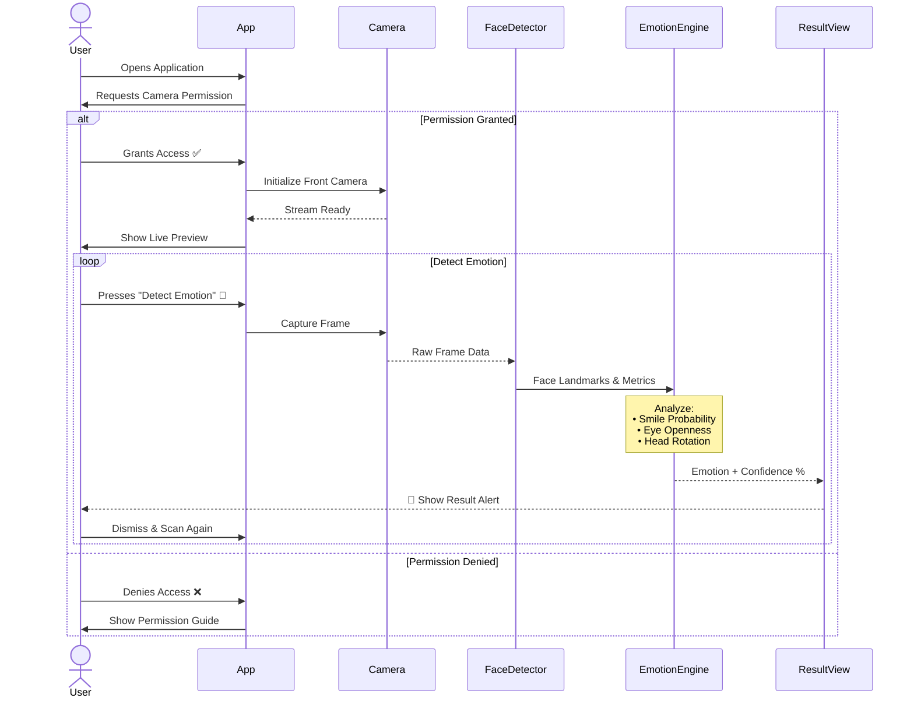
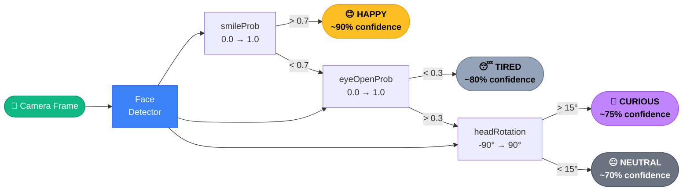
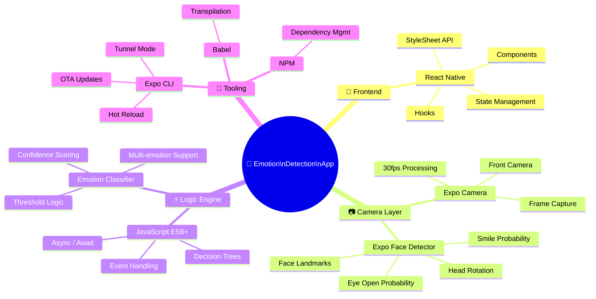
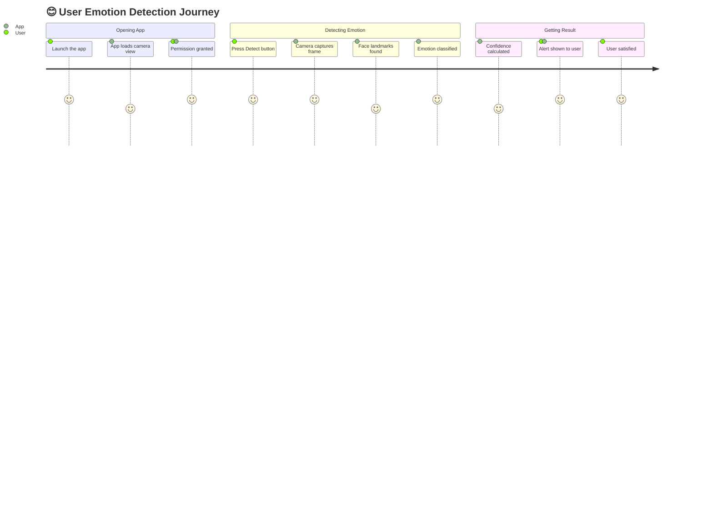

<div align="center">

<!-- ANIMATED HEADER BANNER -->


<br/>

<!-- TYPING ANIMATION -->


<br/><br/>

<!-- APP SCREENSHOT -->


<br/><br/>

<!-- BADGES ROW 1 -->
<p>
  
  
  
  
</p>

<!-- BADGES ROW 2 -->
<p>
  
  
  
  
</p>

<br/>

<!-- ACTION BUTTONS -->
<a href="https://github.com/user-attachments/assets/7da26e73-20f3-4537-9313-c141154ea72e">
  
</a>
&nbsp;&nbsp;
<a href="YOUR_APK_LINK_HERE">
  
</a>

<br/><br/>


</div>

<br/>

## 📋 Table of Contents

- [✨ Features](#-features)
- [🏗️ System Architecture](#-system-architecture)
- [📱 App Flow](#-app-flow)
- [🧠 Detection Logic](#-detection-logic)
- [🛠️ Tech Stack](#-tech-stack)
- [📊 Performance](#-performance)
- [🚀 Getting Started](#-getting-started)
- [📂 Project Structure](#-project-structure)
- [🎯 How It Works](#-how-it-works)
- [🤝 Contributing](#-contributing)
- [📄 License](#-license)

<br/>


<br/>

## ✨ Features

<div align="center">

| Feature | Description | Status |
|:-------:|:-----------:|:------:|
| 📷 **Live Camera Feed** | Real-time front-facing camera view | ✅ Active |
| 😊 **Happy Detection** | Detects smiling via smile probability | ✅ Active |
| 😴 **Tired Detection** | Detects closed eyes / low energy state | ✅ Active |
| 🤔 **Curious Detection** | Detects head tilt angle | ✅ Active |
| 😐 **Neutral Detection** | Default baseline state | ✅ Active |
| 📊 **Confidence Score** | Accuracy percentage for each detection | ✅ Active |
| 🔄 **Multi-scan Mode** | Continuous re-detection support | ✅ Active |
| ⚡ **<1s Response** | Ultra-fast emotion processing | ✅ Active |

</div>

<br/>


<br/>

## 🏗️ System Architecture

<div align="center">



</div>

<br/>


<br/>

## 📱 App Flow

<div align="center">



</div>

<br/>


<br/>

## 🧠 Detection Logic

<div align="center">



</div>

<br/>


<br/>

## 🛠️ Tech Stack

<div align="center">



</div>

<br/>


<br/>

## 📊 Performance

<div align="center">

| Metric | Value | Rating |
|:------:|:-----:|:------:|
| ⚡ Detection Speed | < 1 second | 🟢 Excellent |
| 🎯 Overall Accuracy | ~85% | 🟢 Great |
| 😊 Happy Accuracy | ~90% | 🟢 Excellent |
| 😴 Tired Accuracy | ~80% | 🟡 Good |
| 🤔 Curious Accuracy | ~75% | 🟡 Good |
| 😐 Neutral Accuracy | ~85% | 🟢 Great |
| 🎬 Frame Rate | 30 FPS | 🟢 Smooth |
| 📂 App Size | ~25MB | 🟢 Lightweight |

</div>

<br/>


<br/>

## 🚀 Getting Started

### Prerequisites

```bash
Node.js >= 16.x
npm >= 8.x
Expo CLI >= 6.x
Expo Go App (on your phone)
```

### Installation

```bash
# 1. Clone the repository
git clone https://github.com/LuthandoCandlovu/EMOTION-DETECTION.git

# 2. Navigate to the mobile app directory
cd EMOTION-DETECTION/apps/mobile

# 3. Install all dependencies
npm install

# 4. Start the development server with tunnel (for physical device)
npx expo start --tunnel
```

### Running the App

```bash
# For Android Emulator
npx expo start --android

# For iOS Simulator (Mac only)
npx expo start --ios
```

> **📌 Note:** Camera-based features require a **physical device**. Emulators do not support live camera face detection.

<br/>


<br/>

## 📂 Project Structure

```
EMOTION-DETECTION/
├── 📁 apps/
│   └── 📁 mobile/
│       ├── 📄 App.js                      # Root application entry point
│       ├── 📄 app.json                    # Expo configuration
│       ├── 📄 package.json                # Dependencies & scripts
│       ├── 📁 src/
│       │   ├── 📁 components/
│       │   │   ├── 📄 CameraView.js       # Camera + Face Detector setup
│       │   │   ├── 📄 EmotionResult.js    # Result alert component
│       │   │   └── 📄 PermissionScreen.js # Camera permission handler
│       │   ├── 📁 hooks/
│       │   │   └── 📄 useEmotionDetector.js  # Core detection logic hook
│       │   ├── 📁 utils/
│       │   │   └── 📄 emotionClassifier.js   # Emotion decision engine
│       │   └── 📁 screens/
│       │       └── 📄 HomeScreen.js       # Main screen layout
│       └── 📁 assets/
│           ├── 🖼️ icon.png
│           └── 🖼️ splash.png
└── 📄 README.md
```

<br/>


<br/>

## 🎯 How It Works



<br/>

**Step-by-step breakdown:**

1. **📷 Camera Initialization** — The front-facing camera is activated using `expo-camera`, streaming at 30fps
2. **🔍 Face Detection** — `expo-face-detector` scans each frame and extracts facial landmarks in real time
3. **📐 Feature Extraction** — Key metrics are pulled: `smilingProbability`, `leftEyeOpenProbability`, `rightEyeOpenProbability`, and `yawAngle`
4. **🧠 Classification** — The emotion engine applies threshold-based logic to classify the dominant emotion
5. **📊 Confidence Scoring** — Each detected emotion is assigned a confidence percentage
6. **🎯 Result Display** — An alert dialog presents the emotion result with its confidence score to the user

<br/>


<br/>

## 🤝 Contributing

Contributions make this project better! Here's how to get involved:

```bash
# 1. Fork the project
# 2. Create your feature branch
git checkout -b feature/AmazingFeature

# 3. Commit your changes
git commit -m 'Add some AmazingFeature'

# 4. Push to the branch
git push origin feature/AmazingFeature

# 5. Open a Pull Request
```

**Ideas for contributions:**
- 😮 Add Surprised emotion detection
- 😠 Add Angry emotion detection
- 🌙 Improve low-light face detection
- 📈 Add emotion history / analytics view
- 🌍 Add multi-language support

<br/>


<br/>

## 📄 License

```
MIT License — Copyright (c) 2024 Luthando Candlovu

Permission is hereby granted, free of charge, to any person obtaining a copy
of this software and associated documentation files (the "Software"), to deal
in the Software without restriction, including without limitation the rights
to use, copy, modify, merge, publish, distribute, sublicense, and/or sell
copies of the Software.
```

<br/>


<br/>

<div align="center">

<!-- ANIMATED ACTIVITY GRAPH -->


<br/><br/>

<!-- GITHUB STATS CARDS -->

&nbsp;


<br/><br/>

**Made with ❤️ by [Luthando Candlovu](https://github.com/LuthandoCandlovu)**

<br/>

[](https://github.com/LuthandoCandlovu)
&nbsp;&nbsp;
[](https://github.com/LuthandoCandlovu/EMOTION-DETECTION)

<br/>

<!-- FOOTER WAVE -->


</div>
