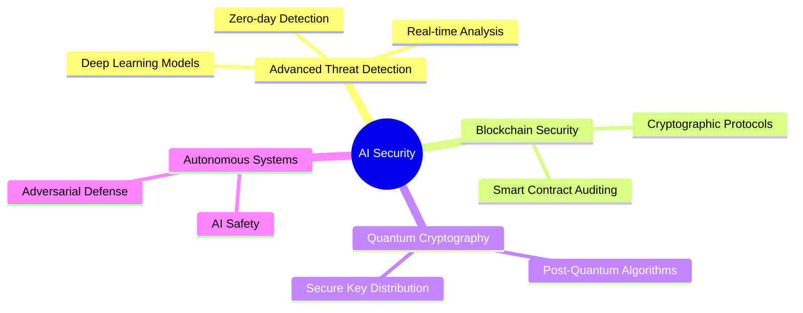

<div align="center">

<!-- Dynamic Typing Header -->
[](https://git.io/typing-svg)

<!-- Banner -->


<br/>

<!-- Animated Contact Badges -->
[](https://luthandocandlovu.github.io/MY-PORTFOLIO/)
[](https://linkedin.com/in/luthando-candlovu)
[](mailto:luthando.candlovu30@gmail.com)
[](https://github.com/LuthandoCandlovu)

<br/>

<!-- Profile Views Counter -->


</div>

---

## 🚀 About Me

```typescript
const luthando = {
    role: "AI Security Researcher & ML Engineer",
    education: "Computer Science Honours Student",
    university: "University of Fort Hare",
    location: "Nairobi, Kenya 🇰🇪",
    
    currentFocus: [
        "Advanced Persistent Threat Detection using Deep Learning",
        "Quantum Cryptography & Blockchain Security Protocols",
        "AI-Driven Cybersecurity Solutions"
    ],
    
    expertise: {
        aiml: ["TensorFlow", "PyTorch", "Scikit-learn", "Neural Networks"],
        security: ["Penetration Testing", "Threat Intelligence", "Malware Analysis"],
        development: ["Python", "TypeScript", "React", "Node.js"],
        tools: ["Wireshark", "Metasploit", "Burp Suite", "Kali Linux"]
    },
    
    achievements: {
        experience: "3+ Years in AI & Security",
        projects: "15+ Completed Projects",
        certifications: ["AI Governance", "Cisco", "Linux Professional", "Hackathon Winner"]
    },
    
    motto: "Securing the Future with Intelligent Systems 🛡️"
};
```

---

## 📊 GitHub Statistics

<div align="center">

<!-- GitHub Stats Card -->


<!-- Top Languages Card -->


</div>

<div align="center">

<!-- GitHub Streak Stats -->
[](https://git.io/streak-stats)

<!-- Activity Graph -->
[](https://github.com/ashutosh00710/github-readme-activity-graph)

<!-- Trophy -->
[](https://github.com/ryo-ma/github-profile-trophy)

</div>

---

## 💻 Tech Stack

<div align="center">

### 🔬 AI & Machine Learning


### 🌐 Web Development


### 🛡️ Security & DevOps


</div>

---

## 🏆 Certifications & Achievements

<div align="center">

<table>
<tr>
<td align="center" width="25%">

<br/><b>Securiti Education</b>
<br/><a href="https://github.com/user-attachments/files/23437206/AI-Governance-Certification-Securiti-Education.pdf">📄 Certificate</a>
</td>
<td align="center" width="25%">

<br/><b>Cisco Systems</b>
<br/><a href="https://github.com/user-attachments/files/23437204/Cisco.certification.pdf">📄 Certificate</a>
</td>
<td align="center" width="25%">

<br/><b>Linux Professional</b>
<br/><a href="https://github.com/user-attachments/files/23437210/Linux.Certificate-4449-49671743.pdf">📄 Certificate</a>
</td>
<td align="center" width="25%">

<br/><b>Competitive Programming</b>
<br/><a href="https://github.com/user-attachments/files/23437207/Hackathon.certification.pdf">📄 Certificate</a>
</td>
</tr>
</table>

**Additional Certifications:** [University Certificate](https://github.com/user-attachments/files/23437203/Luthando_candlovu_Certificate.pdf) | [Training Certificate](https://github.com/user-attachments/files/23437205/Certificate.pdf) | [Achievement Certificate](https://github.com/user-attachments/files/23437208/Luthando.Candlovu_certificate.pdf)

</div>

---

## 🔥 Featured Projects

<div align="center">

### 🛡️ AI-Powered Threat Detection System
**98.2% Accuracy** | Real-time neural network for zero-day vulnerability detection


---

### 🔐 Secure Authentication Framework
**A+ Security Rating** | Multi-factor authentication with behavioral biometrics


---

### 🤖 Intelligent Malware Analysis
**95.7% Performance** | Automated malware classification using machine learning


</div>

---

## 📈 Research & Publications

<div align="center">

| 📚 Publication | 🏛️ Conference | 📅 Year | 🎯 Impact |
|---------------|--------------|---------|-----------|
| **AI-Driven Cyber Threat Intelligence** | IEEE Security | 2024 | 🥇 Best Paper Award |
| **Neural Networks in Intrusion Detection** | ACM Computing | 2023 | 📈 High Impact Factor |
| **Machine Learning for Malware Analysis** | Springer AI | 2023 | 🔬 Peer Reviewed |

</div>

---

## 🎯 Current Focus Areas

<div align="center">




</div>

---

## 📫 Let's Connect & Collaborate!

<div align="center">

### 💼 Open to Research Collaborations | 🚀 Internship Opportunities | 🤝 Innovative AI Security Projects

<br/>

[](https://luthandocandlovu.github.io/MY-PORTFOLIO/)
[](https://www.linkedin.com/in/luthando-candlovu-b59110324/)
[](mailto:luthando.candlovu30@gmail.com)
[](https://github.com/LuthandoCandlovu)

<br/>

### 💡 *"Innovating at the intersection of AI and Security to build a safer digital future"*

<br/>


---


**⭐ Star my repositories if you find my work interesting!**

[](https://github.com/LuthandoCandlovu?tab=followers)
[](https://github.com/LuthandoCandlovu?tab=repositories)

</div>
