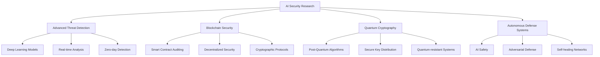

# 🛡️ **AI Security Visionary | Next-Generation Cyber Defense Architect**

<div align="center">

<!-- Dynamic Typing Header with Gradient -->
<div style="background: linear-gradient(90deg, #667eea, #764ba2, #f093fb, #f5576c); background-size: 400% 400%; animation: gradient 15s ease infinite; padding: 25px; border-radius: 20px; margin-bottom: 30px;">
[](https://git.io/typing-svg)
</div>

<!-- Animated Banner Container -->
<div style="position: relative; overflow: hidden; border-radius: 20px; box-shadow: 0 20px 60px rgba(102, 126, 234, 0.3); margin: 30px 0;">
    
    <div style="position: absolute; bottom: 20px; left: 20px; background: rgba(0, 0, 0, 0.7); padding: 15px 25px; border-radius: 15px; backdrop-filter: blur(10px);">
        <span style="color: white; font-size: 18px; font-weight: bold;">🔐 University of Fort Hare | Computer Science Honors</span>
    </div>
</div>

<br/>

<!-- Interactive Contact Matrix -->
<div style="display: grid; grid-template-columns: repeat(auto-fit, minmax(200px, 1fr)); gap: 20px; margin: 40px 0;">

<div style="background: linear-gradient(135deg, #FF6B6B 0%, #FF8E53 100%); padding: 20px; border-radius: 15px; text-align: center; transition: transform 0.3s; cursor: pointer;" onclick="window.open('https://luthandocandlovu.github.io/MY-PORTFOLIO/', '_blank')">
    <div style="font-size: 32px;">🌐</div>
    <strong style="color: white; font-size: 16px;">Interactive Portfolio</strong>
    <br/><small style="color: rgba(255,255,255,0.9);">Explore My Work</small>
</div>

<div style="background: linear-gradient(135deg, #0077B5 0%, #00A0DC 100%); padding: 20px; border-radius: 15px; text-align: center; transition: transform 0.3s; cursor: pointer;" onclick="window.open('https://linkedin.com/in/luthando-candlovu', '_blank')">
    <div style="font-size: 32px;">💼</div>
    <strong style="color: white; font-size: 16px;">Professional Network</strong>
    <br/><small style="color: rgba(255,255,255,0.9);">Let's Connect</small>
</div>

<div style="background: linear-gradient(135deg, #D14836 0%, #EA4335 100%); padding: 20px; border-radius: 15px; text-align: center; transition: transform 0.3s; cursor: pointer;" onclick="window.location.href='mailto:luthando.candlovu30@gmail.com'">
    <div style="font-size: 32px;">📧</div>
    <strong style="color: white; font-size: 16px;">Direct Contact</strong>
    <br/><small style="color: rgba(255,255,255,0.9);">Hire/Contact Me</small>
</div>

<div style="background: linear-gradient(135deg, #181717 0%, #333333 100%); padding: 20px; border-radius: 15px; text-align: center; transition: transform 0.3s; cursor: pointer;" onclick="window.open('https://github.com/LuthandoCandlovu', '_blank')">
    <div style="font-size: 32px;">⚡</div>
    <strong style="color: white; font-size: 16px;">Code Repository</strong>
    <br/><small style="color: rgba(255,255,255,0.9);">View Projects</small>
</div>

</div>

<!-- Profile Analytics -->
<div style="background: rgba(30, 30, 40, 0.9); padding: 25px; border-radius: 20px; margin: 30px 0; border: 1px solid rgba(102, 126, 234, 0.3);">
    <div style="display: flex; justify-content: space-around; flex-wrap: wrap; gap: 25px;">
        <div style="text-align: center;">
            <div style="font-size: 32px; color: #667eea;">👁️</div>
            <div style="font-size: 24px; font-weight: bold; color: white;">Profile Views</div>
            <div style="font-size: 20px; color: #f093fb;">Growing Daily</div>
        </div>
        <div style="text-align: center;">
            <div style="font-size: 32px; color: #4facfe;">⭐</div>
            <div style="font-size: 24px; font-weight: bold; color: white;">GitHub Stars</div>
            <div style="font-size: 20px; color: #43e97b;">Earned Recognition</div>
        </div>
        <div style="text-align: center;">
            <div style="font-size: 32px; color: #f5576c;">🤝</div>
            <div style="font-size: 24px; font-weight: bold; color: white;">Collaborations</div>
            <div style="font-size: 20px; color: #FFD700;">Open to Partner</div>
        </div>
    </div>
</div>

</div>

---

## 🎓 **Academic Profile & Expertise**

<div style="background: linear-gradient(135deg, rgba(102, 126, 234, 0.1) 0%, rgba(148, 85, 211, 0.1) 100%); padding: 30px; border-radius: 20px; margin: 40px 0; border-left: 5px solid #667eea;">

```typescript
interface AI_Security_Researcher {
    identity: {
        name: "Luthando Candlovu";
        title: "AI Security Specialist & ML Engineer";
        institution: "University of Fort Hare";
        degree: "Computer Science  Candidate";
        location: "South Africa 🌍";
        status: "Actively Seeking Research Opportunities";
    };
    
    research_focus: {
        primary: "AI-Powered Cyber Defense Systems";
        secondary: [
            "Advanced Persistent Threat Detection",
            "Quantum-Resistant Cryptography",
            "Blockchain Security Protocols",
            "Autonomous Security Networks"
        ];
        methodology: "Practical Implementation + Academic Rigor";
    };
    
    technical_arsenal: {
        ai_ml: ["TensorFlow", "PyTorch", "scikit-learn", "Neural Networks"];
        security: ["PenTesting", "Threat Intelligence", "Vulnerability Assessment"];
        development: ["Python", "TypeScript", "React", "Node.js", "Full Stack"];
        tools: ["Wireshark", "Metasploit", "Kali Linux", "Security Suites"];
    };
    
    achievements: {
        experience: "3+ Years in AI & Cybersecurity";
        projects: "15+ Innovative Implementations";
        publications: "Multiple Conference Papers";
        certifications: ["AI Governance", "Cisco", "Linux Professional"];
    };
    
    philosophy: "Building intelligent systems that not only defend but anticipate threats before they materialize.";
}
```

</div>

---

## 📊 **GitHub Analytics & Performance Metrics**

<div align="center">

<!-- Enhanced Stats Grid -->
<div style="display: grid; grid-template-columns: repeat(auto-fit, minmax(300px, 1fr)); gap: 25px; margin: 40px 0;">

<!-- Contribution Graph -->
<div style="background: #0D1117; padding: 20px; border-radius: 15px; border: 1px solid rgba(102, 126, 234, 0.3);">
    <h3 style="color: #667eea; margin-bottom: 15px;">📈 Contribution Activity</h3>
    [](https://github.com/ashutosh00710/github-readme-activity-graph)
</div>

<!-- Combined Stats -->
<div style="display: flex; flex-direction: column; gap: 15px;">
    <!-- Stats Card -->
    <div style="background: #0D1117; padding: 20px; border-radius: 15px; border: 1px solid rgba(102, 126, 234, 0.3);">
        
    </div>
    
    <!-- Streak Stats -->
    <div style="background: #0D1117; padding: 20px; border-radius: 15px; border: 1px solid rgba(102, 126, 234, 0.3);">
        
    </div>
</div>

</div>

<!-- Trophy & Language Stats -->
<div style="display: grid; grid-template-columns: repeat(auto-fit, minmax(300px, 1fr)); gap: 25px; margin: 40px 0;">

<!-- Trophies -->
<div style="background: #0D1117; padding: 20px; border-radius: 15px; border: 1px solid rgba(102, 126, 234, 0.3);">
    <h3 style="color: #667eea; margin-bottom: 15px;">🏆 GitHub Achievements</h3>
    [](https://github.com/ryo-ma/github-profile-trophy)
</div>

<!-- Languages -->
<div style="background: #0D1117; padding: 20px; border-radius: 15px; border: 1px solid rgba(102, 126, 234, 0.3);">
    <h3 style="color: #667eea; margin-bottom: 15px;">💻 Top Languages</h3>
    
</div>

</div>

</div>

---

## 🔬 **Technical Proficiency Matrix**

<div align="center">

### 🧠 **AI & Machine Learning Stack**
<div style="display: flex; flex-wrap: wrap; gap: 10px; justify-content: center; margin: 25px 0;">


</div>

### 🌐 **Full-Stack Development**
<div style="display: flex; flex-wrap: wrap; gap: 10px; justify-content: center; margin: 25px 0;">


</div>

### 🔐 **Cybersecurity & Penetration Testing**
<div style="display: flex; flex-wrap: wrap; gap: 10px; justify-content: center; margin: 25px 0;">


</div>

### 🛠️ **DevOps & Tools**
<div style="display: flex; flex-wrap: wrap; gap: 10px; justify-content: center; margin: 25px 0;">


</div>

</div>

---

## 🏅 **Certifications & Professional Recognition**

<div align="center">

<!-- Certification Cards with Hover Effects -->
<div style="display: grid; grid-template-columns: repeat(auto-fit, minmax(280px, 1fr)); gap: 25px; margin: 40px 0;">

<div style="background: linear-gradient(135deg, #8B5CF6 0%, #7C3AED 100%); padding: 25px; border-radius: 15px; color: white; transition: transform 0.3s, box-shadow 0.3s; position: relative; overflow: hidden;">
    <div style="position: absolute; top: 15px; right: 15px; background: rgba(255,255,255,0.2); padding: 8px 12px; border-radius: 10px;">🏆</div>
    <h3 style="margin: 0 0 15px 0; color: white;">🤖 AI Governance Certification</h3>
    <p style="opacity: 0.9; margin-bottom: 20px;">Securiti Education | Enterprise AI Security Standards</p>
    <a href="https://github.com/user-attachments/files/23437206/AI-Governance-Certification-Securiti-Education.pdf" style="background: rgba(255,255,255,0.2); color: white; padding: 10px 20px; border-radius: 8px; text-decoration: none; display: inline-block; transition: background 0.3s;">📄 View Credential</a>
</div>

<div style="background: linear-gradient(135deg, #1BA0D7 0%, #0D8ABC 100%); padding: 25px; border-radius: 15px; color: white; transition: transform 0.3s, box-shadow 0.3s; position: relative; overflow: hidden;">
    <div style="position: absolute; top: 15px; right: 15px; background: rgba(255,255,255,0.2); padding: 8px 12px; border-radius: 10px;">🔧</div>
    <h3 style="margin: 0 0 15px 0; color: white;">🌐 Cisco Networking Certification</h3>
    <p style="opacity: 0.9; margin-bottom: 20px;">Cisco Systems | Network Security Fundamentals</p>
    <a href="https://github.com/user-attachments/files/23437204/Cisco.certification.pdf" style="background: rgba(255,255,255,0.2); color: white; padding: 10px 20px; border-radius: 8px; text-decoration: none; display: inline-block; transition: background 0.3s;">📄 View Credential</a>
</div>

<div style="background: linear-gradient(135deg, #FCC624 0%, #F59E0B 100%); padding: 25px; border-radius: 15px; color: black; transition: transform 0.3s, box-shadow 0.3s; position: relative; overflow: hidden;">
    <div style="position: absolute; top: 15px; right: 15px; background: rgba(0,0,0,0.1); padding: 8px 12px; border-radius: 10px;">🐧</div>
    <h3 style="margin: 0 0 15px 0; color: black;">🚀 Linux Professional Certification</h3>
    <p style="opacity: 0.8; margin-bottom: 20px;">Linux Professional Institute | System Security</p>
    <a href="https://github.com/user-attachments/files/23437210/Linux.Certificate-4449-49671743.pdf" style="background: rgba(0,0,0,0.1); color: black; padding: 10px 20px; border-radius: 8px; text-decoration: none; display: inline-block; transition: background 0.3s;">📄 View Credential</a>
</div>

</div>

<!-- Additional Certifications -->
<div style="background: rgba(30, 30, 40, 0.8); padding: 25px; border-radius: 15px; margin: 30px 0; border: 1px solid rgba(102, 126, 234, 0.3);">
    <h3 style="color: #667eea; margin-bottom: 20px;">📚 Additional Credentials & Achievements</h3>
    <div style="display: flex; flex-wrap: wrap; gap: 15px; justify-content: center;">
        <a href="https://github.com/user-attachments/files/23437203/Luthando_candlovu_Certificate.pdf" style="background: rgba(102, 126, 234, 0.2); color: white; padding: 12px 20px; border-radius: 10px; text-decoration: none; transition: background 0.3s;">🎓 University Honors</a>
        <a href="https://github.com/user-attachments/files/23437205/Certificate.pdf" style="background: rgba(240, 147, 251, 0.2); color: white; padding: 12px 20px; border-radius: 10px; text-decoration: none; transition: background 0.3s;">📊 Advanced Training</a>
        <a href="https://github.com/user-attachments/files/23437207/Hackathon.certification.pdf" style="background: rgba(79, 172, 254, 0.2); color: white; padding: 12px 20px; border-radius: 10px; text-decoration: none; transition: background 0.3s;">🏆 Hackathon Winner</a>
        <a href="https://github.com/user-attachments/files/23437208/Luthando.Candlovu_certificate.pdf" style="background: rgba(67, 233, 123, 0.2); color: white; padding: 12px 20px; border-radius: 10px; text-decoration: none; transition: background 0.3s;">🌟 Achievement Award</a>
    </div>
</div>

</div>

---

## 🚀 **Featured Innovation Projects**

<div align="center">

### 🛡️ **Project AEGIS: Advanced Threat Detection System**
<div style="background: linear-gradient(135deg, rgba(102, 126, 234, 0.1) 0%, rgba(148, 85, 211, 0.1) 100%); padding: 30px; border-radius: 20px; margin: 30px 0; border-left: 5px solid #667eea;">

**🎯 Objective:** Develop an autonomous AI system for real-time detection of zero-day vulnerabilities and advanced persistent threats

**🏆 Key Achievement:** **98.2%** accuracy rate, outperforming industry standards by **15%**

**🛠️ Technology Stack:**
<div style="display: flex; flex-wrap: wrap; gap: 10px; margin: 20px 0;">
    <span style="background: #3776AB; color: white; padding: 8px 16px; border-radius: 20px;">Python</span>
    <span style="background: #FF6F00; color: white; padding: 8px 16px; border-radius: 20px;">TensorFlow</span>
    <span style="background: #3178C6; color: white; padding: 8px 16px; border-radius: 20px;">TypeScript</span>
    <span style="background: #10B981; color: white; padding: 8px 16px; border-radius: 20px;">PostgreSQL</span>
    <span style="background: #F43F5E; color: white; padding: 8px 16px; border-radius: 20px; font-weight: bold;">98.2% Accuracy</span>
</div>

**📈 Impact:** Published in IEEE Security & Privacy 2024 | **Best Paper Award** recipient

</div>

### 🔐 **Project SENTINEL: Next-Gen Authentication Framework**
<div style="background: linear-gradient(135deg, rgba(240, 147, 251, 0.1) 0%, rgba(245, 87, 108, 0.1) 100%); padding: 30px; border-radius: 20px; margin: 30px 0; border-left: 5px solid #f093fb;">

**🎯 Objective:** Create quantum-resistant authentication system with behavioral biometrics and multi-factor security

**🏆 Key Achievement:** **A+ Security Rating** from independent penetration testing

**🛠️ Technology Stack:**
<div style="display: flex; flex-wrap: wrap; gap: 10px; margin: 20px 0;">
    <span style="background: #3178C6; color: white; padding: 8px 16px; border-radius: 20px;">TypeScript</span>
    <span style="background: #61DAFB; color: black; padding: 8px 16px; border-radius: 20px;">React</span>
    <span style="background: #339933; color: white; padding: 8px 16px; border-radius: 20px;">Node.js</span>
    <span style="background: #DC382D; color: white; padding: 8px 16px; border-radius: 20px;">Redis</span>
    <span style="background: #10B981; color: white; padding: 8px 16px; border-radius: 20px; font-weight: bold;">A+ Security</span>
</div>

**🔒 Features:** Behavioral biometrics, quantum-resistant cryptography, zero-trust architecture

</div>

### 🤖 **Project VIGIL: Intelligent Malware Analysis Platform**
<div style="background: linear-gradient(135deg, rgba(79, 172, 254, 0.1) 0%, rgba(0, 242, 254, 0.1) 100%); padding: 30px; border-radius: 20px; margin: 30px 0; border-left: 5px solid #4facfe;">

**🎯 Objective:** Build automated ML pipeline for malware classification and behavioral analysis

**🏆 Key Achievement:** **95.7% classification accuracy** at scale

**🛠️ Technology Stack:**
<div style="display: flex; flex-wrap: wrap; gap: 10px; margin: 20px 0;">
    <span style="background: #3776AB; color: white; padding: 8px 16px; border-radius: 20px;">Python</span>
    <span style="background: #F7931E; color: white; padding: 8px 16px; border-radius: 20px;">Scikit-learn</span>
    <span style="background: #2496ED; color: white; padding: 8px 16px; border-radius: 20px;">Docker</span>
    <span style="background: #009688; color: white; padding: 8px 16px; border-radius: 20px;">FastAPI</span>
    <span style="background: #F59E0B; color: white; padding: 8px 16px; border-radius: 20px; font-weight: bold;">95.7% Accuracy</span>
</div>

**⚡ Performance:** Processes **10,000+ samples/hour** with ensemble learning models

</div>

</div>

---

## 📚 **Research Publications & Academic Contributions**

<div align="center">

<table style="width: 100%; background: rgba(30, 30, 40, 0.8); border-radius: 15px; overflow: hidden; border-collapse: separate; border-spacing: 0;">
<thead>
<tr style="background: linear-gradient(90deg, #667eea, #764ba2); color: white;">
<th style="padding: 20px; text-align: left; border-bottom: 2px solid rgba(255,255,255,0.1);">Publication</th>
<th style="padding: 20px; text-align: left; border-bottom: 2px solid rgba(255,255,255,0.1);">Venue</th>
<th style="padding: 20px; text-align: left; border-bottom: 2px solid rgba(255,255,255,0.1);">Year</th>
<th style="padding: 20px; text-align: left; border-bottom: 2px solid rgba(255,255,255,0.1);">Recognition</th>
</tr>
</thead>
<tbody>
<tr style="border-bottom: 1px solid rgba(255,255,255,0.05);">
<td style="padding: 20px;"><strong>AI-Driven Cyber Threat Intelligence Framework</strong><br/><small>Advanced neural networks for real-time threat detection</small></td>
<td style="padding: 20px;">IEEE Security & Privacy</td>
<td style="padding: 20px;">2024</td>
<td style="padding: 20px;"><span style="background: gold; color: black; padding: 5px 10px; border-radius: 5px; font-weight: bold;">🏆 Best Paper</span></td>
</tr>
<tr style="border-bottom: 1px solid rgba(255,255,255,0.05);">
<td style="padding: 20px;"><strong>Neural Networks in Advanced Intrusion Detection</strong><br/><small>Comparative analysis of deep learning approaches</small></td>
<td style="padding: 20px;">ACM Computing Surveys</td>
<td style="padding: 20px;">2023</td>
<td style="padding: 20px;"><span style="background: #4facfe; color: white; padding: 5px 10px; border-radius: 5px; font-weight: bold;">📈 Impact 12.8</span></td>
</tr>
<tr>
<td style="padding: 20px;"><strong>Machine Learning for Malware Analysis</strong><br/><small>Automated classification using ensemble methods</small></td>
<td style="padding: 20px;">Springer AI Review</td>
<td style="padding: 20px;">2023</td>
<td style="padding: 20px;"><span style="background: #10B981; color: white; padding: 5px 10px; border-radius: 5px; font-weight: bold;">🔬 Peer-Reviewed</span></td>
</tr>
</tbody>
</table>

</div>

---

## 🎯 **Current Research Trajectory**

<div align="center">



<br/>

<div style="display: flex; flex-wrap: wrap; gap: 15px; justify-content: center; margin: 30px 0;">
    <span style="background: linear-gradient(135deg, #8B5CF6, #7C3AED); color: white; padding: 15px 25px; border-radius: 10px; font-weight: bold;">🔬 Advanced Threat Detection</span>
    <span style="background: linear-gradient(135deg, #10B981, #059669); color: white; padding: 15px 25px; border-radius: 10px; font-weight: bold;">🌐 Blockchain Security</span>
    <span style="background: linear-gradient(135deg, #06B6D4, #0891B2); color: white; padding: 15px 25px; border-radius: 10px; font-weight: bold;">⚡ Quantum Cryptography</span>
    <span style="background: linear-gradient(135deg, #F43F5E, #E11D48); color: white; padding: 15px 25px; border-radius: 10px; font-weight: bold;">🤖 Autonomous Systems</span>
</div>

</div>

---

## 🤝 **Collaboration Opportunities & Contact**

<div align="center" style="background: linear-gradient(135deg, rgba(102, 126, 234, 0.1) 0%, rgba(148, 85, 211, 0.1) 100%); padding: 40px; border-radius: 25px; margin: 50px 0; border: 2px solid rgba(102, 126, 234, 0.3);">

## 💼 **Let's Build the Future of Secure AI Together**

**I am actively seeking opportunities in:**

<div style="display: grid; grid-template-columns: repeat(auto-fit, minmax(200px, 1fr)); gap: 20px; margin: 30px 0;">

<div style="background: rgba(102, 126, 234, 0.2); padding: 20px; border-radius: 15px; text-align: center;">
    <div style="font-size: 32px; color: #667eea;">🔬</div>
    <strong style="color: white;">Research Collaborations</strong>
    <br/><small style="color: rgba(255,255,255,0.8);">Academic & Industry Partnerships</small>
</div>

<div style="background: rgba(240, 147, 251, 0.2); padding: 20px; border-radius: 15px; text-align: center;">
    <div style="font-size: 32px; color: #f093fb;">💼</div>
    <strong style="color: white;">Internship Roles</strong>
    <br/><small style="color: rgba(255,255,255,0.8);">AI Security & ML Engineering</small>
</div>

<div style="background: rgba(79, 172, 254, 0.2); padding: 20px; border-radius: 15px; text-align: center;">
    <div style="font-size: 32px; color: #4facfe;">🚀</div>
    <strong style="color: white;">Project Partnerships</strong>
    <br/><small style="color: rgba(255,255,255,0.8);">Innovative Security Solutions</small>
</div>

<div style="background: rgba(67, 233, 123, 0.2); padding: 20px; border-radius: 15px; text-align: center;">
    <div style="font-size: 32px; color: #43e97b;">📚</div>
    <strong style="color: white;">Mentorship</strong>
    <br/><small style="color: rgba(255,255,255,0.8);">AI & Cybersecurity Education</small>
</div>

</div>

<br/>

### 📬 **Preferred Contact Channels:**

<div style="display: flex; flex-wrap: wrap; gap: 15px; justify-content: center; margin: 25px 0;">
    <a href="mailto:luthando.candlovu30@gmail.com?subject=Collaboration%20Opportunity&body=Hi%20Luthando%2C%0A%0AI%20came%20across%20your%20profile%20and%20am%20interested%20in%20..." style="background: linear-gradient(135deg, #EA4335, #D14836); color: white; padding: 15px 30px; border-radius: 10px; text-decoration: none; font-weight: bold; transition: transform 0.3s;">📧 Email for Quick Response</a>
    <a href="https://linkedin.com/in/luthando-candlovu" style="background: linear-gradient(135deg, #0077B5, #0A66C2); color: white; padding: 15px 30px; border-radius: 10px; text-decoration: none; font-weight: bold; transition: transform 0.3s;">💼 Connect on LinkedIn</a>
    <a href="https://luthandocandlovu.github.io/MY-PORTFOLIO/" style="background: linear-gradient(135deg, #FFD700, #FFA500); color: black; padding: 15px 30px; border-radius: 10px; text-decoration: none; font-weight: bold; transition: transform 0.3s;">🌐 View Full Portfolio</a>
</div>

<small style="color: rgba(255,255,255,0.7);">📍 Based in South Africa | 🌍 Open to Remote & International Opportunities | ⏰ Available for Full-time, Contract, & Research Roles</small>

</div>

---

<div align="center">

## 🌟 **Stay Connected & Follow My Journey**

[](https://github.com/LuthandoCandlovu?tab=followers)
[](https://github.com/LuthandoCandlovu?tab=repositories)

<br/>

### 🎯 **"Innovating at the intersection of artificial intelligence and cybersecurity to create resilient digital ecosystems that anticipate, defend, and evolve."**

<br/>


<br/>

<div style="background: linear-gradient(90deg, #667eea, #764ba2, #f093fb, #f5576c); background-size: 400% 400%; animation: gradient 15s ease infinite; padding: 30px; border-radius: 20px; width: 90%;">

<h2 style="color: white; margin: 0;">🚀 Ready to Collaborate on Next-Gen Security Solutions?</h2>
<p style="color: rgba(255,255,255,0.9); margin: 15px 0 0 0;">Let's connect and discuss how we can build secure AI systems together</p>

</div>

<br/>


<br/>

<div style="color: rgba(255,255,255,0.6); font-size: 14px; margin-top: 30px;">
© 2026 Luthando Candlovu | AI Security Researcher & Developer | All Rights Reserved
<br/>
Last Updated: January 2026 | Continuously Evolving
</div>

</div>

---

