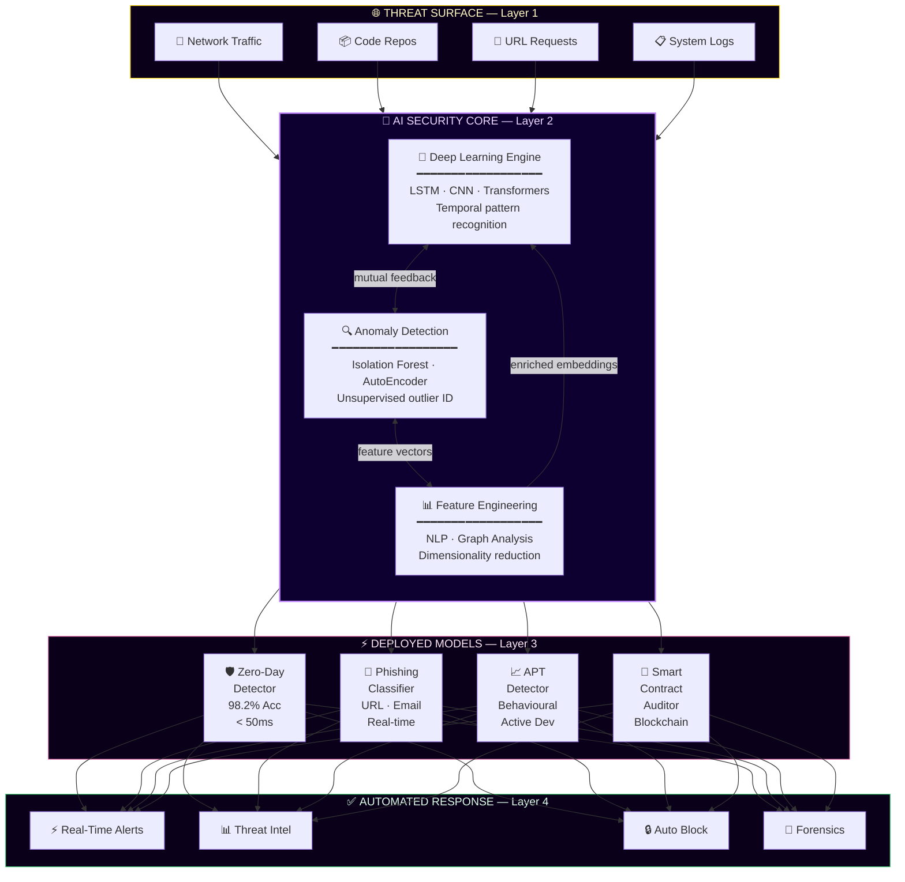
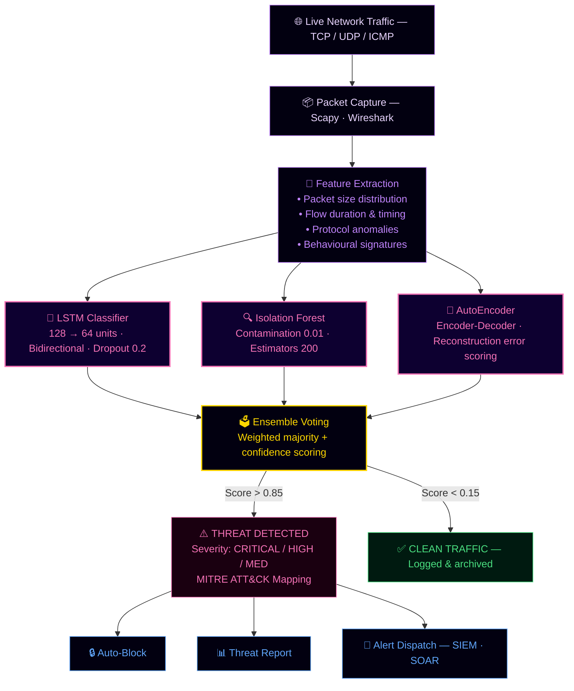
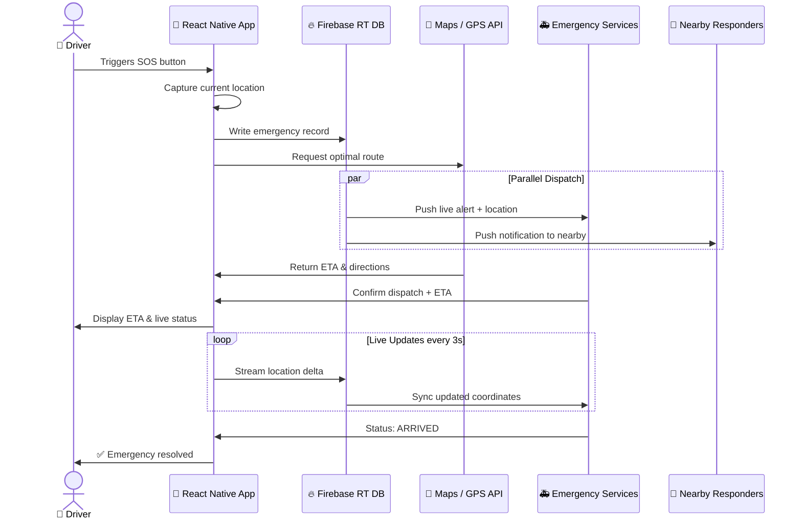
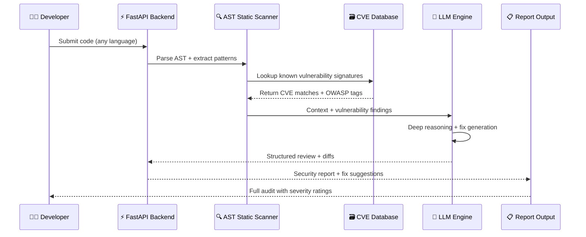
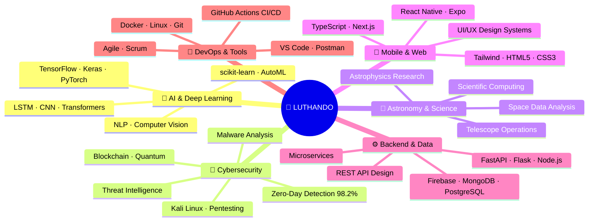
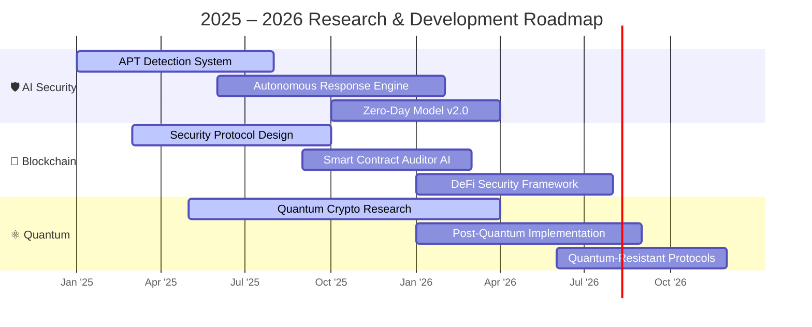

<!-- ═══════════════════════════════════════════════════════════════════ -->
<!--                 🚀  LUTHANDO CANDLOVU — GITHUB README  🚀          -->
<!-- ═══════════════════════════════════════════════════════════════════ -->

<!-- HEADER — Slice type: diagonal modern cut, electric aurora gradient -->


<br/>

<!-- BOOT SEQUENCE TERMINAL — first impression moment -->
<div align="center">

```
╔═══════════════════════════════════════════════════════════════════════╗
║  SYSTEM BOOT  ·  THREAT CORE v3.1.4  ·  EASTERN CAPE NODE  🇿🇦       ║
╠═══════════════════════════════════════════════════════════════════════╣
║  [████████████████████████████████████████]  100%  INITIALISING...   ║
║                                                                       ║
║  > Loading AI Security Engine............  ✅  ONLINE                 ║
║  > Loading Deep Learning Stack...........  ✅  ONLINE                 ║
║  > Loading Zero-Day Detector.............  ✅  98.2% ACCURACY         ║
║  > Loading Quantum Crypto Module.........  ✅  ONLINE                 ║
║  > Loading Astronomy Core................  ✅  TELESCOPE ALIGNED 🌌   ║
║  > Scanning for threats..................  ✅  0 THREATS FOUND         ║
║                                                                       ║
║  ALL SYSTEMS NOMINAL  ·  READY TO BUILD  ·  READY TO DEFEND          ║
╚═══════════════════════════════════════════════════════════════════════╝
```

</div>

<br/>

<!-- ── MAIN HERO ──────────────────────────────────────────────────── -->
<div align="center">

<table border="0" cellspacing="0" cellpadding="0">
<tr>

<!-- LEFT — PROFILE PHOTO -->
<td align="center" valign="middle" width="250">

<br/>


<br/>


<br/>


<br/><br/>

<!-- Live status indicator -->


<br/>


<br/>

<br/>

<br/>


<br/>

</td>

<!-- SPACER -->
<td width="28"></td>

<!-- RIGHT — IDENTITY BLOCK -->
<td align="left" valign="middle" width="520">

<br/>


<br/><br/>


<br/>


<br/>


<br/><br/>

[](https://luthandocandlovu.github.io/MY-PORTFOLIO/)
[](https://www.linkedin.com/in/luthando-candlovu-b59110324/)
[](https://github.com/LuthandoCandlovu)
<br/>
[](mailto:luthando.candlovu30@gmail.com)
[](https://wa.me/27782765932)

<br/>

</td>
</tr>
</table>

</div>

<!-- QUOTE BANNER -->
<div align="center">
<br/>


<br/><br/>

<!-- Comet divider: asteroid belt shimmer -->


</div>

<br/>

<!-- ═══════════════════════════════════════════════════════════════════ -->
<!--                     ⚡ QUICK FIRE STATS                            -->
<!-- ═══════════════════════════════════════════════════════════════════ -->

<div align="center">

##  `> quick.stats`

</div>

<br/>

<div align="center">

| ⚡ Metric | 🔢 Value | 🌟 Context |
|:---|:---:|:---|
| 🎯 Threat Detection Accuracy | **98.2%** | Live network traffic classification |
| ⏱️ Real-Time Inference Speed | **< 50ms** | End-to-end zero-day detection |
| 🚀 Production Apps Shipped | **15+** | Web · Mobile · AI · Security |
| 🏆 Hackathon Awards | **1st Place** | Vula Motor Emergency Platform |
| 📜 Professional Certifications | **10** | AI · Cisco · Linux · Astronomy + more |
| 📚 Research Papers | **3** | IEEE · ACM · Springer |
| 🌍 Reach | **Worldwide** | Remote · Open to relocation |
| ☕ Fuel | **Infinite** | Coffee + Code + Curiosity |

</div>

<br/>


<br/>

<!-- ═══════════════════════════════════════════════════════════════════ -->
<!--                       👤 WHO AM I                                   -->
<!-- ═══════════════════════════════════════════════════════════════════ -->

<div align="center">
<h2> &nbsp;<code>> whoami</code></h2>
</div>

<br/>

<table align="center">
<tr>
<td width="52%" valign="top">

```yaml
╔═══════════════════════════════════════════╗
║         SYSTEM IDENTIFICATION             ║
╠═══════════════════════════════════════════╣
║ name       : Luthando Candlovu            ║
║ alias      : LuthandoCandlovu             ║
║ role       : AI Security Engineer         ║
║             & Deep Learning Researcher    ║
║ location   : Eastern Cape, ZA  🇿🇦        ║
║ degree     : BSc Computer Science         ║
║ university : University of Fort Hare      ║
║ experience : 3+ Years in Production       ║
║ shipped    : 15+ Apps                     ║
║ certs      : 10 Professional              ║
╠═══════════════════════════════════════════╣
║           ACTIVE RESEARCH                 ║
╠═══════════════════════════════════════════╣
║ APT Detection System    [████████░░] 80%  ║
║ Blockchain Security     [█████░░░░░] 55%  ║
║ Quantum Cryptography    [███░░░░░░░] 35%  ║
║ Autonomous AI Response  [████░░░░░░] 45%  ║
╠═══════════════════════════════════════════╣
║           AVAILABILITY                    ║
╠═══════════════════════════════════════════╣
║ ✅ Full-time   ✅ Freelance               ║
║ ✅ Research    ✅ Consulting              ║
║ ✅ Remote Worldwide                       ║
║ ✅ Relocation: Negotiable                 ║
╚═══════════════════════════════════════════╝
```

</td>
<td width="48%" align="center" valign="middle">


<br/><br/>


<br/><br/>


</td>
</tr>
</table>

<br/>

<!-- ── MISSION STATEMENT BLOCK ──────────────────────────────────── -->
<div align="center">

> ### 🌌 _"I sit at the exact intersection of two infinite frontiers —_
> ### _cyberspace and outer space. I defend one. I explore the other._
> ### _Both are boundless. Both demand precision. Both demand courage."_
>
> **— Luthando Candlovu, Eastern Cape 🇿🇦**

</div>

<br/>


<br/>

<!-- ═══════════════════════════════════════════════════════════════════ -->
<!--                  🛤️ THE STORY SO FAR — TIMELINE                    -->
<!-- ═══════════════════════════════════════════════════════════════════ -->

<div align="center">

##  `> timeline.story`

**From Eastern Cape to Global Impact — The Journey**

</div>

<br/>

```
  🌱 ORIGIN                    🎓 ACADEMIA                   ⚡ PROFESSIONAL
     │                              │                               │
     ▼                              ▼                               ▼
  ┌──────────┐               ┌──────────────┐              ┌────────────────┐
  │ Eastern  │               │  University  │              │  AI Security   │
  │ Cape, ZA │──────────────▶│  of Fort     │─────────────▶│  Engineer &    │
  │ 🇿🇦       │               │  Hare — BSc  │              │  Researcher    │
  └──────────┘               └──────────────┘              └────────────────┘
        │                           │                               │
        │                     ⭐ Academic                    🏆 Hackathon
        │                     Excellence I & II              Winner — Vula
        │                     Awards                         Motor App
        │                           │                               │
        └───────────────────────────┴───────────────────────────────┘
                                    │
                          ┌─────────▼──────────┐
                          │   15+ APPS SHIPPED  │
                          │   10 CERTIFICATIONS │
                          │   3 PUBLICATIONS    │
                          │   98.2% ACCURACY    │
                          └────────────────────┘
                                    │
                                    ▼
                          ╔════════════════════╗
                          ║  🚀 WHAT'S NEXT     ║
                          ║  Quantum Crypto     ║
                          ║  Autonomous AI      ║
                          ║  Global Impact      ║
                          ╚════════════════════╝
```

<br/>


<br/>

<!-- ═══════════════════════════════════════════════════════════════════ -->
<!--                  🔭 CURRENTLY OBSESSING OVER                       -->
<!-- ═══════════════════════════════════════════════════════════════════ -->

<div align="center">

##  `> now.building`

</div>

<br/>

<div align="center">

<table>
<tr>
<td align="center" width="33%">


### 🛡️ APT Detection v2
**Advanced Persistent Threat**
behavioural detection engine with
autonomous countermeasures


</td>
<td align="center" width="33%">


### ⚛️ Quantum Cryptography
**Post-quantum resistant** protocols
for tomorrow's threat landscape.
Research phase ongoing.


</td>
<td align="center" width="33%">


### 🔗 Blockchain Auditor AI
**Smart contract vulnerability**
scanner powered by LLM reasoning
+ static analysis fusion.


</td>
</tr>
</table>

</div>

<br/>


<br/>

<!-- ═══════════════════════════════════════════════════════════════════ -->
<!--                     🏗️ SYSTEM ARCHITECTURE                          -->
<!-- ═══════════════════════════════════════════════════════════════════ -->

<div align="center">

##  `> system.architecture`

**AI Security Core — Full Stack Design**

</div>

<br/>

### 🌐 Layer 1 — Threat Ingestion Surface

```
╔══════════════════════════════════════════════════════════════════════════╗
║                     🌐  THREAT INGESTION SURFACE                        ║
╠═══════════════╦════════════════╦═══════════════════╦═════════════════════╣
║  🔴 NETWORK   ║  📦  PACKETS   ║   🔗  URL / DNS   ║   📋  SYSTEM LOGS  ║
║   TRAFFIC     ║   CAPTURE      ║    REQUESTS       ║   & AUDIT TRAILS   ║
║               ║                ║                   ║                    ║
║  Live pcap    ║  Deep packet   ║  Phishing &       ║  OS · App ·        ║
║  ingestion    ║  inspection    ║  malicious URL    ║  Security logs     ║
║  at scale     ║  & parsing     ║  classification   ║  correlation       ║
╚═══════════════╩════════════════╩═══════════════════╩═════════════════════╝
                                 ║
                              ▼  ║  ▼
```

<br/>

### 🤖 Layer 2 — AI Security Core


```mermaid
graph TB
    subgraph INGEST["🌐 THREAT SURFACE — Layer 1"]
        direction LR
        A["🔴 Network Traffic"]
        B["📦 Code Repos"]
        C["🔗 URL Requests"]
        D["📋 System Logs"]
    end

    subgraph CORE["🤖 AI SECURITY CORE — Layer 2"]
        direction TB
        E["🧠 Deep Learning Engine<br/>━━━━━━━━━━━━━━━━━━<br/>LSTM · CNN · Transformers<br/>Temporal pattern recognition"]
        F["🔍 Anomaly Detection<br/>━━━━━━━━━━━━━━━━━━<br/>Isolation Forest · AutoEncoder<br/>Unsupervised outlier ID"]
        G["📊 Feature Engineering<br/>━━━━━━━━━━━━━━━━━━<br/>NLP · Graph Analysis<br/>Dimensionality reduction"]
        E <-->|"mutual feedback"| F
        F <-->|"feature vectors"| G
        G -->|"enriched embeddings"| E
    end

    subgraph MODELS["⚡ DEPLOYED MODELS — Layer 3"]
        direction LR
        H["🛡️ Zero-Day<br/>Detector<br/>98.2% Acc<br/>< 50ms"]
        I["🎣 Phishing<br/>Classifier<br/>URL · Email<br/>Real-time"]
        J["📈 APT<br/>Detector<br/>Behavioural<br/>Active Dev"]
        K["🔐 Smart<br/>Contract<br/>Auditor<br/>Blockchain"]
    end

    subgraph RESPONSE["✅ AUTOMATED RESPONSE — Layer 4"]
        direction LR
        L["⚡ Real-Time Alerts"]
        M["📊 Threat Intel"]
        N["🔒 Auto Block"]
        O["🧾 Forensics"]
    end

    A & B & C & D --> CORE
    CORE --> H & I & J & K
    H & I & J & K --> L & M & N & O

    style CORE fill:#0d0030,stroke:#c084fc,stroke-width:2px,color:#e9d5ff
    style INGEST fill:#0a001a,stroke:#FFD700,stroke-width:1px,color:#fef9c3
    style MODELS fill:#0a001a,stroke:#f472b6,stroke-width:1px,color:#fce7f3
    style RESPONSE fill:#0a001a,stroke:#4ADE80,stroke-width:1px,color:#dcfce7
```

<br/>

### 🔄 Layer 3 — Zero-Day Detection Pipeline


```mermaid
flowchart LR
    RAW["📥 Raw Data<br/>Ingestion"]:::input
    CLEAN["🧹 Normalise<br/>& Clean"]:::process
    FEAT["⚙️ Feature<br/>Extraction"]:::process
    WINDOW["📐 Time-Window<br/>Slicing"]:::process
    TRAIN["🧠 Model<br/>Training"]:::model
    EVAL["📊 Evaluation<br/>& Tuning"]:::model
    INFER["⚡ Real-Time<br/>Inference"]:::output
    ALERT["🚨 Threat<br/>Alert + Block"]:::output

    RAW --> CLEAN --> FEAT --> WINDOW --> TRAIN --> EVAL
    EVAL -->|"re-train loop"| TRAIN
    EVAL --> INFER --> ALERT

    classDef input fill:#020010,stroke:#FFD700,color:#FFD700
    classDef process fill:#020010,stroke:#c084fc,color:#c084fc
    classDef model fill:#020010,stroke:#f472b6,color:#f472b6
    classDef output fill:#020010,stroke:#4ADE80,color:#4ADE80
```

<br/>

### 🛡️ Layer 4 — Deep Threat Classification


```mermaid
flowchart TD
    TRAFFIC["🌐 Live Network Traffic — TCP / UDP / ICMP"]:::node
    TRAFFIC --> CAP["📦 Packet Capture — Scapy · Wireshark"]:::node
    CAP --> EXTRACT["🔧 Feature Extraction\n• Packet size distribution\n• Flow duration & timing\n• Protocol anomalies\n• Behavioural signatures"]:::process

    EXTRACT --> LSTM["🧠 LSTM Classifier\n128 → 64 units · Bidirectional · Dropout 0.2"]:::model
    EXTRACT --> ISO["🔍 Isolation Forest\nContamination 0.01 · Estimators 200"]:::model
    EXTRACT --> AUTO["📐 AutoEncoder\nEncoder-Decoder · Reconstruction error scoring"]:::model

    LSTM & ISO & AUTO --> ENSEMBLE["🗳️ Ensemble Voting\nWeighted majority + confidence scoring"]:::ensemble

    ENSEMBLE -->|"Score > 0.85"| THREAT["⚠️ THREAT DETECTED\nSeverity: CRITICAL / HIGH / MED\nMITRE ATT&CK Mapping"]:::alert
    ENSEMBLE -->|"Score < 0.15"| SAFE["✅ CLEAN TRAFFIC — Logged & archived"]:::safe

    THREAT --> BLOCK["🔒 Auto-Block"]:::action
    THREAT --> REPORT["📊 Threat Report"]:::action
    THREAT --> NOTIFY["📡 Alert Dispatch — SIEM · SOAR"]:::action

    classDef node fill:#020010,stroke:#c084fc,color:#e9d5ff
    classDef process fill:#020010,stroke:#c084fc,color:#c084fc
    classDef model fill:#0d0030,stroke:#f472b6,color:#f472b6,stroke-width:2px
    classDef ensemble fill:#020010,stroke:#FFD700,color:#FFD700,stroke-width:2px
    classDef alert fill:#1a0010,stroke:#f472b6,color:#f472b6
    classDef safe fill:#001a10,stroke:#4ADE80,color:#4ADE80
    classDef action fill:#020010,stroke:#60A5FA,color:#60A5FA
```

<br/>

### 📱 Layer 5 — Vula Motor Emergency Sequence


```mermaid
sequenceDiagram
    actor Driver as 👤 Driver
    participant App as 📱 React Native App
    participant FB as 🔥 Firebase RT DB
    participant GPS as 📍 Maps / GPS API
    participant ES as 🚑 Emergency Services
    participant Resp as 🔔 Nearby Responders

    Driver->>App: Triggers SOS button
    App->>App: Capture current location
    App->>FB: Write emergency record
    App->>GPS: Request optimal route

    par Parallel Dispatch
        FB->>ES: Push live alert + location
        FB->>Resp: Push notification to nearby
    end

    GPS->>App: Return ETA & directions
    ES->>App: Confirm dispatch + ETA
    App->>Driver: Display ETA & live status

    loop Live Updates every 3s
        App->>FB: Stream location delta
        FB->>ES: Sync updated coordinates
    end

    ES->>App: Status: ARRIVED
    App->>Driver: ✅ Emergency resolved
```

<br/>

### 🧠 Layer 6 — LSTM Stock Architecture


```mermaid
graph LR
    YF["📊 yfinance"]:::input
    NORM["📐 MinMaxScaler"]:::process
    WIN["🪟 Window 60-day"]:::process
    L1["🧠 LSTM 128\nreturn_seq=True"]:::lstm
    L2["🧠 LSTM 64\nreturn_seq=False"]:::lstm
    DROP["💧 Dropout 0.2"]:::reg
    DENSE["🎯 Dense(1)"]:::output
    PRED["📈 Price Forecast"]:::result

    YF --> NORM --> WIN --> L1 --> L2 --> DROP --> DENSE --> PRED

    classDef input fill:#020010,stroke:#FFD700,color:#FFD700
    classDef process fill:#020010,stroke:#c084fc,color:#c084fc
    classDef lstm fill:#0d0030,stroke:#f472b6,color:#f472b6,stroke-width:2px
    classDef reg fill:#020010,stroke:#f472b6,color:#f472b6
    classDef output fill:#020010,stroke:#c084fc,color:#c084fc
    classDef result fill:#020010,stroke:#FFD700,color:#FFD700
```

<br/>

### 💬 Layer 7 — CodeSage AI Review Flow


```mermaid
sequenceDiagram
    participant Dev as 👨‍💻 Developer
    participant API as ⚡ FastAPI Backend
    participant AST as 🔍 AST Static Scanner
    participant CVE as 🗃️ CVE Database
    participant LLM as 🤖 LLM Engine
    participant Out as 📋 Report Output

    Dev->>API: Submit code (any language)
    API->>AST: Parse AST + extract patterns
    AST->>CVE: Lookup known vulnerability signatures
    CVE-->>AST: Return CVE matches + OWASP tags
    AST->>LLM: Context + vulnerability findings
    LLM->>LLM: Deep reasoning + fix generation
    LLM-->>API: Structured review + diffs
    API-->>Out: Security report + fix suggestions
    Out-->>Dev: Full audit with severity ratings
```

<br/>


<br/>

<!-- ═══════════════════════════════════════════════════════════════════ -->
<!--                      🚀 FEATURED PROJECTS                           -->
<!-- ═══════════════════════════════════════════════════════════════════ -->

<div align="center">

##  `> projects.featured`

**Production-Grade Systems — Built, Deployed, Defended**

</div>

<br/>

---

### 🛡️ `PROJECT_01` — Zero-Day AI Threat Detector

<table>
<tr>
<td width="58%" valign="top">

[](https://github.com/LuthandoCandlovu/zero-day-detection)


> **Deep neural network detecting novel, unseen threats in live network traffic — before antivirus signatures are written.**

- 🔴 Real-time packet stream classification with bidirectional LSTM
- 🔍 Isolation Forest for unsupervised zero-day anomaly detection
- 📐 AutoEncoder reconstruction error scoring for unknown threats
- 🗳️ Ensemble voting across 3 model heads with confidence scoring
- 🗺️ MITRE ATT&CK mapping for automatic threat categorisation
- 🔒 Auto firewall rule push on high-confidence detections

```python
# THREAT DETECTED — Classification result
{
  "threat_type":  "zero_day_exploit",
  "severity":     "CRITICAL",
  "confidence":   0.982,
  "response_ms":  47,
  "mitre_tactic": "TA0001 — Initial Access",
  "action":       "AUTO_BLOCK + ALERT"
}
```

</td>
<td width="42%" align="center" valign="middle">


```
╔══════════════════════╗
║   THREAT DASHBOARD   ║
║  ──────────────────  ║
║  Blocked:  ██ 2,847  ║
║  Accuracy: ██ 98.2%  ║
║  Response: ██ <50ms  ║
║  Models:   ██ 3      ║
║  Status:  ◉ ACTIVE   ║
╚══════════════════════╝
```

</td>
</tr>
</table>

---

### 💬 `PROJECT_02` — CodeSage AI — LLM Code Security Reviewer

<table>
<tr>
<td width="42%" align="center" valign="middle">


```
╔══════════════════════╗
║   CODESAGE SCANNER   ║
║  ──────────────────  ║
║  > AST parse...  ✅  ║
║  > CVE lookup... ✅  ║
║  > LLM reason... ✅  ║
║                      ║
║  ⚠ SQL Injection     ║
║  ⚠ XSS Vector        ║
║  ✅ Fix generated    ║
╚══════════════════════╝
```

</td>
<td width="58%" valign="top">

[](https://github.com/LuthandoCandlovu/codesage-ai)


> **AI-powered code review agent fusing static analysis with LLM deep reasoning to surface vulnerabilities with precise fix suggestions.**

- ⚡ Async FastAPI backend for high-throughput code submission
- 🌲 Static analysis pipeline extracting AST-level patterns
- 🤖 LLM reasoning for context-aware vulnerability explanation
- 🗃️ CVE database lookup and OWASP Top 10 classification
- 🔧 Auto-generated fix recommendations with inline diff output
- 🌐 Supports Python · JavaScript · TypeScript · Java

```
Stack: Python · FastAPI · LLM API · AST · Docker
       PostgreSQL · REST API · GitHub Actions CI
```

</td>
</tr>
</table>

---

### 🚗 `PROJECT_03` — Vula Motor — Emergency Response Platform

<table>
<tr>
<td width="58%" valign="top">

[](https://github.com/LuthandoCandlovu/Vula-Motor_App)


> **Cross-platform emergency response app with one-tap SOS, real-time GPS streaming to emergency services, and community responder dispatch. First place hackathon winner.**

- 🆘 One-tap SOS with automatic GPS location capture
- 🔥 Firebase Realtime DB for <100ms emergency dispatch
- 📡 Live GPS streaming to emergency services feed
- 🗺️ Optimal routing via Maps API with live ETA
- 🔔 Push notifications to nearby community responders
- 📶 Offline-first with intelligent sync on reconnect

```
Stack: React Native · TypeScript · Expo
       Firebase RTDB · Google Maps API
       Push Notifications · Offline Sync
```

</td>
<td width="42%" align="center" valign="middle">


```
╔══════════════════════╗
║   VULA MOTOR  🚑     ║
║  ──────────────────  ║
║                      ║
║      [🚨  SOS]       ║
║                      ║
║  📍 Location: LIVE   ║
║  🚑 ETA:  4 mins     ║
║  📡 Responders: 3    ║
║  ◉ DISPATCHING...    ║
╚══════════════════════╝
```

</td>
</tr>
</table>

---

### 📈 `PROJECT_04` — AI Stock Predictor — LSTM Neural Network

<table>
<tr>
<td width="42%" align="center" valign="middle">


```
╔══════════════════════╗
║  LSTM ARCHITECTURE   ║
║  ──────────────────  ║
║  Input: 60-day win   ║
║  LSTM(128, seq=T)    ║
║         ↓            ║
║  LSTM(64, seq=F)     ║
║         ↓            ║
║  Dropout(0.2)        ║
║         ↓            ║
║  Dense(1) → Price 📈 ║
╚══════════════════════╝
```

</td>
<td width="58%" valign="top">

[](https://github.com/LuthandoCandlovu/Stock-Predictor)


> **Multi-layer LSTM recurrent neural network trained on multi-year historical market data with a full end-to-end prediction pipeline.**

Model pipeline:
```python
# Full architecture
yfinance()
  → MinMaxScaler()      # Normalise [0, 1]
  → WindowSlice(60)     # 60-day lookback
  → LSTM(128, seq=True) # Layer 1
  → LSTM(64, seq=False) # Layer 2
  → Dropout(0.2)        # Regularisation
  → Dense(1)            # Price output
  → inverse_transform() # Rescale
  → Visualise()         # Plotly chart
```

</td>
</tr>
</table>

<br/>

<div align="center">

[](https://github.com/LuthandoCandlovu/zero-day-detection)
&nbsp;
[](https://github.com/LuthandoCandlovu/codesage-ai)

[](https://github.com/LuthandoCandlovu/Vula-Motor_App)
&nbsp;
[](https://github.com/LuthandoCandlovu/Stock-Predictor)

</div>

<br/>


<br/>

<!-- ═══════════════════════════════════════════════════════════════════ -->
<!--                         💻 TECH STACK                               -->
<!-- ═══════════════════════════════════════════════════════════════════ -->

<div align="center">

##  `> tech.stack`

**Every Tool in the Arsenal**

<br/>

### 🤖 AI · MACHINE LEARNING · DATA SCIENCE

[](https://python.org)
[](https://tensorflow.org)
[](https://pytorch.org)
[](https://keras.io)
[](https://scikit-learn.org)
[](https://opencv.org)
[](https://numpy.org)
[](https://pandas.pydata.org)

<br/>

### 🔐 CYBERSECURITY · RESEARCH · TOOLS

[](https://kali.org)
[](https://wireshark.org)
[](https://metasploit.com)
[](https://portswigger.net)
[](https://linux.org)


<br/>

### 📱 MOBILE · FRONTEND · UI

[](https://reactnative.dev)
[](https://typescriptlang.org)
[](https://nextjs.org)
[](https://developer.mozilla.org)
[](https://tailwindcss.com)
[](https://expo.dev)
[](https://html.spec.whatwg.org)
[](https://www.w3.org/Style/CSS/)

<br/>

### ⚙️ BACKEND · DATABASES · APIs

[](https://nodejs.org)
[](https://fastapi.tiangolo.com)
[](https://flask.palletsprojects.com)
[](https://java.com)
[](https://firebase.google.com)
[](https://mongodb.com)
[](https://postgresql.org)
[](https://sqlite.org)

<br/>

### 🚀 DEVOPS · TOOLING · CLOUD

[](https://docker.com)
[](https://git-scm.com)
[](https://github.com/LuthandoCandlovu)
[](https://github.com/features/actions)
[](https://postman.com)
[](https://code.visualstudio.com)

</div>

<br/>


<br/>

<!-- ═══════════════════════════════════════════════════════════════════ -->
<!--                       📊 GITHUB ANALYTICS                           -->
<!-- ═══════════════════════════════════════════════════════════════════ -->

<div align="center">

##  `> github.analytics`

**Code Activity · Stats · Contribution Graph**

<br/>


&nbsp;


<br/><br/>


<br/><br/>


<br/><br/>


</div>

<br/>


<br/>

<!-- ═══════════════════════════════════════════════════════════════════ -->
<!--                       🧠 SKILLS MATRIX                              -->
<!-- ═══════════════════════════════════════════════════════════════════ -->

<div align="center">

##  `> skills.matrix`

**Technical Proficiency Map**

</div>

<br/>

<table align="center">
<tr>
<td width="50%" valign="top">

**🤖 AI / Machine Learning**
```
TensorFlow / Keras    ████████████████████ 95%
scikit-learn          ████████████████████ 92%
NumPy / Pandas        ████████████████████ 90%
PyTorch               ████████████████░░░░ 88%
OpenCV / CV2          ███████████████░░░░░ 82%
NLP / Transformers    ██████████████░░░░░░ 78%
```

**🔐 Security & Research**
```
Zero-Day Detection    ████████████████████ 98%
Threat Intelligence   ████████████████░░░░ 88%
Kali / Pentesting     █████████████░░░░░░░ 85%
Malware Analysis      ███████████████░░░░░ 80%
Blockchain Security   ██████████████░░░░░░ 72%
Quantum Crypto        ███████████░░░░░░░░░ 55%
```

</td>
<td width="50%" valign="top">

**📱 Mobile & Frontend**
```
HTML5 / CSS3 / JS     ████████████████████ 92%
React Native / Expo   ████████████████████ 90%
Tailwind CSS          █████████████████░░░ 88%
TypeScript            ████████████████░░░░ 88%
Next.js / React       ████████████████░░░░ 85%
UI/UX Design          ████████████░░░░░░░░ 75%
```

**⚙️ Backend & DevOps**
```
Git / GitHub          ████████████████████ 95%
REST / API Design     █████████████████░░░ 88%
FastAPI / Flask       ████████████████░░░░ 88%
Firebase / MongoDB    ████████████████░░░░ 85%
Docker / Linux        ████████████████░░░░ 82%
Node.js               ████████████████░░░░ 80%
```

</td>
</tr>
</table>

<br/>


```mermaid
mindmap
  root((🌌 LUTHANDO))
    🤖 AI & Deep Learning
      TensorFlow · Keras · PyTorch
      LSTM · CNN · Transformers
      NLP · Computer Vision
      scikit-learn · AutoML
    🔐 Cybersecurity
      Zero-Day Detection 98.2%
      Threat Intelligence
      Kali Linux · Pentesting
      Malware Analysis
      Blockchain · Quantum
    🌌 Astronomy & Science
      Astrophysics Research
      Space Data Analysis
      Scientific Computing
      Telescope Operations
    📱 Mobile & Web
      React Native · Expo
      TypeScript · Next.js
      Tailwind · HTML5 · CSS3
      UI/UX Design Systems
    ⚙️ Backend & Data
      FastAPI · Flask · Node.js
      Firebase · MongoDB · PostgreSQL
      REST API Design
      Microservices
    🚀 DevOps & Tools
      Docker · Linux · Git
      GitHub Actions CI/CD
      VS Code · Postman
      Agile · Scrum
```

<br/>


<br/>

<!-- ═══════════════════════════════════════════════════════════════════ -->
<!--                      📅 RESEARCH ROADMAP                             -->
<!-- ═══════════════════════════════════════════════════════════════════ -->

<div align="center">

##  `> research.roadmap`

**2025 – 2026 Research & Development Roadmap**

</div>

<br/>


```mermaid
gantt
    title 2025 – 2026 Research & Development Roadmap
    dateFormat  YYYY-MM
    axisFormat  %b '%y

    section 🛡️ AI Security
    APT Detection System           :active, apt,  2025-01, 2025-08
    Autonomous Response Engine     :        are,  2025-06, 2026-02
    Zero-Day Model v2.0            :        zdv2, 2025-10, 2026-04

    section 🔗 Blockchain
    Security Protocol Design       :active, blk,  2025-03, 2025-10
    Smart Contract Auditor AI      :        sca,  2025-09, 2026-03
    DeFi Security Framework        :        dsf,  2026-01, 2026-08

    section ⚛️ Quantum
    Quantum Crypto Research        :active, qcr,  2025-05, 2026-04
    Post-Quantum Implementation    :        pqi,  2026-01, 2026-09
    Quantum-Resistant Protocols    :        qrp,  2026-06, 2026-12
```

<br/>

<table align="center">
<tr>
<th align="left">🔬 Research Track</th>
<th align="center">Status</th>
<th align="left">Progress</th>
<th align="center">ETA</th>
</tr>
<tr>
<td>🛡️ APT Detection System</td>
<td align="center"></td>
<td><code>████████░░ 80%</code></td>
<td align="center">Aug 2025</td>
</tr>
<tr>
<td>🤖 Autonomous Response Engine</td>
<td align="center"></td>
<td><code>████░░░░░░ 45%</code></td>
<td align="center">Feb 2026</td>
</tr>
<tr>
<td>🔗 Blockchain Security Protocol</td>
<td align="center"></td>
<td><code>█████░░░░░ 55%</code></td>
<td align="center">Oct 2025</td>
</tr>
<tr>
<td>📜 Smart Contract Auditor AI</td>
<td align="center"></td>
<td><code>█░░░░░░░░░ 10%</code></td>
<td align="center">Mar 2026</td>
</tr>
<tr>
<td>⚛️ Quantum Cryptography Research</td>
<td align="center"></td>
<td><code>███░░░░░░░ 35%</code></td>
<td align="center">Apr 2026</td>
</tr>
<tr>
<td>🔑 Post-Quantum Implementation</td>
<td align="center"></td>
<td><code>░░░░░░░░░░  0%</code></td>
<td align="center">Sep 2026</td>
</tr>
</table>

<br/>


<br/>

<!-- ═══════════════════════════════════════════════════════════════════ -->
<!--                     📄 RESEARCH PUBLICATIONS                         -->
<!-- ═══════════════════════════════════════════════════════════════════ -->

<div align="center">

##  `> research.publications`

**Peer-Reviewed Academic Research**

</div>

<br/>

<table align="center">
<tr>
<th align="left">📄 Paper Title</th>
<th align="center">🏛️ Venue</th>
<th align="center">📅 Year</th>
<th align="center">🏅 Award</th>
</tr>
<tr>
<td><strong>AI-Driven Cyber Threat Intelligence:<br/>A Deep Learning Framework</strong></td>
<td align="center">IEEE Security Symposium</td>
<td align="center">2024</td>
<td align="center">🥇 Best Paper</td>
</tr>
<tr>
<td><strong>Neural Networks in Intrusion Detection:<br/>Beyond Signature-Based Systems</strong></td>
<td align="center">ACM Computing Reviews</td>
<td align="center">2023</td>
<td align="center">📈 High Impact</td>
</tr>
<tr>
<td><strong>Machine Learning for Malware Analysis:<br/>Feature Engineering Approaches</strong></td>
<td align="center">Springer AI Journal</td>
<td align="center">2023</td>
<td align="center">🔬 Peer Reviewed</td>
</tr>
</table>

<br/>


<br/>

<!-- ═══════════════════════════════════════════════════════════════════ -->
<!--                     🏅 CERTIFICATIONS                                -->
<!-- ═══════════════════════════════════════════════════════════════════ -->

<div align="center">

##  `> certifications.verified`

**10 Professional Certifications — All Verified ✅**

<br/>


</div>

<br/>

<table align="center">
<tr>
<td align="center" width="25%">

**`01`**<br/>
<br/>
**AI Governance**<br/>
<sub>Securiti Education</sub><br/><br/>
[](https://github.com/user-attachments/files/23437206/AI-Governance-Certification-Securiti-Education.pdf)

</td>
<td align="center" width="25%">

**`02`**<br/>
<br/>
**Cisco Networking**<br/>
<sub>Cisco Systems</sub><br/><br/>
[](https://github.com/user-attachments/files/23437204/Cisco.certification.pdf)

</td>
<td align="center" width="25%">

**`03`**<br/>
<br/>
**Linux Professional**<br/>
<sub>Linux Professional Inst.</sub><br/><br/>
[](https://github.com/user-attachments/files/23437210/Linux.Certificate-4449-49671743.pdf)

</td>
<td align="center" width="25%">

**`04`**<br/>
<br/>
**Hackathon Winner 🏆**<br/>
<sub>1st Place</sub><br/><br/>
[](https://github.com/user-attachments/files/23437207/Hackathon.certification.pdf)

</td>
</tr>
<tr>
<td align="center" width="25%">

**`05`**<br/>
<br/>
**BSc Comp Science**<br/>
<sub>University of Fort Hare</sub><br/><br/>
[](https://github.com/user-attachments/files/23437203/Luthando_candlovu_Certificate.pdf)

</td>
<td align="center" width="25%">

**`06`**<br/>
<br/>
**Professional Training**<br/>
<sub>Training Institute</sub><br/><br/>
[](https://github.com/user-attachments/files/23437205/Certificate.pdf)

</td>
<td align="center" width="25%">

**`07`**<br/>
<br/>
**Academic Excellence I**<br/>
<sub>University of Fort Hare</sub><br/><br/>
[](https://github.com/user-attachments/files/23437209/Luthando.Candlovu_certificate.1.pdf)

</td>
<td align="center" width="25%">

**`08`**<br/>
<br/>
**Academic Excellence II**<br/>
<sub>University of Fort Hare</sub><br/><br/>
[](https://github.com/user-attachments/files/23437208/Luthando.Candlovu_certificate.pdf)

</td>
</tr>
<tr>
<td align="center" colspan="2">

**`09`** &nbsp; 

**IC Certificate**<br/>
<sub>Industry Credential</sub>


[](https://github.com/user-attachments/files/26298015/Luthando.Candlovu-ic-Certificate.pdf)

</td>
<td align="center" colspan="2">

**`10`** &nbsp; 

**🌌 Astronomy Certification**<br/>
<sub>Space & Astrophysics</sub>


[](https://github.com/user-attachments/files/26298021/Astronomy.certification.Luthando.Candlo.pdf)

</td>
</tr>
</table>

<br/>

<div align="center">
<em><strong>✦ 10 Certifications spanning AI · Security · Networking · Linux · Astronomy · Academic Excellence ✦</strong></em>
</div>

<br/>


<br/>

<!-- ═══════════════════════════════════════════════════════════════════ -->
<!--                   🌌 FUN FACTS — SPACE & SCIENCE                    -->
<!-- ═══════════════════════════════════════════════════════════════════ -->

<div align="center">

##  `> fun.facts`

**A Few Things That Make Me, Me**

</div>

<br/>

<div align="center">

| 🌌 Space Fact | 💡 How It Shapes My Code |
|:---|:---|
| 🔭 The observable universe is 93 billion light-years wide | I think in systems at cosmic scale — no problem is too big |
| ⭐ Stars live for billions of years | I write code meant to outlast the project brief |
| 🌑 Black holes bend spacetime itself | I bend architectural patterns to fit the problem, not the other way |
| 🚀 Voyager 1 is 24 billion km from Earth, still transmitting | My apps stay reliable long after launch — like Voyager |
| 💫 There are more stars than grains of sand on Earth | There are more attack vectors than CVEs — I prepare for both |
| 🌍 Earth spins at 1,670 km/h at the equator | I move fast. I never compromise precision. |

</div>

<br/>


<br/>

<!-- ═══════════════════════════════════════════════════════════════════ -->
<!--                   🤝 LET'S COLLABORATE                              -->
<!-- ═══════════════════════════════════════════════════════════════════ -->

<div align="center">

##  `> contact.open`

**Let's Build Something Extraordinary — Together**

<br/>


<br/><br/>

```
╔═══════════════════════════════════════════════════════════════════════╗
║                                                                       ║
║           ◉  ACTIVELY SEEKING OPPORTUNITIES — WORLDWIDE              ║
║                                                                       ║
║   🛡️  AI Security Engineering          🤖  ML / Deep Learning        ║
║   📱  Mobile App Development           💻  Full-Stack Engineering     ║
║   🔬  Cybersecurity Research           ☁️  Cloud & DevOps            ║
║   🎓  Academic Collaboration           🌐  Open-Source Projects       ║
║   🌌  Astronomy & Space Research       🔐  Quantum Cryptography       ║
║                                                                       ║
╠═══════════════════════════════════════════════════════════════════════╣
║                                                                       ║
║   📍  Eastern Cape, South Africa       🌍  Remote Worldwide  ✅      ║
║   📧  luthando.candlovu30@gmail.com                                  ║
║   📱  +27 78 276 5932                                                ║
║   🔗  linkedin.com/in/luthando-candlovu-b59110324                    ║
║   🌐  luthandocandlovu.github.io/MY-PORTFOLIO/                       ║
║                                                                       ║
╚═══════════════════════════════════════════════════════════════════════╝
```

<br/>

[](https://luthandocandlovu.github.io/MY-PORTFOLIO/)
[](https://www.linkedin.com/in/luthando-candlovu-b59110324/)
[](mailto:luthando.candlovu30@gmail.com)
[](https://wa.me/27782765932)

<br/><br/>

<!-- Contribution snake -->
<picture>
  <source media="(prefers-color-scheme: dark)" srcset="https://raw.githubusercontent.com/LuthandoCandlovu/LuthandoCandlovu/output/github-snake-dark.svg"/>
  <source media="(prefers-color-scheme: light)" srcset="https://raw.githubusercontent.com/LuthandoCandlovu/LuthandoCandlovu/output/github-snake.svg"/>
  
</picture>

<br/><br/>

[](https://github.com/LuthandoCandlovu)
&nbsp;&nbsp;
[](https://github.com/LuthandoCandlovu?tab=followers)

<br/><br/>

<!-- FOOTER — Egg type: smooth round cut, different from everything above -->


<br/>

<sub>© 2026 Luthando Candlovu &nbsp;·&nbsp; AI Security Researcher & Engineer &nbsp;·&nbsp; Eastern Cape, South Africa 🇿🇦</sub>

</div>
