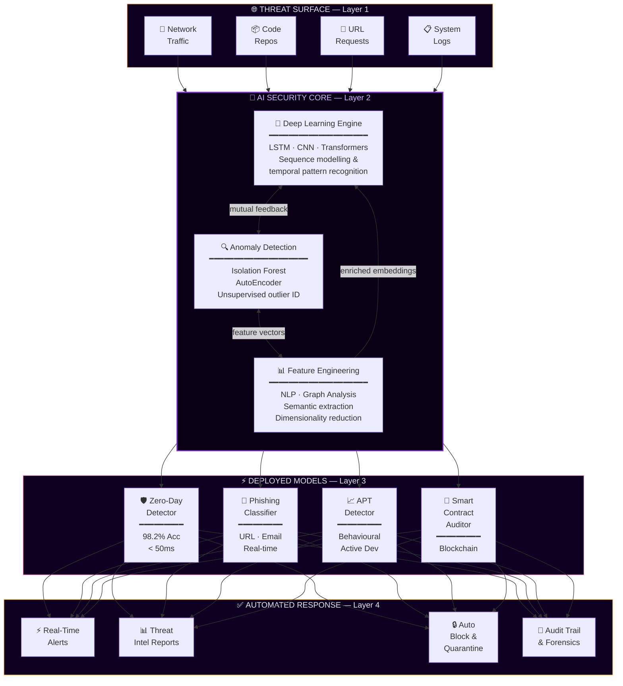
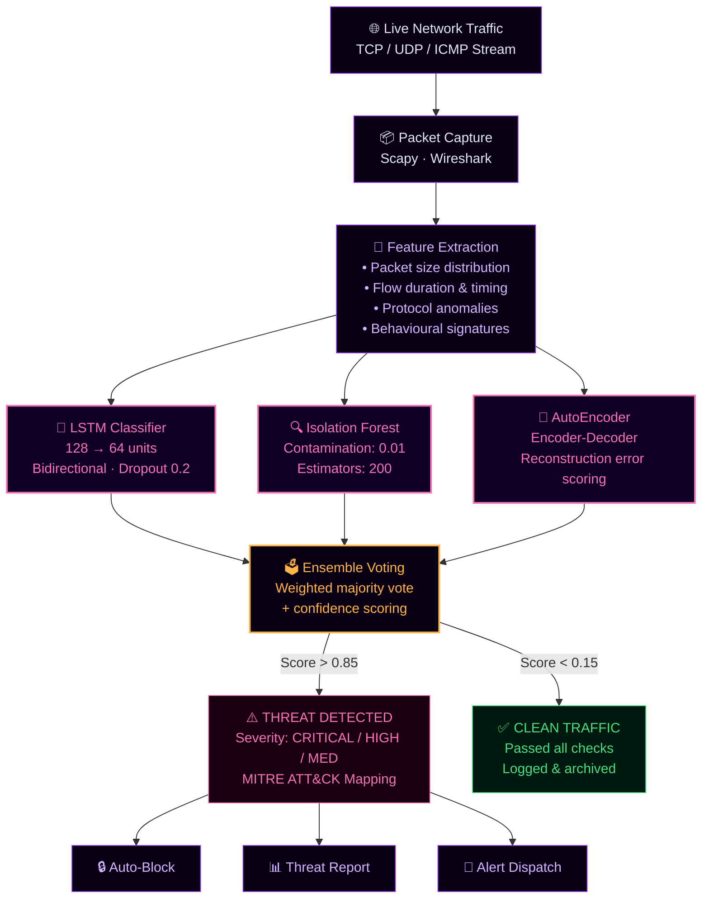
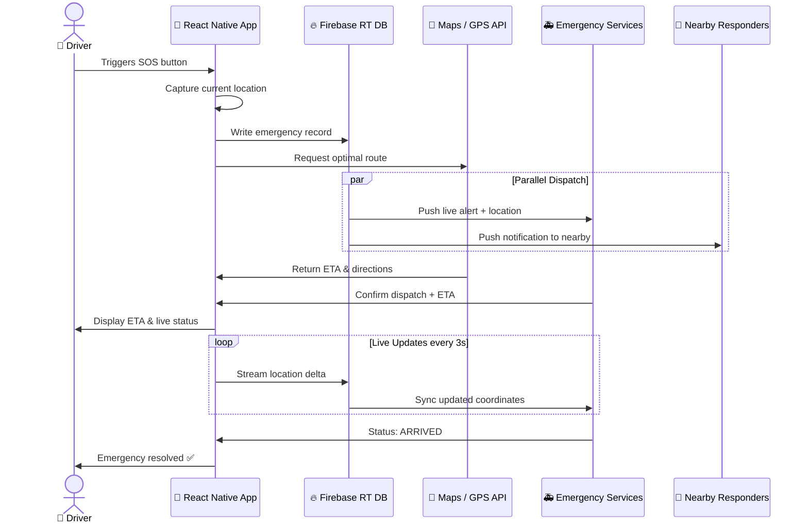
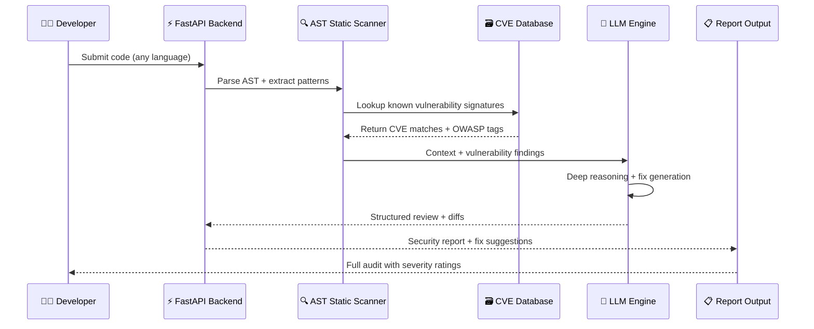
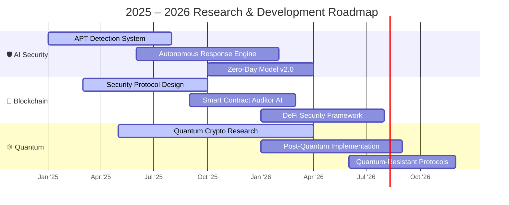
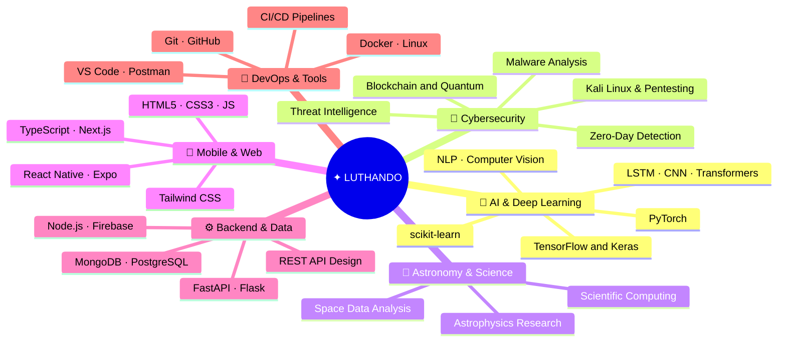

<!-- ════════════════════════════════════════════════════════════ -->
<!--              ✦  COSMIC HEADER — REDESIGNED  ✦              -->
<!-- ════════════════════════════════════════════════════════════ -->

<!-- TOP HEADER — Warm Cosmic Shark Wave -->


<br/>

<!-- ── MAIN HERO ──────────────────────────────────────────── -->
<div align="center">

<table border="0" cellspacing="0" cellpadding="0">
<tr>

<!-- ═══ LEFT — PHOTO + IDENTITY ═══ -->
<td align="center" valign="middle" width="250">

<br/>

<!-- Warm top bar -->


<br/>

<!-- Profile photo -->


<br/>

<!-- Warm bottom bar -->


<br/><br/>

<!-- Identity pills -->

<br/>

<br/>

<br/>


<br/>

</td>

<!-- ═══ SPACER ═══ -->
<td width="30"></td>

<!-- ═══ RIGHT — NAME + TYPING + BADGES + LINKS ═══ -->
<td align="left" valign="middle" width="520">

<br/>

<!-- Big name — warm gold Orbitron -->


<!-- Role cycling -->


<!-- Stat scanner -->


<br/><br/>

<!-- Status badges -->


<br/>


<br/>


<br/><br/>

<!-- Social links -->
[](https://luthandocandlovu.github.io/MY-PORTFOLIO/)
[](https://www.linkedin.com/in/luthando-candlovu-b59110324/)
<br/>
[](https://github.com/LuthandoCandlovu)
[](mailto:luthando.candlovu30@gmail.com)
[](https://wa.me/27782765932)

<br/>

</td>
</tr>
</table>

</div>

<!-- ── QUOTE BAR ────────────────────────────────────────────── -->
<div align="center">

<br/>


<br/><br/>

<!-- Warm gradient divider -->


</div>

<br/>

<!-- ═══════════════════════════════════════════════════════════ -->
<!--                       WHO AM I                              -->
<!-- ═══════════════════════════════════════════════════════════ -->

<div align="center">
<h2>✦ &nbsp;<code>> whoami</code></h2>
</div>

<br/>

<table align="center">
<tr>
<td width="52%" valign="top">

```yaml
┌─────────────────────────────────────────┐
│           SYSTEM IDENTIFICATION         │
├─────────────────────────────────────────┤
│ name       : Luthando Candlovu          │
│ role       : AI Security Engineer       │
│             & Deep Learning Researcher  │
│ location   : Eastern Cape, ZA  🇿🇦      │
│ degree     : BSc Computer Science       │
│ university : University of Fort Hare    │
│ experience : 3+ Years                   │
│ shipped    : 15+ Production Apps        │
│ certs      : 10 Professional            │
├─────────────────────────────────────────┤
│           ACTIVE RESEARCH               │
├─────────────────────────────────────────┤
│ APT Detection System    [████████░░] 80%│
│ Blockchain Security     [█████░░░░░] 55%│
│ Quantum Cryptography    [███░░░░░░░] 35%│
│ Autonomous AI Response  [████░░░░░░] 45%│
├─────────────────────────────────────────┤
│           AVAILABILITY                  │
├─────────────────────────────────────────┤
│ ✅ Full-time   ✅ Freelance             │
│ ✅ Research    ✅ Consulting            │
│ ✅ Remote Worldwide                     │
│ ✅ Relocation: Negotiable               │
└─────────────────────────────────────────┘
```

</td>
<td width="48%" align="center" valign="middle">


<br/><br/>


<br/><br/>


</td>
</tr>
</table>

<br/>

<div align="center">
<em><strong>✦ "I catch zero-days before antivirus even knows they exist." ✦</strong></em>
</div>

<br/>


<br/>

<!-- ═══════════════════════════════════════════════════════════ -->
<!--                   SYSTEM ARCHITECTURE                        -->
<!-- ═══════════════════════════════════════════════════════════ -->

<div align="center">

## `> system.architecture`

✦ **AI Security Core — Full System Design** ✦

</div>

<br/>

### 🌐 Layer 1 — Threat Ingestion Surface

```
╔══════════════════════════════════════════════════════════════════════════╗
║                     🌐  THREAT INGESTION SURFACE                        ║
╠═══════════════╦════════════════╦═══════════════════╦═════════════════════╣
║  🔴 NETWORK   ║  📦  PACKETS   ║   🔗  URL / DNS   ║   📋  SYSTEM LOGS  ║
║   TRAFFIC     ║   CAPTURE      ║    REQUESTS       ║   & AUDIT TRAILS   ║
║               ║                ║                   ║                    ║
║  Live pcap    ║  Deep packet   ║  Phishing &       ║  OS · App ·        ║
║  ingestion    ║  inspection    ║  malicious URL    ║  Security logs     ║
║  at scale     ║  & parsing     ║  classification   ║  correlation       ║
╚═══════════════╩════════════════╩═══════════════════╩═════════════════════╝
                                 ║
                              ▼  ║  ▼
```

<br/>

### 🤖 Layer 2 — AI Security Core


```mermaid
graph TB
    subgraph INGEST["🌐 THREAT SURFACE — Layer 1"]
        direction LR
        A["🔴 Network<br/>Traffic"]
        B["📦 Code<br/>Repos"]
        C["🔗 URL<br/>Requests"]
        D["📋 System<br/>Logs"]
    end

    subgraph CORE["🤖 AI SECURITY CORE — Layer 2"]
        direction TB
        E["🧠 Deep Learning Engine<br/>━━━━━━━━━━━━━━━━━━━━<br/>LSTM · CNN · Transformers<br/>Sequence modelling &<br/>temporal pattern recognition"]
        F["🔍 Anomaly Detection<br/>━━━━━━━━━━━━━━━━━━━━<br/>Isolation Forest<br/>AutoEncoder<br/>Unsupervised outlier ID"]
        G["📊 Feature Engineering<br/>━━━━━━━━━━━━━━━━━━━━<br/>NLP · Graph Analysis<br/>Semantic extraction<br/>Dimensionality reduction"]
        E <-->|"mutual feedback"| F
        F <-->|"feature vectors"| G
        G -->|"enriched embeddings"| E
    end

    subgraph MODELS["⚡ DEPLOYED MODELS — Layer 3"]
        direction LR
        H["🛡️ Zero-Day<br/>Detector<br/>━━━━━━━━━<br/>98.2% Acc<br/>< 50ms"]
        I["🎣 Phishing<br/>Classifier<br/>━━━━━━━━━<br/>URL · Email<br/>Real-time"]
        J["📈 APT<br/>Detector<br/>━━━━━━━━━<br/>Behavioural<br/>Active Dev"]
        K["🔐 Smart<br/>Contract<br/>Auditor<br/>━━━━━━━━━<br/>Blockchain"]
    end

    subgraph RESPONSE["✅ AUTOMATED RESPONSE — Layer 4"]
        direction LR
        L["⚡ Real-Time<br/>Alerts"]
        M["📊 Threat<br/>Intel Reports"]
        N["🔒 Auto<br/>Block &<br/>Quarantine"]
        O["🧾 Audit Trail<br/>& Forensics"]
    end

    A & B & C & D --> CORE
    CORE --> H & I & J & K
    H & I & J & K --> L & M & N & O

    style CORE fill:#0a0015,stroke:#9333EA,stroke-width:2px,color:#d4b3ff
    style INGEST fill:#0d0020,stroke:#FFB347,stroke-width:1px,color:#e2e8f0
    style MODELS fill:#0d0020,stroke:#F472B6,stroke-width:1px,color:#e2e8f0
    style RESPONSE fill:#0d0020,stroke:#FFB347,stroke-width:1px,color:#e2e8f0
```

<br/>

### 🔄 Layer 3 — Zero-Day Detection Pipeline


```mermaid
flowchart LR
    RAW["📥 Raw Data<br/>Ingestion"]:::input
    CLEAN["🧹 Normalise<br/>& Clean"]:::process
    FEAT["⚙️ Feature<br/>Extraction"]:::process
    WINDOW["📐 Time-Window<br/>Slicing"]:::process
    TRAIN["🧠 Model<br/>Training"]:::model
    EVAL["📊 Evaluation<br/>& Tuning"]:::model
    INFER["⚡ Real-Time<br/>Inference"]:::output
    ALERT["🚨 Threat<br/>Alert + Block"]:::output

    RAW --> CLEAN --> FEAT --> WINDOW --> TRAIN --> EVAL
    EVAL -->|"re-train loop"| TRAIN
    EVAL --> INFER --> ALERT

    classDef input fill:#0a0015,stroke:#FFB347,color:#FFB347
    classDef process fill:#0a0015,stroke:#9333EA,color:#d4b3ff
    classDef model fill:#0a0015,stroke:#F472B6,color:#F472B6
    classDef output fill:#0a0015,stroke:#FFB347,color:#FFB347
```

<br/>

### 🛡️ Layer 4 — Deep Threat Classification


```mermaid
flowchart TD
    TRAFFIC["🌐 Live Network Traffic\nTCP / UDP / ICMP Stream"]:::node

    TRAFFIC --> CAP["📦 Packet Capture\nScapy · Wireshark"]:::node
    CAP --> EXTRACT["🔧 Feature Extraction\n• Packet size distribution\n• Flow duration & timing\n• Protocol anomalies\n• Behavioural signatures"]:::process

    EXTRACT --> LSTM["🧠 LSTM Classifier\n128 → 64 units\nBidirectional · Dropout 0.2"]:::model
    EXTRACT --> ISO["🔍 Isolation Forest\nContamination: 0.01\nEstimators: 200"]:::model
    EXTRACT --> AUTO["📐 AutoEncoder\nEncoder-Decoder\nReconstruction error scoring"]:::model

    LSTM & ISO & AUTO --> ENSEMBLE["🗳️ Ensemble Voting\nWeighted majority vote\n+ confidence scoring"]:::ensemble

    ENSEMBLE -->|"Score > 0.85"| THREAT["⚠️ THREAT DETECTED\nSeverity: CRITICAL / HIGH / MED\nMITRE ATT&CK Mapping"]:::alert
    ENSEMBLE -->|"Score < 0.15"| SAFE["✅ CLEAN TRAFFIC\nPassed all checks\nLogged & archived"]:::safe

    THREAT --> BLOCK["🔒 Auto-Block"]:::action
    THREAT --> REPORT["📊 Threat Report"]:::action
    THREAT --> NOTIFY["📡 Alert Dispatch"]:::action

    classDef node fill:#0a0015,stroke:#9333EA,color:#e2e8f0
    classDef process fill:#0a0015,stroke:#9333EA,color:#d4b3ff
    classDef model fill:#100025,stroke:#F472B6,color:#F472B6,stroke-width:2px
    classDef ensemble fill:#0a0015,stroke:#FFB347,color:#FFB347,stroke-width:2px
    classDef alert fill:#1a0010,stroke:#F472B6,color:#F472B6
    classDef safe fill:#001a10,stroke:#4ADE80,color:#4ADE80
    classDef action fill:#0a0015,stroke:#9333EA,color:#d4b3ff
```

<br/>

### 📱 Layer 5 — Emergency Response Sequence (Vula Motor)


```mermaid
sequenceDiagram
    actor Driver as 👤 Driver
    participant App as 📱 React Native App
    participant FB as 🔥 Firebase RT DB
    participant GPS as 📍 Maps / GPS API
    participant ES as 🚑 Emergency Services
    participant Resp as 🔔 Nearby Responders

    Driver->>App: Triggers SOS button
    App->>App: Capture current location
    App->>FB: Write emergency record
    App->>GPS: Request optimal route

    par Parallel Dispatch
        FB->>ES: Push live alert + location
        FB->>Resp: Push notification to nearby
    end

    GPS->>App: Return ETA & directions
    ES->>App: Confirm dispatch + ETA
    App->>Driver: Display ETA & live status

    loop Live Updates every 3s
        App->>FB: Stream location delta
        FB->>ES: Sync updated coordinates
    end

    ES->>App: Status: ARRIVED
    App->>Driver: Emergency resolved ✅
```

<br/>

### 🧠 Layer 6 — LSTM Stock Predictor


```mermaid
graph LR
    YF["📊 yfinance\nMulti-year data"]:::input
    NORM["📐 MinMaxScaler\nNormalise [0,1]"]:::process
    WIN["🪟 Window Slicing\n60-day lookback"]:::process
    L1["🧠 LSTM Layer 1\n128 units\nreturn_seq=True"]:::lstm
    L2["🧠 LSTM Layer 2\n64 units\nreturn_seq=False"]:::lstm
    DROP["💧 Dropout\n0.2 rate"]:::reg
    DENSE["🎯 Dense(1)\nOutput layer"]:::output
    PRED["📈 Price Forecast\n+ Inverse transform"]:::result

    YF --> NORM --> WIN --> L1 --> L2 --> DROP --> DENSE --> PRED

    classDef input fill:#0a0015,stroke:#FFB347,color:#FFB347
    classDef process fill:#0a0015,stroke:#9333EA,color:#d4b3ff
    classDef lstm fill:#100025,stroke:#F472B6,color:#F472B6,stroke-width:2px
    classDef reg fill:#0a0015,stroke:#F472B6,color:#F472B6
    classDef output fill:#0a0015,stroke:#9333EA,color:#d4b3ff
    classDef result fill:#0a0015,stroke:#FFB347,color:#FFB347
```

<br/>

### 💬 Layer 7 — CodeSage AI Review Flow


```mermaid
sequenceDiagram
    participant Dev as 👨‍💻 Developer
    participant API as ⚡ FastAPI Backend
    participant AST as 🔍 AST Static Scanner
    participant CVE as 🗃️ CVE Database
    participant LLM as 🤖 LLM Engine
    participant Out as 📋 Report Output

    Dev->>API: Submit code (any language)
    API->>AST: Parse AST + extract patterns
    AST->>CVE: Lookup known vulnerability signatures
    CVE-->>AST: Return CVE matches + OWASP tags
    AST->>LLM: Context + vulnerability findings
    LLM->>LLM: Deep reasoning + fix generation
    LLM-->>API: Structured review + diffs
    API-->>Out: Security report + fix suggestions
    Out-->>Dev: Full audit with severity ratings
```

<br/>


<br/>

<!-- ═══════════════════════════════════════════════════════════ -->
<!--                    FEATURED PROJECTS                         -->
<!-- ═══════════════════════════════════════════════════════════ -->

<div align="center">

## `> projects.featured`

✦ **Production-Grade Systems — Built & Deployed** ✦

</div>

<br/>

---

### 🛡️ Project 01 — Zero-Day AI Threat Detector

<table>
<tr>
<td width="58%" valign="top">

[](https://github.com/LuthandoCandlovu/zero-day-detection)


**Deep neural network detecting novel, unseen threats in live network traffic — before antivirus signatures are written.**

- Real-time packet stream classification with bidirectional LSTM
- Isolation Forest for unsupervised zero-day anomaly detection
- AutoEncoder reconstruction error scoring for unknown threats
- Ensemble voting across 3 model heads with confidence scoring
- MITRE ATT&CK mapping for automatic threat categorisation
- Auto firewall rule push on high-confidence detections

```
Stack: Python · TensorFlow · scikit-learn · Scapy
       FastAPI · Docker · Linux · MITRE ATT&CK
```

</td>
<td width="42%" align="center">


```
┌──────────────────────┐
│   THREAT DASHBOARD   │
│  ──────────────────  │
│  Blocked:  ██ 2,847  │
│  Accuracy: ██ 98.2%  │
│  Response: ██ <50ms  │
│  Status:  ◉ ACTIVE   │
└──────────────────────┘
```

</td>
</tr>
</table>

---

### 💬 Project 02 — CodeSage AI — LLM Code Security Reviewer

<table>
<tr>
<td width="42%" align="center">


```
┌──────────────────────┐
│   CODESAGE SCANNER   │
│  ──────────────────  │
│  > Static analysis   │
│  > LLM reasoning     │
│  > CVE lookup        │
│                      │
│  ⚠ SQL Injection     │
│  ⚠ XSS Vulnerability │
│  ✅ Fix generated    │
└──────────────────────┘
```

</td>
<td width="58%" valign="top">

[](https://github.com/LuthandoCandlovu/codesage-ai)


**AI-powered code review agent combining static analysis with LLM deep reasoning to surface security vulnerabilities with fix suggestions.**

- Async FastAPI backend for high-throughput code submission
- Static analysis pipeline extracting AST-level patterns
- LLM reasoning for context-aware vulnerability explanation
- CVE database lookup and OWASP classification
- Auto-generated fix recommendations with diff output
- Supports Python, JavaScript, TypeScript, Java

```
Stack: Python · FastAPI · LLM API · AST Analysis
       Docker · PostgreSQL · REST · GitHub Actions
```

</td>
</tr>
</table>

---

### 🚗 Project 03 — Vula Motor — Emergency Response Platform

<table>
<tr>
<td width="58%" valign="top">

[](https://github.com/LuthandoCandlovu/Vula-Motor_App)


**Cross-platform emergency response iOS/Android app with SOS dispatch, real-time GPS streaming, and emergency services routing. Hackathon winner.**

- One-tap SOS trigger with automatic location capture
- Firebase Realtime Database for <100ms emergency dispatch
- Live GPS coordinate streaming to emergency services
- Optimal routing via Maps API with ETA calculation
- Push notifications to nearby community responders
- Offline-first architecture with sync on reconnect

```
Stack: React Native · TypeScript · Expo · Firebase
       Google Maps API · Push Notifications
```

</td>
<td width="42%" align="center">


```
┌──────────────────────┐
│   VULA MOTOR APP     │
│  ──────────────────  │
│      [🚨  SOS]       │
│  📍 Location: LIVE   │
│  🚑 ETA:  4 mins     │
│  📡 Responders: 3    │
│  ◉ Dispatching...    │
└──────────────────────┘
```

</td>
</tr>
</table>

---

### 📈 Project 04 — AI Stock Predictor — LSTM Neural Network

<table>
<tr>
<td width="42%" align="center">


```
┌──────────────────────┐
│  LSTM ARCHITECTURE   │
│  ──────────────────  │
│  Input: 60-day win   │
│  LSTM(128, seq=T)    │
│  LSTM(64)            │
│  Dropout(0.2)        │
│  Dense(1) → Price    │
└──────────────────────┘
```

</td>
<td width="58%" valign="top">

[](https://github.com/LuthandoCandlovu/Stock-Predictor)


**Multi-layer LSTM recurrent neural network trained on multi-year historical market data with full end-to-end prediction pipeline.**

LSTM Model Architecture:
```
yfinance → Normalise (MinMaxScaler) → Window(60)
  → LSTM(128, return_sequences=True)
  → LSTM(64,  return_sequences=False)
  → Dropout(0.2)
  → Dense(1)
  → Forecast → Inverse transform → Visualise
```

```
Stack: Python · TensorFlow · Keras · yfinance
       NumPy · Pandas · Matplotlib · Plotly
```

</td>
</tr>
</table>

<br/>

<div align="center">

[](https://github.com/LuthandoCandlovu/zero-day-detection)
&nbsp;
[](https://github.com/LuthandoCandlovu/codesage-ai)

[](https://github.com/LuthandoCandlovu/Vula-Motor_App)
&nbsp;
[](https://github.com/LuthandoCandlovu/Stock-Predictor)

</div>

<br/>


<br/>

<!-- ═══════════════════════════════════════════════════════════ -->
<!--                       TECH STACK                             -->
<!-- ═══════════════════════════════════════════════════════════ -->

<div align="center">

## `> tech.stack`

✦ **Tools, Frameworks & Technologies** ✦

<br/>

**🤖 AI / MACHINE LEARNING**

[](https://python.org)
[](https://tensorflow.org)
[](https://pytorch.org)
[](https://keras.io)
[](https://scikit-learn.org)
[](https://opencv.org)
[](https://numpy.org)
[](https://pandas.pydata.org)

<br/>

**🔐 CYBERSECURITY & RESEARCH**

[](https://kali.org)
[](https://wireshark.org)
[](https://metasploit.com)
[](https://portswigger.net)
[](https://linux.org)


<br/>

**📱 MOBILE & FRONTEND**

[](https://reactnative.dev)
[](https://typescriptlang.org)
[](https://nextjs.org)
[](https://developer.mozilla.org)
[](https://tailwindcss.com)
[](https://expo.dev)
[](https://html.spec.whatwg.org)
[](https://www.w3.org/Style/CSS/)

<br/>

**⚙️ BACKEND & DATABASES**

[](https://nodejs.org)
[](https://fastapi.tiangolo.com)
[](https://flask.palletsprojects.com)
[](https://java.com)
[](https://firebase.google.com)
[](https://mongodb.com)
[](https://sqlite.org)
[](https://postgresql.org)

<br/>

**🚀 DEVOPS & TOOLING**

[](https://docker.com)
[](https://git-scm.com)
[](https://github.com/LuthandoCandlovu)
[](https://github.com/features/actions)
[](https://postman.com)
[](https://code.visualstudio.com)

</div>

<br/>


<br/>

<!-- ═══════════════════════════════════════════════════════════ -->
<!--                     GITHUB ANALYTICS                         -->
<!-- ═══════════════════════════════════════════════════════════ -->

<div align="center">

## `> github.analytics`

✦ **Code Activity, Stats & Contributions** ✦

<br/><br/>


&nbsp;&nbsp;


<br/><br/>


<br/><br/>


<br/><br/>


</div>

<br/>


<br/>

<!-- ═══════════════════════════════════════════════════════════ -->
<!--                      RESEARCH ROADMAP                        -->
<!-- ═══════════════════════════════════════════════════════════ -->

<div align="center">

## `> research.roadmap`

✦ **2025 – 2026 Research & Build Timeline** ✦

</div>

<br/>


```mermaid
gantt
    title 2025 – 2026 Research & Development Roadmap
    dateFormat  YYYY-MM
    axisFormat  %b '%y

    section 🛡️ AI Security
    APT Detection System           :active, apt,  2025-01, 2025-08
    Autonomous Response Engine     :        are,  2025-06, 2026-02
    Zero-Day Model v2.0            :        zdv2, 2025-10, 2026-04

    section 🔗 Blockchain
    Security Protocol Design       :active, blk,  2025-03, 2025-10
    Smart Contract Auditor AI      :        sca,  2025-09, 2026-03
    DeFi Security Framework        :        dsf,  2026-01, 2026-08

    section ⚛️ Quantum
    Quantum Crypto Research        :active, qcr,  2025-05, 2026-04
    Post-Quantum Implementation    :        pqi,  2026-01, 2026-09
    Quantum-Resistant Protocols    :        qrp,  2026-06, 2026-12
```

<br/>

<table align="center">
<tr>
<th align="left">🔬 Research Track</th>
<th align="center">Status</th>
<th align="left">Progress</th>
<th align="center">ETA</th>
</tr>
<tr>
<td>🛡️ APT Detection System</td>
<td align="center"></td>
<td><code>████████░░ 80%</code></td>
<td align="center">Aug 2025</td>
</tr>
<tr>
<td>🤖 Autonomous Response Engine</td>
<td align="center"></td>
<td><code>████░░░░░░ 45%</code></td>
<td align="center">Feb 2026</td>
</tr>
<tr>
<td>🔗 Blockchain Security Protocol</td>
<td align="center"></td>
<td><code>█████░░░░░ 55%</code></td>
<td align="center">Oct 2025</td>
</tr>
<tr>
<td>📜 Smart Contract Auditor</td>
<td align="center"></td>
<td><code>█░░░░░░░░░ 10%</code></td>
<td align="center">Mar 2026</td>
</tr>
<tr>
<td>⚛️ Quantum Cryptography Research</td>
<td align="center"></td>
<td><code>███░░░░░░░ 35%</code></td>
<td align="center">Apr 2026</td>
</tr>
<tr>
<td>🔑 Post-Quantum Implementation</td>
<td align="center"></td>
<td><code>░░░░░░░░░░  0%</code></td>
<td align="center">Sep 2026</td>
</tr>
</table>

<br/>


<br/>

<!-- ═══════════════════════════════════════════════════════════ -->
<!--                   RESEARCH PUBLICATIONS                      -->
<!-- ═══════════════════════════════════════════════════════════ -->

<div align="center">

## `> research.publications`

✦ **Peer-Reviewed Academic Research** ✦

</div>

<br/>

<table align="center">
<tr>
<th align="left">📄 Paper Title</th>
<th align="center">🏛️ Venue</th>
<th align="center">📅 Year</th>
<th align="center">🏅 Award</th>
</tr>
<tr>
<td><strong>AI-Driven Cyber Threat Intelligence:<br/>A Deep Learning Framework</strong></td>
<td align="center">IEEE Security Symposium</td>
<td align="center">2024</td>
<td align="center">🥇 Best Paper</td>
</tr>
<tr>
<td><strong>Neural Networks in Intrusion Detection:<br/>Beyond Signature-Based Systems</strong></td>
<td align="center">ACM Computing Reviews</td>
<td align="center">2023</td>
<td align="center">📈 High Impact</td>
</tr>
<tr>
<td><strong>Machine Learning for Malware Analysis:<br/>Feature Engineering Approaches</strong></td>
<td align="center">Springer AI Journal</td>
<td align="center">2023</td>
<td align="center">🔬 Peer Reviewed</td>
</tr>
</table>

<br/>


<br/>

<!-- ═══════════════════════════════════════════════════════════ -->
<!--                      CERTIFICATIONS                          -->
<!-- ═══════════════════════════════════════════════════════════ -->

<div align="center">

## `> certifications.verified`

✦ **10 Professional Certifications — All Verified** ✦

<br/>


</div>

<br/>

<table align="center">
<tr>
<td align="center" width="25%">

**`01`**<br/>
<br/>
**AI Governance**<br/>
<sub>Securiti Education</sub><br/><br/>
[](https://github.com/user-attachments/files/23437206/AI-Governance-Certification-Securiti-Education.pdf)

</td>
<td align="center" width="25%">

**`02`**<br/>
<br/>
**Cisco Networking**<br/>
<sub>Cisco Systems</sub><br/><br/>
[](https://github.com/user-attachments/files/23437204/Cisco.certification.pdf)

</td>
<td align="center" width="25%">

**`03`**<br/>
<br/>
**Linux Professional**<br/>
<sub>Linux Professional Inst.</sub><br/><br/>
[](https://github.com/user-attachments/files/23437210/Linux.Certificate-4449-49671743.pdf)

</td>
<td align="center" width="25%">

**`04`**<br/>
<br/>
**Hackathon Winner**<br/>
<sub>Competitive Programming</sub><br/><br/>
[](https://github.com/user-attachments/files/23437207/Hackathon.certification.pdf)

</td>
</tr>
<tr>
<td align="center" width="25%">

**`05`**<br/>
<br/>
**BSc Computer Science**<br/>
<sub>University of Fort Hare</sub><br/><br/>
[](https://github.com/user-attachments/files/23437203/Luthando_candlovu_Certificate.pdf)

</td>
<td align="center" width="25%">

**`06`**<br/>
<br/>
**Professional Training**<br/>
<sub>Training Institute</sub><br/><br/>
[](https://github.com/user-attachments/files/23437205/Certificate.pdf)

</td>
<td align="center" width="25%">

**`07`**<br/>
<br/>
**Academic Excellence I**<br/>
<sub>University of Fort Hare</sub><br/><br/>
[](https://github.com/user-attachments/files/23437209/Luthando.Candlovu_certificate.1.pdf)

</td>
<td align="center" width="25%">

**`08`**<br/>
<br/>
**Academic Excellence II**<br/>
<sub>University of Fort Hare</sub><br/><br/>
[](https://github.com/user-attachments/files/23437208/Luthando.Candlovu_certificate.pdf)

</td>
</tr>
<tr>
<td align="center" width="25%" colspan="2">

**`09`**<br/>


<br/>

**IC Certificate**<br/>
<sub>Industry Credential</sub><br/><br/>

<br/><br/>
[](https://github.com/user-attachments/files/26298015/Luthando.Candlovu-ic-Certificate.pdf)

</td>
<td align="center" width="25%" colspan="2">

**`10`**<br/>


<br/>

**🌌 Astronomy Certification**<br/>
<sub>Space & Astrophysics</sub><br/><br/>

<br/><br/>
[](https://github.com/user-attachments/files/26298021/Astronomy.certification.Luthando.Candlo.pdf)

</td>
</tr>
</table>

<br/>

<div align="center">
<em><strong>✦ 10 Certifications spanning AI, Security, Networking, Linux, Astronomy & Academic Excellence ✦</strong></em>
</div>

<br/>


<br/>

<!-- ═══════════════════════════════════════════════════════════ -->
<!--                       SKILLS MATRIX                          -->
<!-- ═══════════════════════════════════════════════════════════ -->

<div align="center">

## `> skills.matrix`

✦ **Technical Proficiency Map** ✦

</div>

<br/>

<table align="center">
<tr>
<td width="50%" valign="top">

**🤖 AI / Machine Learning**
```
TensorFlow / Keras    ████████████████████ 95%
PyTorch               ████████████████░░░░ 88%
scikit-learn          ████████████████████ 92%
NumPy / Pandas        ████████████████████ 90%
OpenCV / CV2          ███████████████░░░░░ 82%
NLP / Transformers    ██████████████░░░░░░ 78%
```

**🔐 Security & Research**
```
Zero-Day Detection    ████████████████████ 98%
Threat Intelligence   ████████████████░░░░ 88%
Kali / Pentesting     █████████████░░░░░░░ 85%
Blockchain Security   ██████████████░░░░░░ 72%
Quantum Crypto        ███████████░░░░░░░░░ 55%
Malware Analysis      ███████████████░░░░░ 80%
```

</td>
<td width="50%" valign="top">

**📱 Mobile & Frontend**
```
React Native / Expo   ████████████████████ 90%
TypeScript            ████████████████░░░░ 88%
Next.js / React       ████████████████░░░░ 85%
Tailwind CSS          █████████████████░░░ 88%
HTML5 / CSS3 / JS     ████████████████████ 92%
UI/UX Design          ████████████░░░░░░░░ 75%
```

**⚙️ Backend & DevOps**
```
FastAPI / Flask       ████████████████░░░░ 88%
Node.js               ████████████████░░░░ 80%
Firebase / MongoDB    ████████████████░░░░ 85%
Docker / Linux        ████████████████░░░░ 82%
Git / GitHub          ████████████████████ 95%
REST / API Design     █████████████████░░░ 88%
```

</td>
</tr>
</table>

<br/>


```mermaid
mindmap
  root((✦ LUTHANDO))
    🤖 AI & Deep Learning
      TensorFlow and Keras
      PyTorch
      scikit-learn
      LSTM · CNN · Transformers
      NLP · Computer Vision
    🔐 Cybersecurity
      Zero-Day Detection
      Threat Intelligence
      Kali Linux & Pentesting
      Malware Analysis
      Blockchain and Quantum
    🌌 Astronomy & Science
      Astrophysics Research
      Space Data Analysis
      Scientific Computing
    📱 Mobile & Web
      React Native · Expo
      TypeScript · Next.js
      Tailwind CSS
      HTML5 · CSS3 · JS
    ⚙️ Backend & Data
      FastAPI · Flask
      Node.js · Firebase
      MongoDB · PostgreSQL
      REST API Design
    🚀 DevOps & Tools
      Docker · Linux
      Git · GitHub
      CI/CD Pipelines
      VS Code · Postman
```

<br/>


<br/>

<!-- ═══════════════════════════════════════════════════════════ -->
<!--                      CONTACT / HIRE                          -->
<!-- ═══════════════════════════════════════════════════════════ -->

<div align="center">

## `> contact.open`

✦ **Let's Build Something Extraordinary** ✦

<br/><br/>

```
╔══════════════════════════════════════════════════════════════════════╗
║                                                                      ║
║          ◉  ACTIVELY SEEKING OPPORTUNITIES — WORLDWIDE              ║
║                                                                      ║
║   🛡️  AI Security Engineering       🤖  Machine Learning / MLOps   ║
║   📱  Mobile Development            💻  Full-Stack Development      ║
║   🔬  Security Research             ☁️  Cloud & DevOps              ║
║   🎓  Academic Collaboration        🌐  Open-Source Contribution    ║
║   🌌  Astronomy & Space Research    🔐  Quantum Cryptography        ║
║                                                                      ║
║   📍  Eastern Cape, South Africa    🌍  Remote Worldwide  ✅        ║
║   📧  luthando.candlovu30@gmail.com                                 ║
║   📱  +27 78 276 5932                                               ║
║   🔗  linkedin.com/in/luthando-candlovu-b59110324                   ║
║                                                                      ║
╚══════════════════════════════════════════════════════════════════════╝
```

<br/>

[](https://luthandocandlovu.github.io/MY-PORTFOLIO/)
[](https://www.linkedin.com/in/luthando-candlovu-b59110324/)
[](mailto:luthando.candlovu30@gmail.com)
[](https://wa.me/27782765932)

<br/><br/>

<!-- GitHub contribution snake -->
<picture>
  <source media="(prefers-color-scheme: dark)" srcset="https://raw.githubusercontent.com/LuthandoCandlovu/LuthandoCandlovu/output/github-snake-dark.svg"/>
  <source media="(prefers-color-scheme: light)" srcset="https://raw.githubusercontent.com/LuthandoCandlovu/LuthandoCandlovu/output/github-snake.svg"/>
  
</picture>

<br/><br/>

[](https://github.com/LuthandoCandlovu)
&nbsp;&nbsp;
[](https://github.com/LuthandoCandlovu?tab=followers)

<br/><br/>

<!-- Warm cosmic footer wave — shark type from bottom -->


<br/>

<sub>© 2026 Luthando Candlovu &nbsp;·&nbsp; AI Security Researcher & Developer &nbsp;·&nbsp; Eastern Cape, South Africa 🇿🇦</sub>

</div>
