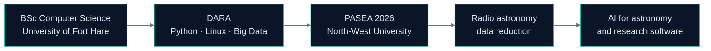
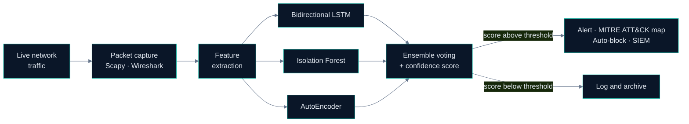
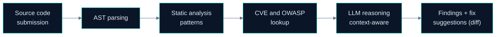

<!-- ═══════════════════════════════════════════════════════════════
     LUTHANDO CANDLOVU — GITHUB PROFILE
     Palette: Navy #0a1628 · Teal #14b8a6 · Gold #f5b942 · Slate #64748b
     Works in both GitHub light and dark mode.
     ═══════════════════════════════════════════════════════════════ -->

 

 

<!-- ─────────────────────────  HIGHLIGHTS  ───────────────────────── -->

<table>
<tr>
<td align="center" width="20%">
<h2>15+</h2>
APPS SHIPPED
</td>
<td align="center" width="20%">
<h2>98.2%</h2>
THREAT-DETECTION ACCURACY
</td>
<td align="center" width="20%">
<h2>1st</h2>
HACKATHON PLACE
</td>
<td align="center" width="20%">
<h2>2</h2>
ASTRONOMY PROGRAMMES DARA · PASEA
</td>
<td align="center" width="20%">
<h2>10+</h2>
CERTIFICATIONS
</td>
</tr>
</table>

 

<!-- ───────────────────────────  ABOUT  ─────────────────────────── -->

## About

I'm a **Computer Science graduate from the University of Fort Hare** who builds software people actually use, and who is increasingly drawn to the science behind the data.

My work sits between **software engineering, data science, AI/ML and scientific computing**, with a growing focus on **radio astronomy**. I've built web platforms, mobile apps and machine-learning systems for local institutions and community contexts. I'm now applying those skills to astronomy data: Python, Linux, big-data workflows and AI for science.

> **Currently looking for** opportunities in software engineering, data science, AI/ML and scientific computing, where I can contribute, keep learning and build real-world systems.

 

<!-- ─────────────────────  ASTRONOMY & SCIENCE  ───────────────────── -->

## Astronomy & Scientific Computing

<table>
<tr>
<td width="50%" valign="top">

### 🔭 PASEA
**Pan-African School for Emerging Astronomers**
North-West University · 14–18 September 2026

An intensive school for emerging African astronomers, adding astronomy foundations, research practice and a peer network to my software and data background.

<!-- Add your certificate link:
[View certificate](YOUR_PASEA_CERTIFICATE_LINK) -->

</td>
<td width="50%" valign="top">

### 📡 DARA
**Development in Africa with Radio Astronomy**
Python · Linux · Big Data · AI in Astronomy

Practical training in scientific-data workflows: reduction and analysis of radio astronomy data, and applying machine learning to astronomical problems.

<!-- Add your certificate link:
[View certificate](YOUR_DARA_CERTIFICATE_LINK) -->

</td>
</tr>
</table>

```mermaid
%%{init: {'theme':'base','themeVariables':{'primaryColor':'#0a1628','primaryTextColor':'#e2e8f0','primaryBorderColor':'#14b8a6','lineColor':'#64748b','fontFamily':'Inter, Segoe UI, sans-serif'}}}%%
flowchart LR
    A["BSc Computer Science<br/>University of Fort Hare"] --> B["DARA<br/>Python · Linux · Big Data"]
    B --> C["PASEA 2026<br/>North-West University"]
    C --> D["Radio astronomy<br/>data reduction"]
    D --> E["AI for astronomy<br/>and research software"]
```

| Focus | Tools & skills | Application |
|:---|:---|:---|
| **Scientific Python** | NumPy · Pandas · SciPy · Matplotlib | Numerical analysis and plotting of observational data |
| **Linux workflows** | Bash · Git · SSH · Docker | Running processing pipelines on remote and shared machines |
| **Data reduction** | Radio astronomy pipelines | Turning raw telescope data into science-ready products |
| **Machine learning** | TensorFlow · PyTorch · scikit-learn | Classification and anomaly detection on scientific data |
| **Research software** | Testing · CI · clean architecture | Reproducible, maintainable code |

 

<!-- ───────────────────────  WHAT I BUILD  ─────────────────────── -->

## What I build

| | Area | What it looks like |
|:---:|:---|:---|
| 🤖 | **AI / ML systems** | Deep-learning models, time-series prediction, NLP |
| 🛡️ | **Security tools** | Zero-day and anomaly detection, AI-assisted code review |
| 📊 | **Data pipelines** | Cleaning, feature engineering, log analysis, scientific data |
| 📱 | **Mobile apps** | Cross-platform apps with real-time features |
| 💻 | **Full-stack platforms** | Web systems for education, property management and community use |

 

<!-- ─────────────────────  FEATURED PROJECTS  ───────────────────── -->

## Featured projects

<table>
<tr>
<td width="50%" valign="top">

#### 🛡️ Zero-Day Detection
Deep-learning threat detection on live network traffic. A bidirectional LSTM, Isolation Forest and AutoEncoder ensemble, with MITRE ATT&CK mapping.

**98.2% accuracy · under 50 ms inference**

`Python` `TensorFlow` `scikit-learn`

[View repository →](https://github.com/LuthandoCandlovu/zero-day-detection)

</td>
<td width="50%" valign="top">

#### 🔍 CodeSage AI
Code security reviewer that combines static analysis (AST) with LLM reasoning to find vulnerabilities, map them to OWASP and suggest fixes.

**Async API · CVE lookup · inline diffs**

`Python` `FastAPI` `Docker` `PostgreSQL`

[View repository →](https://github.com/LuthandoCandlovu/codesage-ai)

</td>
</tr>
<tr>
<td width="50%" valign="top">

#### 🚑 Vula Motor 🏆
Emergency response app with one-tap SOS, live GPS streaming, nearby responder alerts and offline-first sync.

**1st place, hackathon**

`React Native` `TypeScript` `Firebase` `Expo`

[View repository →](https://github.com/LuthandoCandlovu/Vula-Motor_App)

</td>
<td width="50%" valign="top">

#### 📈 Stock Predictor
Multi-layer LSTM trained on multi-year market data, with an end-to-end pipeline from download to visualised prediction.

**LSTM 128 → 64 · 60-day window**

`Python` `Keras` `yfinance` `Plotly`

[View repository →](https://github.com/LuthandoCandlovu/Stock-Predictor)

</td>
</tr>
<tr>
<td width="50%" valign="top">

#### 🚦 Traffic Prediction
Machine-learning model that forecasts traffic patterns from historical data.

`Python` `scikit-learn`

<!-- Replace with the exact repo URL -->
[View repository →](https://github.com/LuthandoCandlovu?tab=repositories)

</td>
<td width="50%" valign="top">

#### 🗣️ African Language NLP
Natural language processing work focused on African languages, so language technology reaches more people.

`Python` `NLP`

<!-- Replace with the exact repo URL -->
[View repository →](https://github.com/LuthandoCandlovu?tab=repositories)

</td>
</tr>
<tr>
<td width="50%" valign="top">

#### 🧾 Log Anomaly Platform
Platform that ingests system logs and surfaces unusual behaviour.

`Python` `FastAPI`

<!-- Replace with the exact repo URL -->
[View repository →](https://github.com/LuthandoCandlovu?tab=repositories)

</td>
<td width="50%" valign="top">

#### 🌍 SkyWatch Africa
Astronomy project that makes African skies and space science more accessible.

`Python` `Astronomy`

<!-- Replace with the exact repo URL -->
[View repository →](https://github.com/LuthandoCandlovu?tab=repositories)

</td>
</tr>
</table>

<b>How Zero-Day Detection works</b> (architecture)

 

```mermaid
%%{init: {'theme':'base','themeVariables':{'primaryColor':'#0a1628','primaryTextColor':'#e2e8f0','primaryBorderColor':'#14b8a6','lineColor':'#64748b','fontFamily':'Inter, Segoe UI, sans-serif'}}}%%
flowchart LR
    T["Live network<br/>traffic"] --> C["Packet capture<br/>Scapy · Wireshark"]
    C --> F["Feature<br/>extraction"]
    F --> L["Bidirectional LSTM"]
    F --> I["Isolation Forest"]
    F --> A["AutoEncoder"]
    L --> E["Ensemble voting<br/>+ confidence score"]
    I --> E
    A --> E
    E -->|"score above threshold"| X["Alert · MITRE ATT&CK map<br/>Auto-block · SIEM"]
    E -->|"score below threshold"| S["Log and archive"]
```

<b>How CodeSage AI works</b> (architecture)

 

```mermaid
%%{init: {'theme':'base','themeVariables':{'primaryColor':'#0a1628','primaryTextColor':'#e2e8f0','primaryBorderColor':'#14b8a6','lineColor':'#64748b','fontFamily':'Inter, Segoe UI, sans-serif'}}}%%
flowchart LR
    S["Source code<br/>submission"] --> P["AST parsing"]
    P --> D["Static analysis<br/>patterns"]
    D --> V["CVE and OWASP<br/>lookup"]
    V --> M["LLM reasoning<br/>context-aware"]
    M --> R["Findings + fix<br/>suggestions (diff)"]
```

 

<!-- ────────────────────────  TECH STACK  ──────────────────────── -->

## Tech stack

| | |
|:---|:---|
| **Languages** |       |
| **AI / ML** |      |
| **Data & science** |     |
| **Backend** |        |
| **Frontend & mobile** |      |
| **DevOps & tools** |      |
| **Security** |     |

 

<!-- ───────────────────  RESEARCH & PUBLICATIONS  ─────────────────── -->

## Research & publications

<!-- Tip: add a DOI or link for each paper so readers can verify it -->

| Year | Paper | Venue | Note |
|:---:|:---|:---|:---|
| 2024 | AI-Driven Cyber Threat Intelligence: A Deep Learning Framework | IEEE Security Symposium | Best Paper |
| 2023 | Neural Networks in Intrusion Detection: Beyond Signature-Based Systems | ACM Computing Reviews | High impact |
| 2023 | Machine Learning for Malware Analysis: Feature Engineering Approaches | Springer AI Journal | Peer reviewed |

**Ongoing research interests:** advanced persistent threat detection · smart-contract security · post-quantum cryptography · AI for radio astronomy

 

<!-- ────────────────────  CERTIFICATIONS  ──────────────────── -->

## Certifications & achievements

| | Credential | Issuer | |
|:---:|:---|:---|:---:|
| 🔭 | **PASEA** · Sept 2026 | North-West University | <!-- add link --> |
| 📡 | **DARA** | Radio astronomy training | <!-- add link --> |
| 🌌 | **Astronomy Certification** | Space & Astrophysics | [View](https://github.com/user-attachments/files/26298021/Astronomy.certification.Luthando.Candlo.pdf) |
| 🏆 | **Hackathon 1st place** · Vula Motor | Hackathon | [View](https://github.com/user-attachments/files/23437207/Hackathon.certification.pdf) |
| 🎓 | **BSc Computer Science** | University of Fort Hare | [View](https://github.com/user-attachments/files/23437203/Luthando_candlovu_Certificate.pdf) |
| ⭐ | **Academic Excellence I** | University of Fort Hare | [View](https://github.com/user-attachments/files/23437209/Luthando.Candlovu_certificate.1.pdf) |
| ⭐ | **Academic Excellence II** | University of Fort Hare | [View](https://github.com/user-attachments/files/23437208/Luthando.Candlovu_certificate.pdf) |
| 🤖 | **AI Governance** | Securiti Education | [View](https://github.com/user-attachments/files/23437206/AI-Governance-Certification-Securiti-Education.pdf) |
| 🌐 | **Cisco Networking** | Cisco | [View](https://github.com/user-attachments/files/23437204/Cisco.certification.pdf) |
| 🐧 | **Linux** | Linux Professional Institute | [View](https://github.com/user-attachments/files/23437210/Linux.Certificate-4449-49671743.pdf) |
| 🎖️ | **IC Certificate** | Industry credential | [View](https://github.com/user-attachments/files/26298015/Luthando.Candlovu-ic-Certificate.pdf) |
| 📘 | **Professional Training** | Training institute | [View](https://github.com/user-attachments/files/23437205/Certificate.pdf) |

 

<!-- ──────────────────────  GITHUB ACTIVITY  ────────────────────── -->

## GitHub activity

 

<!-- ───────────────────────────  CONTACT  ─────────────────────────── -->

## Get in touch

I'm open to **full-time roles, freelance work, research collaboration and consulting**, remote worldwide.

| | |
|:---|:---|
| 📍 **Location** | Eastern Cape, South Africa |
| 📧 **Email** | [luthando.candlovu30@gmail.com](mailto:luthando.candlovu30@gmail.com) |
| 💼 **LinkedIn** | [linkedin.com/in/luthando-candlovu](https://www.linkedin.com/in/luthando-candlovu-b59110324/) |
| 🌐 **Portfolio** | [luthandocandlovu.github.io/MY-PORTFOLIO](https://luthandocandlovu.github.io/MY-PORTFOLIO/) |

<picture>
  <source media="(prefers-color-scheme: dark)" srcset="https://raw.githubusercontent.com/LuthandoCandlovu/LuthandoCandlovu/output/github-snake-dark.svg"/>
  <source media="(prefers-color-scheme: light)" srcset="https://raw.githubusercontent.com/LuthandoCandlovu/LuthandoCandlovu/output/github-snake.svg"/>
  
</picture>

© 2026 Luthando Candlovu · Eastern Cape, South Africa 🇿🇦

