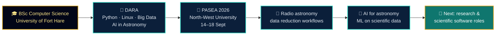
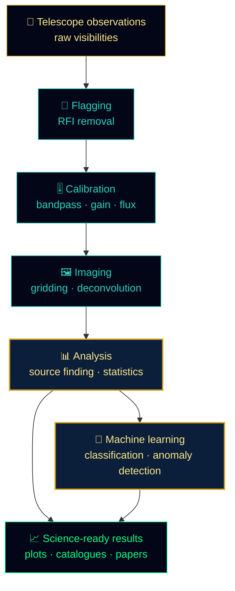
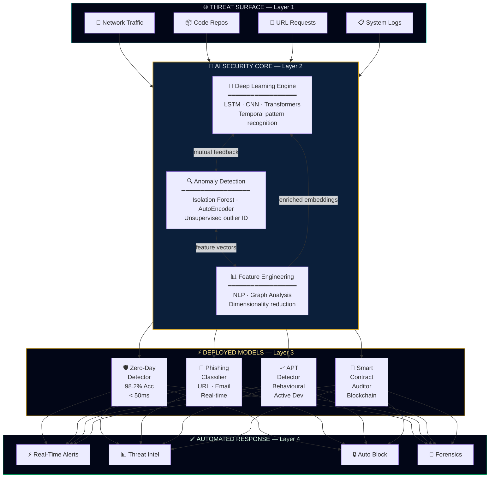
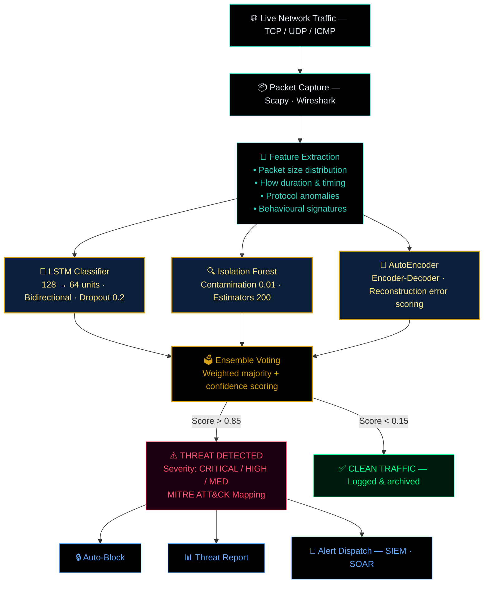
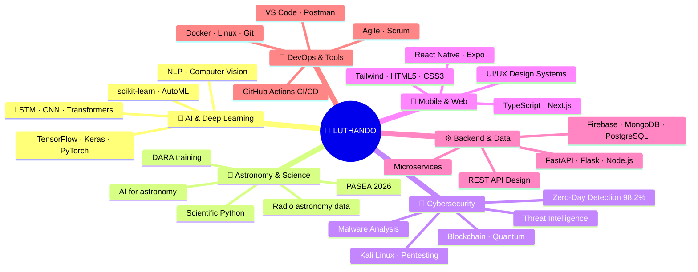
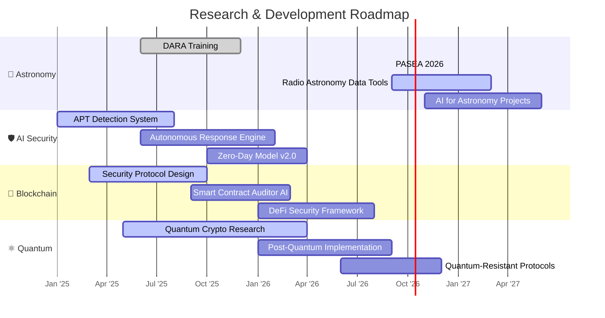

<div align="center">

<!-- ╔══════════════════════════════════════════════════════════════╗ -->
<!--           ANIMATED HEADER — NAVY · TEAL · GOLD COSMOS          -->
<!-- ╚══════════════════════════════════════════════════════════════╝ -->


</div>

<!-- ══════════════════════════════════════════════════════════════ -->
<!--                   ANIMATED TYPING LINES                       -->
<!-- ══════════════════════════════════════════════════════════════ -->

<div align="center">


<br/>

<!-- SOCIAL BADGES -->
<a href="https://www.linkedin.com/in/luthando-candlovu-b59110324/">
  
</a>
<a href="mailto:luthando.candlovu30@gmail.com">
  
</a>
<a href="https://luthandocandlovu.github.io/MY-PORTFOLIO/">
  
</a>
<a href="https://github.com/LuthandoCandlovu">
  
</a>
<a href="https://wa.me/27782765932">
  
</a>

<br/><br/>


</div>

<br/>

<!-- GOLD / TEAL DIVIDER -->


<br/>

<!-- ══════════════════════════════════════════════════════════════ -->
<!--                  🔭 NEW — PASEA PROMO BANNER                   -->
<!-- ══════════════════════════════════════════════════════════════ -->

<div align="center">


<br/>


</div>

<br/>


<br/>

<!-- ══════════════════════════════════════════════════════════════ -->
<!--                    ⚡ BOOT SEQUENCE                            -->
<!-- ══════════════════════════════════════════════════════════════ -->

<div align="center">


<br/>


<br/>

| &nbsp; | Module | Status | Signal |
|:---:|:---|:---:|:---:|
| 💻 | **Software Engineering Core** |  | `████████████ 100%` |
| 🤖 | **AI / Deep Learning Stack** |  | `████████████ 100%` |
| 🎯 | **Zero-Day Detector** |  | `███████████░  98%` |
| 📊 | **Data Science Pipelines** |  | `████████████ 100%` |
| 📡 | **Radio Astronomy Workflows** |  | `███████████░  90%` |
| 🔭 | **PASEA 2026** |  | `████████████ DONE` |
| 🔗 | **Blockchain Auditor** |  | `████████░░░░  55%` |
| ⚛️ | **Quantum Crypto Module** |  | `████░░░░░░░░  35%` |

<br/>


</div>

<br/>

<!-- ANIMATED GIF DIVIDER -->


<br/>

<!-- ══════════════════════════════════════════════════════════════ -->
<!--                    👤 WHO AM I — HERO SECTION                 -->
<!-- ══════════════════════════════════════════════════════════════ -->

<div align="center">

##  `> whoami`

</div>

<br/>

<table align="center">
<tr>
<td align="center" valign="middle" width="260">


<br/><br/>


<br/><br/>


<br/>


<br/>

<br/>

<br/>

<br/>


</td>

<td width="30"></td>

<td align="left" valign="middle" width="540">


<br/><br/>

```yaml
╔══════════════════════════════════════════════╗
║          SYSTEM IDENTIFICATION               ║
╠══════════════════════════════════════════════╣
║  name       : Luthando Candlovu              ║
║  alias      : LuthandoCandlovu               ║
║  role       : Software Developer             ║
║               AI/ML · Data · Scientific Comp ║
║  location   : Eastern Cape, ZA  🇿🇦          ║
║  degree     : BSc Computer Science           ║
║  university : University of Fort Hare        ║
║  training   : DARA · PASEA (Sept 2026)       ║
║  shipped    : 15+ Apps                       ║
║  certs      : 10+ Professional               ║
╠══════════════════════════════════════════════╣
║  ✅ Full-time   ✅ Freelance                  ║
║  ✅ Research    ✅ Consulting                 ║
║  ✅ Remote Worldwide                          ║
╚══════════════════════════════════════════════╝
```

</td>
</tr>
</table>

<br/>

<div align="center">

> ### 🌌 *"I sit at the intersection of two infinite frontiers —*
> ### *cyberspace and outer space. I build in one.*
> ### *I'm learning to explore the other."*
>
> **— Luthando Candlovu, Eastern Cape 🇿🇦**


</div>

<br/>


<br/>

<!-- ══════════════════════════════════════════════════════════════ -->
<!--                  🎯 WHAT I'M LOOKING FOR                       -->
<!-- ══════════════════════════════════════════════════════════════ -->

<div align="center">

##  `> currently.looking.for`


</div>

<br/>

<div align="center">

| 💻 Software Engineering | 📊 Data Science | 🤖 AI / ML | 🔭 Scientific Computing |
|:---:|:---:|:---:|:---:|
| Full-stack web | Data pipelines | Deep learning | Radio astronomy data |
| Mobile apps | Feature engineering | NLP | Python + Linux workflows |
| APIs & backends | Analysis & visualisation | Time-series | Data reduction |
| Cloud & DevOps | Log & anomaly analysis | Computer vision | AI for astronomy |

</div>

<br/>


<br/>

<!-- ══════════════════════════════════════════════════════════════ -->
<!--                     ⚡ QUICK FIRE STATS                        -->
<!-- ══════════════════════════════════════════════════════════════ -->

<div align="center">

##  `> quick.stats`


<br/><br/>

| ⚡ Metric | 🔢 Value | 🌟 Context |
|:---|:---:|:---|
| 🎯 Threat Detection Accuracy | **98.2%** | Live network traffic classification |
| ⏱️ Real-Time Inference Speed | **< 50ms** | End-to-end zero-day detection |
| 🚀 Production Apps Shipped | **15+** | Web · Mobile · AI · Security |
| 🏆 Hackathon Awards | **1st Place** | Vula Motor Emergency Platform |
| 🔭 Astronomy Training | **DARA + PASEA** | Radio astronomy · Sept 2026 |
| 📜 Professional Certifications | **10+** | AI · Cisco · Linux · Astronomy + more |
| 📚 Research Papers | **3** | IEEE · ACM · Springer |
| 🌍 Reach | **Worldwide** | Remote · Open to relocation |
| ☕ Fuel | **Infinite** | Coffee + Code + Curiosity |

<br/>

<table>
<tr>
<td align="center"></td>
<td align="center"></td>
<td align="center"></td>
<td align="center"></td>
<td align="center"></td>
</tr>
</table>

</div>

<br/>


<br/>
<!-- ══════════════════════════════════════════════════════════════ -->
<!--        🌌 ASTRONOMY & SCIENTIFIC COMPUTING — PASEA + DARA      -->
<!-- ══════════════════════════════════════════════════════════════ -->

<div align="center">

##  `> astronomy.scientific.computing`

**Radio Astronomy · Scientific Data · AI for Science**


</div>

<br/>

<div align="center">


</div>

<br/>

<table align="center">
<tr>
<td width="50%" valign="top">

### 🔭 PASEA — 2026

**Pan-African School for Emerging Astronomers**
North-West University · **14–18 September 2026**


An intensive school for emerging African astronomers. It gave me astronomy foundations, exposure to research practice and a network of fellow early-career astronomers, and it strengthens my software and data background with real scientific context.

<!-- Add your PASEA certificate link below:
[](YOUR_PASEA_CERTIFICATE_LINK)
-->

</td>
<td width="50%" valign="top">

### 📡 DARA

**Development in Africa with Radio Astronomy**
Python · Linux · Big Data · AI in Astronomy


Practical training in scientific-data workflows: Python and Linux tooling, big-data handling and reduction of radio astronomy data, and applying AI methods to astronomical problems.

<!-- Add your DARA certificate link below:
[](YOUR_DARA_CERTIFICATE_LINK)
-->

</td>
</tr>
</table>

<br/>

### 🧭 Astronomy journey


```mermaid
flowchart LR
    A["🎓 BSc Computer Science<br/>University of Fort Hare"]:::start
    B["📡 DARA<br/>Python · Linux · Big Data<br/>AI in Astronomy"]:::step
    C["🔭 PASEA 2026<br/>North-West University<br/>14–18 Sept"]:::step
    D["🌌 Radio astronomy<br/>data reduction workflows"]:::step
    E["🤖 AI for astronomy<br/>ML on scientific data"]:::step
    F["🚀 Next: research &<br/>scientific software roles"]:::goal

    A --> B --> C --> D --> E --> F

    classDef start fill:#020617,stroke:#d4a017,color:#fde68a,stroke-width:2px
    classDef step fill:#0b1f3a,stroke:#2dd4bf,color:#e2e8f0,stroke-width:2px
    classDef goal fill:#0f766e,stroke:#d4a017,color:#ffffff,stroke-width:2px
```

<br/>

### 🛰️ Radio astronomy data workflow


```mermaid
flowchart TD
    OBS["📡 Telescope observations<br/>raw visibilities"]:::input
    FLAG["🚩 Flagging<br/>RFI removal"]:::process
    CAL["🎚️ Calibration<br/>bandpass · gain · flux"]:::process
    IMG["🖼️ Imaging<br/>gridding · deconvolution"]:::process
    ANALYSE["📊 Analysis<br/>source finding · statistics"]:::model
    ML["🤖 Machine learning<br/>classification · anomaly detection"]:::model
    OUT["📈 Science-ready results<br/>plots · catalogues · papers"]:::output

    OBS --> FLAG --> CAL --> IMG --> ANALYSE --> OUT
    ANALYSE --> ML --> OUT

    classDef input fill:#020617,stroke:#d4a017,color:#fde68a
    classDef process fill:#020617,stroke:#2dd4bf,color:#2dd4bf
    classDef model fill:#0b1f3a,stroke:#d4a017,color:#fde68a,stroke-width:2px
    classDef output fill:#020617,stroke:#00ff88,color:#00ff88
```

<br/>

### 🧰 What I bring to scientific computing

<div align="center">

| 🌌 Area | 🛠️ Tools & skills | 💡 How it connects |
|:---|:---|:---|
| **Scientific Python** | NumPy · Pandas · SciPy · Matplotlib | Numerical analysis and plotting of observational data |
| **Linux workflows** | Bash · Git · SSH · Docker | Running processing pipelines on remote and shared machines |
| **Data reduction** | Radio astronomy pipelines (DARA) | Turning raw telescope data into science-ready products |
| **Machine learning** | TensorFlow · PyTorch · scikit-learn | Classification, anomaly detection and time-series on scientific data |
| **Big data** | Large-array handling · efficient I/O | Working with data volumes typical of modern telescopes |
| **Software engineering** | Testing · CI · clean architecture | Reproducible, maintainable research code |

</div>

<br/>

<div align="center">


</div>

<br/>


<br/>

<!-- ══════════════════════════════════════════════════════════════ -->
<!--                  🛤️ STORY / TIMELINE                          -->
<!-- ══════════════════════════════════════════════════════════════ -->

<div align="center">

##  `> timeline.story`

**From Eastern Cape to Global Impact — The Journey**


</div>

<br/>

<div align="center">

<table border="0" cellpadding="0" cellspacing="0" width="98%">
<tr>
<td align="center" width="23%">

<br/>

<br/><sub>Where the journey began</sub>
</td>
<td align="center" width="3%">

</td>
<td align="center" width="23%">

<br/>

<br/><sub>Academic Excellence Awards</sub>
</td>
<td align="center" width="3%">

</td>
<td align="center" width="23%">

<br/>

<br/><sub>Vula Motor · 1st Place</sub>
</td>
<td align="center" width="3%">

</td>
<td align="center" width="23%">

<br/>

<br/><sub>Radio astronomy training</sub>
</td>
</tr>
</table>

<br/>


</div>

<br/>


<br/>

<!-- ══════════════════════════════════════════════════════════════ -->
<!--                  🔭 CURRENTLY BUILDING                         -->
<!-- ══════════════════════════════════════════════════════════════ -->

<div align="center">

##  `> now.building`


</div>

<br/>

<div align="center">

<table>
<tr>
<td align="center" width="25%">


### 🛡️ APT Detection v2

**Advanced Persistent Threat**
behavioural engine with
autonomous countermeasures


`████████░░ 80%`

</td>
<td align="center" width="25%">


### 📡 Radio Astronomy Data Tools

**Python workflows** for reducing
and analysing radio astronomy
data, built after DARA + PASEA


`██████░░░░ growing`

</td>
<td align="center" width="25%">


### ⚛️ Quantum Cryptography

**Post-quantum resistant** protocols
for tomorrow's threat landscape.
Research phase ongoing.


`███░░░░░░░ 35%`

</td>
<td align="center" width="25%">


### 🔗 Blockchain Auditor AI

**Smart contract vulnerability**
scanner — LLM reasoning
+ static analysis fusion.


`█████░░░░░ 55%`

</td>
</tr>
</table>

</div>

<br/>


<br/>
<!-- ══════════════════════════════════════════════════════════════ -->
<!--                    🏗️ SYSTEM ARCHITECTURE                      -->
<!-- ══════════════════════════════════════════════════════════════ -->

<div align="center">

##  `> system.architecture`

**AI Security Core — Full Stack Design**

</div>

<br/>

### 🌐 Layer 1 — Threat Ingestion Surface

```
╔══════════════════════════════════════════════════════════════════════════╗
║                     🌐  THREAT INGESTION SURFACE                        ║
╠═══════════════╦════════════════╦═══════════════════╦═════════════════════╣
║  🔴 NETWORK   ║  📦  PACKETS   ║   🔗  URL / DNS   ║   📋  SYSTEM LOGS  ║
║   TRAFFIC     ║   CAPTURE      ║    REQUESTS       ║   & AUDIT TRAILS   ║
║               ║                ║                   ║                    ║
║  Live pcap    ║  Deep packet   ║  Phishing &       ║  OS · App ·        ║
║  ingestion    ║  inspection    ║  malicious URL    ║  Security logs     ║
║  at scale     ║  & parsing     ║  classification   ║  correlation       ║
╚═══════════════╩════════════════╩═══════════════════╩═════════════════════╝
```

<br/>

### 🤖 Layer 2 — AI Security Core


```mermaid
graph TB
    subgraph INGEST["🌐 THREAT SURFACE — Layer 1"]
        direction LR
        A["🔴 Network Traffic"]
        B["📦 Code Repos"]
        C["🔗 URL Requests"]
        D["📋 System Logs"]
    end

    subgraph CORE["🤖 AI SECURITY CORE — Layer 2"]
        direction TB
        E["🧠 Deep Learning Engine<br/>━━━━━━━━━━━━━━━━━━<br/>LSTM · CNN · Transformers<br/>Temporal pattern recognition"]
        F["🔍 Anomaly Detection<br/>━━━━━━━━━━━━━━━━━━<br/>Isolation Forest · AutoEncoder<br/>Unsupervised outlier ID"]
        G["📊 Feature Engineering<br/>━━━━━━━━━━━━━━━━━━<br/>NLP · Graph Analysis<br/>Dimensionality reduction"]
        E <-->|"mutual feedback"| F
        F <-->|"feature vectors"| G
        G -->|"enriched embeddings"| E
    end

    subgraph MODELS["⚡ DEPLOYED MODELS — Layer 3"]
        direction LR
        H["🛡️ Zero-Day<br/>Detector<br/>98.2% Acc<br/>< 50ms"]
        I["🎣 Phishing<br/>Classifier<br/>URL · Email<br/>Real-time"]
        J["📈 APT<br/>Detector<br/>Behavioural<br/>Active Dev"]
        K["🔐 Smart<br/>Contract<br/>Auditor<br/>Blockchain"]
    end

    subgraph RESPONSE["✅ AUTOMATED RESPONSE — Layer 4"]
        direction LR
        L["⚡ Real-Time Alerts"]
        M["📊 Threat Intel"]
        N["🔒 Auto Block"]
        O["🧾 Forensics"]
    end

    A & B & C & D --> CORE
    CORE --> H & I & J & K
    H & I & J & K --> L & M & N & O

    style CORE fill:#0b1f3a,stroke:#d4a017,stroke-width:2px,color:#e2e8f0
    style INGEST fill:#020617,stroke:#2dd4bf,stroke-width:1px,color:#e2e8f0
    style MODELS fill:#020617,stroke:#d4a017,stroke-width:1px,color:#fde68a
    style RESPONSE fill:#020617,stroke:#00ff88,stroke-width:1px,color:#dcfce7
```

<br/>

### 🔄 Layer 3 — Zero-Day Detection Pipeline


```mermaid
flowchart LR
    RAW["📥 Raw Data<br/>Ingestion"]:::input
    CLEAN["🧹 Normalise<br/>& Clean"]:::process
    FEAT["⚙️ Feature<br/>Extraction"]:::process
    WINDOW["📐 Time-Window<br/>Slicing"]:::process
    TRAIN["🧠 Model<br/>Training"]:::model
    EVAL["📊 Evaluation<br/>& Tuning"]:::model
    INFER["⚡ Real-Time<br/>Inference"]:::output
    ALERT["🚨 Threat<br/>Alert + Block"]:::output

    RAW --> CLEAN --> FEAT --> WINDOW --> TRAIN --> EVAL
    EVAL -->|"re-train loop"| TRAIN
    EVAL --> INFER --> ALERT

    classDef input fill:#000000,stroke:#d4a017,color:#d4a017
    classDef process fill:#000000,stroke:#2dd4bf,color:#2dd4bf
    classDef model fill:#0b1f3a,stroke:#d4a017,color:#fde68a
    classDef output fill:#000000,stroke:#00ff88,color:#00ff88
```

<br/>

### 🛡️ Layer 4 — Deep Threat Classification


```mermaid
flowchart TD
    TRAFFIC["🌐 Live Network Traffic — TCP / UDP / ICMP"]:::node
    TRAFFIC --> CAP["📦 Packet Capture — Scapy · Wireshark"]:::node
    CAP --> EXTRACT["🔧 Feature Extraction\n• Packet size distribution\n• Flow duration & timing\n• Protocol anomalies\n• Behavioural signatures"]:::process

    EXTRACT --> LSTM["🧠 LSTM Classifier\n128 → 64 units · Bidirectional · Dropout 0.2"]:::model
    EXTRACT --> ISO["🔍 Isolation Forest\nContamination 0.01 · Estimators 200"]:::model
    EXTRACT --> AUTO["📐 AutoEncoder\nEncoder-Decoder · Reconstruction error scoring"]:::model

    LSTM & ISO & AUTO --> ENSEMBLE["🗳️ Ensemble Voting\nWeighted majority + confidence scoring"]:::ensemble

    ENSEMBLE -->|"Score > 0.85"| THREAT["⚠️ THREAT DETECTED\nSeverity: CRITICAL / HIGH / MED\nMITRE ATT&CK Mapping"]:::alert
    ENSEMBLE -->|"Score < 0.15"| SAFE["✅ CLEAN TRAFFIC — Logged & archived"]:::safe

    THREAT --> BLOCK["🔒 Auto-Block"]:::action
    THREAT --> REPORT["📊 Threat Report"]:::action
    THREAT --> NOTIFY["📡 Alert Dispatch — SIEM · SOAR"]:::action

    classDef node fill:#000000,stroke:#2dd4bf,color:#e2e8f0
    classDef process fill:#000000,stroke:#2dd4bf,color:#2dd4bf
    classDef model fill:#0b1f3a,stroke:#d4a017,color:#fde68a,stroke-width:2px
    classDef ensemble fill:#000000,stroke:#d4a017,color:#d4a017,stroke-width:2px
    classDef alert fill:#1a0010,stroke:#ff4d6d,color:#ff4d6d
    classDef safe fill:#001a10,stroke:#00ff88,color:#00ff88
    classDef action fill:#000000,stroke:#60A5FA,color:#60A5FA
```

<br/>


<br/>

<!-- ══════════════════════════════════════════════════════════════ -->
<!--                     🚀 FEATURED PROJECTS                       -->
<!-- ══════════════════════════════════════════════════════════════ -->

<div align="center">

##  `> projects.featured`

**Production-Grade Systems — Built, Deployed, Defended**


</div>

<br/>

---

### 🛡️ `PROJECT_01` — Zero-Day AI Threat Detector

<table>
<tr>
<td width="58%" valign="top">

[](https://github.com/LuthandoCandlovu/zero-day-detection)


> **Deep neural network detecting novel, unseen threats in live network traffic — before antivirus signatures exist.**

- 🔴 Real-time packet stream classification with bidirectional LSTM
- 🔍 Isolation Forest for unsupervised zero-day anomaly detection
- 📐 AutoEncoder reconstruction error scoring for unknown threats
- 🗳️ Ensemble voting across 3 model heads with confidence scoring
- 🗺️ MITRE ATT&CK mapping for automatic threat categorisation
- 🔒 Auto firewall rule push on high-confidence detections

```python
# Sample classification output
{
  "threat_type":  "zero_day_exploit",
  "severity":     "CRITICAL",
  "confidence":   0.982,
  "response_ms":  47,
  "mitre_tactic": "TA0001 — Initial Access",
  "action":       "AUTO_BLOCK + ALERT"
}
```

</td>
<td width="42%" align="center" valign="middle">


```
╔══════════════════════╗
║   THREAT DASHBOARD   ║
║   (sample display)   ║
║  ──────────────────  ║
║  Accuracy: ██ 98.2%  ║
║  Response: ██ <50ms  ║
║  Models:   ██ 3      ║
║  Status:  ◉ ACTIVE   ║
╚══════════════════════╝
```

</td>
</tr>
</table>

---

### 💬 `PROJECT_02` — CodeSage AI — LLM Code Security Reviewer

<table>
<tr>
<td width="42%" align="center" valign="middle">


```
╔══════════════════════╗
║   CODESAGE SCANNER   ║
║  ──────────────────  ║
║  > AST parse...  ✅  ║
║  > CVE lookup... ✅  ║
║  > LLM reason... ✅  ║
║                      ║
║  ⚠ SQL Injection     ║
║  ⚠ XSS Vector        ║
║  ✅ Fix generated    ║
╚══════════════════════╝
```

</td>
<td width="58%" valign="top">

[](https://github.com/LuthandoCandlovu/codesage-ai)


> **AI-powered code review agent fusing static analysis with LLM deep reasoning to surface vulnerabilities with precise fix suggestions.**

- ⚡ Async FastAPI backend for high-throughput code submission
- 🌲 Static analysis pipeline extracting AST-level patterns
- 🤖 LLM reasoning for context-aware vulnerability explanation
- 🗃️ CVE database lookup and OWASP Top 10 classification
- 🔧 Auto-generated fix recommendations with inline diff output
- 🌐 Supports Python · JavaScript · TypeScript · Java

```
Stack: Python · FastAPI · LLM API · AST · Docker
       PostgreSQL · REST API · GitHub Actions CI
```

</td>
</tr>
</table>

---

### 🚗 `PROJECT_03` — Vula Motor — Emergency Response Platform 🏆

<table>
<tr>
<td width="58%" valign="top">

[](https://github.com/LuthandoCandlovu/Vula-Motor_App)


> **Cross-platform emergency response app with one-tap SOS, real-time GPS streaming to emergency services, and community responder dispatch.**

- 🆘 One-tap SOS with automatic GPS location capture
- 🔥 Firebase Realtime DB for <100ms emergency dispatch
- 📡 Live GPS streaming to emergency services feed
- 🗺️ Optimal routing via Maps API with live ETA
- 🔔 Push notifications to nearby community responders
- 📶 Offline-first with intelligent sync on reconnect

```
Stack: React Native · TypeScript · Expo
       Firebase RTDB · Google Maps API
       Push Notifications · Offline Sync
```

</td>
<td width="42%" align="center" valign="middle">


```
╔══════════════════════╗
║   VULA MOTOR  🚑     ║
║  ──────────────────  ║
║                      ║
║      [🚨  SOS]       ║
║                      ║
║  📍 Location: LIVE   ║
║  🚑 ETA:  4 mins     ║
║  📡 Responders: 3    ║
║  ◉ DISPATCHING...    ║
╚══════════════════════╝
```

</td>
</tr>
</table>

---

### 📈 `PROJECT_04` — AI Stock Predictor — LSTM Neural Network

<table>
<tr>
<td width="42%" align="center" valign="middle">


```
╔══════════════════════╗
║  LSTM ARCHITECTURE   ║
║  ──────────────────  ║
║  Input: 60-day win   ║
║  LSTM(128, seq=T)    ║
║         ↓            ║
║  LSTM(64, seq=F)     ║
║         ↓            ║
║  Dropout(0.2)        ║
║         ↓            ║
║  Dense(1) → Price 📈 ║
╚══════════════════════╝
```

</td>
<td width="58%" valign="top">

[](https://github.com/LuthandoCandlovu/Stock-Predictor)


> **Multi-layer LSTM recurrent neural network trained on multi-year historical market data with a full end-to-end prediction pipeline.**

```python
# Full architecture
yfinance()
  → MinMaxScaler()      # Normalise [0, 1]
  → WindowSlice(60)     # 60-day lookback
  → LSTM(128, seq=True) # Layer 1
  → LSTM(64, seq=False) # Layer 2
  → Dropout(0.2)        # Regularisation
  → Dense(1)            # Price output
  → inverse_transform() # Rescale
  → Visualise()         # Plotly chart
```

</td>
</tr>
</table>

---

### 🚦 `PROJECT_05` — Traffic Prediction

<table>
<tr>
<td width="58%" valign="top">

<!-- Replace the repo link below with the exact repo URL -->
[](https://github.com/LuthandoCandlovu?tab=repositories)


> **Machine-learning model that predicts traffic patterns from historical data.**

- 📊 Data cleaning and feature engineering on time-based traffic data
- 🤖 Model training and evaluation for traffic forecasting
- 📈 Visual analysis of patterns across time and location

</td>
<td width="42%" align="center" valign="middle">

```
╔══════════════════════╗
║  TRAFFIC PREDICTION  ║
║  ──────────────────  ║
║  Data  → Clean       ║
║  Model → Train       ║
║  Result → Forecast   ║
╚══════════════════════╝
```

</td>
</tr>
</table>

---

### 🗣️ `PROJECT_06` — African Language NLP

<table>
<tr>
<td width="42%" align="center" valign="middle">

```
╔══════════════════════╗
║   AFRICAN LANG NLP   ║
║  ──────────────────  ║
║  Text → Tokenise     ║
║  Model → Understand  ║
║  Goal → Inclusion    ║
╚══════════════════════╝
```

</td>
<td width="58%" valign="top">

<!-- Replace the repo link below with the exact repo URL -->
[](https://github.com/LuthandoCandlovu?tab=repositories)


> **Natural language processing work focused on African languages, so language technology serves more people.**

- 🌍 Text processing for under-resourced African languages
- 🤖 Model experiments with modern NLP approaches
- 📚 Built with local language inclusion in mind

</td>
</tr>
</table>

---

### 🧾 `PROJECT_07` — Log Anomaly Platform

<table>
<tr>
<td width="58%" valign="top">

<!-- Replace the repo link below with the exact repo URL -->
[](https://github.com/LuthandoCandlovu?tab=repositories)


> **Platform that analyses system logs and surfaces unusual behaviour.**

- 📋 Log ingestion and parsing
- 🔍 Anomaly detection over log patterns
- 🚨 Alerts for suspicious or unexpected events

</td>
<td width="42%" align="center" valign="middle">

```
╔══════════════════════╗
║  LOG ANOMALY VIEW    ║
║  ──────────────────  ║
║  Logs   → Parse      ║
║  Model  → Score      ║
║  Alert  → Investigate║
╚══════════════════════╝
```

</td>
</tr>
</table>

---

### 🤖 `PROJECT_08` — Smart Assistant

<table>
<tr>
<td width="42%" align="center" valign="middle">

```
╔══════════════════════╗
║   SMART ASSISTANT    ║
║  ──────────────────  ║
║  Ask   → Understand  ║
║  Think → Respond     ║
║  Help  → Automate    ║
╚══════════════════════╝
```

</td>
<td width="58%" valign="top">

<!-- Replace the repo link below with the exact repo URL -->
[](https://github.com/LuthandoCandlovu?tab=repositories)


> **AI assistant that understands requests and helps users get things done.**

- 💬 Conversational interface
- 🧠 Language-model powered understanding
- ⚙️ Task assistance and automation

</td>
</tr>
</table>

---

### 🌍 `PROJECT_09` — SkyWatch Africa

<table>
<tr>
<td width="58%" valign="top">

<!-- Replace the repo link below with the exact repo URL -->
[](https://github.com/LuthandoCandlovu?tab=repositories)


> **Astronomy-focused project bringing African skies and space science to more people.**

- 🔭 Sky and astronomy data presented clearly
- 🌌 Built to make astronomy accessible
- 📡 Connects to my DARA and PASEA training

</td>
<td width="42%" align="center" valign="middle">

```
╔══════════════════════╗
║   SKYWATCH AFRICA    ║
║  ──────────────────  ║
║  Sky   → Observe     ║
║  Data  → Explore     ║
║  Space → For everyone║
╚══════════════════════╝
```

</td>
</tr>
</table>

<br/>

<div align="center">

[](https://github.com/LuthandoCandlovu/zero-day-detection)
&nbsp;
[](https://github.com/LuthandoCandlovu/codesage-ai)

[](https://github.com/LuthandoCandlovu/Vula-Motor_App)
&nbsp;
[](https://github.com/LuthandoCandlovu/Stock-Predictor)

</div>

<br/>


<br/>
<!-- ══════════════════════════════════════════════════════════════ -->
<!--                       💻 TECH STACK                            -->
<!-- ══════════════════════════════════════════════════════════════ -->

<div align="center">

##  `> tech.stack`

**Every Tool in the Arsenal**


<br/><br/>

### 🤖 AI · MACHINE LEARNING · DATA SCIENCE

[](https://python.org)
[](https://tensorflow.org)
[](https://pytorch.org)
[](https://keras.io)
[](https://scikit-learn.org)
[](https://opencv.org)
[](https://numpy.org)
[](https://pandas.pydata.org)
[](https://jupyter.org)

### 🔭 SCIENTIFIC COMPUTING · ASTRONOMY

[](https://scipy.org)
[](https://linux.org)
[](https://matplotlib.org)


### 🔐 CYBERSECURITY · RESEARCH · TOOLS

[](https://kali.org)
[](https://wireshark.org)
[](https://metasploit.com)
[](https://portswigger.net)
[](https://linux.org)


### 📱 MOBILE · FRONTEND · UI

[](https://reactnative.dev)
[](https://typescriptlang.org)
[](https://nextjs.org)
[](https://developer.mozilla.org)
[](https://tailwindcss.com)
[](https://expo.dev)
[](https://html.spec.whatwg.org)
[](https://www.w3.org/Style/CSS/)

### ⚙️ BACKEND · DATABASES · APIs

[](https://nodejs.org)
[](https://fastapi.tiangolo.com)
[](https://flask.palletsprojects.com)
[](https://java.com)
[](https://isocpp.org)
[](https://firebase.google.com)
[](https://mongodb.com)
[](https://postgresql.org)
[](https://sqlite.org)

### 🚀 DEVOPS · TOOLING · CLOUD

[](https://docker.com)
[](https://git-scm.com)
[](https://github.com/LuthandoCandlovu)
[](https://github.com/features/actions)
[](https://postman.com)
[](https://code.visualstudio.com)

</div>

<br/>


<br/>

<!-- ══════════════════════════════════════════════════════════════ -->
<!--                     📊 GITHUB ANALYTICS                        -->
<!-- ══════════════════════════════════════════════════════════════ -->

<div align="center">

##  `> github.analytics`

**Code Activity · Stats · Contribution Graph**


<br/><br/>


&nbsp;


<br/><br/>


<br/><br/>


<br/><br/>


<br/><br/>

[](https://github.com/LuthandoCandlovu)
&nbsp;&nbsp;
[](https://github.com/LuthandoCandlovu?tab=followers)

</div>

<br/>


<br/>

<!-- ══════════════════════════════════════════════════════════════ -->
<!--                     🧠 SKILLS MATRIX                           -->
<!-- ══════════════════════════════════════════════════════════════ -->

<div align="center">

##  `> skills.matrix`

**Technical Proficiency Map**


</div>

<br/>

<table align="center">
<tr>
<td width="50%" valign="top">

**🤖 AI / Machine Learning**
```
TensorFlow / Keras    ████████████████████ 95%
scikit-learn          ████████████████████ 92%
NumPy / Pandas        ████████████████████ 90%
PyTorch               ████████████████░░░░ 88%
OpenCV / CV2          ███████████████░░░░░ 82%
NLP / Transformers    ██████████████░░░░░░ 78%
```

**🔭 Scientific Computing**
```
Scientific Python     ████████████████░░░░ 85%
Linux Workflows       ████████████████░░░░ 82%
Radio Astro Data      ████████████░░░░░░░░ 65%
Data Visualisation    ████████████████░░░░ 85%
Big Data Handling     ███████████░░░░░░░░░ 60%
```

**🔐 Security & Research**
```
Zero-Day Detection    ████████████████████ 98%
Threat Intelligence   ████████████████░░░░ 88%
Kali / Pentesting     █████████████░░░░░░░ 85%
Malware Analysis      ███████████████░░░░░ 80%
Blockchain Security   ██████████████░░░░░░ 72%
Quantum Crypto        ███████████░░░░░░░░░ 55%
```

</td>
<td width="50%" valign="top">

**📱 Mobile & Frontend**
```
HTML5 / CSS3 / JS     ████████████████████ 92%
React Native / Expo   ████████████████████ 90%
Tailwind CSS          █████████████████░░░ 88%
TypeScript            ████████████████░░░░ 88%
Next.js / React       ████████████████░░░░ 85%
UI/UX Design          ████████████░░░░░░░░ 75%
```

**⚙️ Backend & DevOps**
```
Git / GitHub          ████████████████████ 95%
REST / API Design     █████████████████░░░ 88%
FastAPI / Flask       ████████████████░░░░ 88%
Firebase / MongoDB    ████████████████░░░░ 85%
Docker / Linux        ████████████████░░░░ 82%
Node.js               ████████████████░░░░ 80%
```

</td>
</tr>
</table>

<br/>


```mermaid
mindmap
  root((🌌 LUTHANDO))
    🤖 AI & Deep Learning
      TensorFlow · Keras · PyTorch
      LSTM · CNN · Transformers
      NLP · Computer Vision
      scikit-learn · AutoML
    🔭 Astronomy & Science
      DARA training
      PASEA 2026
      Radio astronomy data
      Scientific Python
      AI for astronomy
    🔐 Cybersecurity
      Zero-Day Detection 98.2%
      Threat Intelligence
      Kali Linux · Pentesting
      Malware Analysis
      Blockchain · Quantum
    📱 Mobile & Web
      React Native · Expo
      TypeScript · Next.js
      Tailwind · HTML5 · CSS3
      UI/UX Design Systems
    ⚙️ Backend & Data
      FastAPI · Flask · Node.js
      Firebase · MongoDB · PostgreSQL
      REST API Design
      Microservices
    🚀 DevOps & Tools
      Docker · Linux · Git
      GitHub Actions CI/CD
      VS Code · Postman
      Agile · Scrum
```

<br/>


<br/>

<!-- ══════════════════════════════════════════════════════════════ -->
<!--                    📅 RESEARCH ROADMAP                         -->
<!-- ══════════════════════════════════════════════════════════════ -->

<div align="center">

##  `> research.roadmap`

**Research & Development Roadmap**

</div>

<br/>


```mermaid
gantt
    title Research & Development Roadmap
    dateFormat  YYYY-MM
    axisFormat  %b '%y

    section 🔭 Astronomy
    DARA Training                  :done,   dara,  2025-06, 2025-12
    PASEA 2026                     :done,   pasea, 2026-09, 2026-09
    Radio Astronomy Data Tools     :active, rad,   2026-09, 2027-03
    AI for Astronomy Projects      :        aia,   2026-11, 2027-06

    section 🛡️ AI Security
    APT Detection System           :active, apt,  2025-01, 2025-08
    Autonomous Response Engine     :        are,  2025-06, 2026-02
    Zero-Day Model v2.0            :        zdv2, 2025-10, 2026-04

    section 🔗 Blockchain
    Security Protocol Design       :active, blk,  2025-03, 2025-10
    Smart Contract Auditor AI      :        sca,  2025-09, 2026-03
    DeFi Security Framework        :        dsf,  2026-01, 2026-08

    section ⚛️ Quantum
    Quantum Crypto Research        :active, qcr,  2025-05, 2026-04
    Post-Quantum Implementation    :        pqi,  2026-01, 2026-09
    Quantum-Resistant Protocols    :        qrp,  2026-06, 2026-12
```

<br/>

<table align="center">
<tr>
<th align="left">🔬 Research Track</th>
<th align="center">Status</th>
<th align="left">Progress</th>
</tr>
<tr>
<td>🔭 PASEA 2026</td>
<td align="center"></td>
<td><code>██████████ 100%</code></td>
</tr>
<tr>
<td>📡 DARA Training</td>
<td align="center"></td>
<td><code>██████████ 100%</code></td>
</tr>
<tr>
<td>🌌 Radio Astronomy Data Tools</td>
<td align="center"></td>
<td><code>███░░░░░░░ growing</code></td>
</tr>
<tr>
<td>🛡️ APT Detection System</td>
<td align="center"></td>
<td><code>████████░░ 80%</code></td>
</tr>
<tr>
<td>🤖 Autonomous Response Engine</td>
<td align="center"></td>
<td><code>████░░░░░░ 45%</code></td>
</tr>
<tr>
<td>🔗 Blockchain Security Protocol</td>
<td align="center"></td>
<td><code>█████░░░░░ 55%</code></td>
</tr>
<tr>
<td>📜 Smart Contract Auditor AI</td>
<td align="center"></td>
<td><code>█░░░░░░░░░ 10%</code></td>
</tr>
<tr>
<td>⚛️ Quantum Cryptography Research</td>
<td align="center"></td>
<td><code>███░░░░░░░ 35%</code></td>
</tr>
<tr>
<td>🔑 Post-Quantum Implementation</td>
<td align="center"></td>
<td><code>░░░░░░░░░░  0%</code></td>
</tr>
</table>

<br/>


<br/>

<!-- ══════════════════════════════════════════════════════════════ -->
<!--                   📄 RESEARCH PUBLICATIONS                     -->
<!-- ══════════════════════════════════════════════════════════════ -->

<div align="center">

##  `> research.publications`

**Academic Research**


</div>

<br/>

<!-- Tip: add a DOI or link for each paper so readers can verify it -->

<table align="center">
<tr>
<th align="left">📄 Paper Title</th>
<th align="center">🏛️ Venue</th>
<th align="center">📅 Year</th>
<th align="center">🏅 Award</th>
</tr>
<tr>
<td><strong>AI-Driven Cyber Threat Intelligence:<br/>A Deep Learning Framework</strong></td>
<td align="center">IEEE Security Symposium</td>
<td align="center">2024</td>
<td align="center">🥇 Best Paper</td>
</tr>
<tr>
<td><strong>Neural Networks in Intrusion Detection:<br/>Beyond Signature-Based Systems</strong></td>
<td align="center">ACM Computing Reviews</td>
<td align="center">2023</td>
<td align="center">📈 High Impact</td>
</tr>
<tr>
<td><strong>Machine Learning for Malware Analysis:<br/>Feature Engineering Approaches</strong></td>
<td align="center">Springer AI Journal</td>
<td align="center">2023</td>
<td align="center">🔬 Peer Reviewed</td>
</tr>
</table>

<br/>


<br/>

<!-- ══════════════════════════════════════════════════════════════ -->
<!--                   🏅 CERTIFICATIONS                            -->
<!-- ══════════════════════════════════════════════════════════════ -->

<div align="center">

##  `> certifications.verified`

**12 Certifications & Achievements**


<br/><br/>


</div>

<br/>

<table align="center">
<tr>
<td align="center" width="25%">

**`01`**<br/>
<br/>
**PASEA 2026** <br/>
<sub>North-West University · 14–18 Sept 2026</sub><br/><br/>
<!-- Add your PASEA certificate link:
[](YOUR_LINK) -->


</td>
<td align="center" width="25%">

**`02`**<br/>
<br/>
**DARA Training** <br/>
<sub>Radio astronomy · Python · Linux</sub><br/><br/>
<!-- Add your DARA certificate link:
[](YOUR_LINK) -->


</td>
<td align="center" width="25%">

**`03`**<br/>
<br/>
**🌌 Astronomy Certification**<br/>
<sub>Space & Astrophysics</sub><br/><br/>
[](https://github.com/user-attachments/files/26298021/Astronomy.certification.Luthando.Candlo.pdf)

</td>
<td align="center" width="25%">

**`04`**<br/>
<br/>
**Hackathon Winner 🏆**<br/>
<sub>1st Place — Vula Motor</sub><br/><br/>
[](https://github.com/user-attachments/files/23437207/Hackathon.certification.pdf)

</td>
</tr>
<tr>
<td align="center" width="25%">

**`05`**<br/>
<br/>
**AI Governance**<br/>
<sub>Securiti Education</sub><br/><br/>
[](https://github.com/user-attachments/files/23437206/AI-Governance-Certification-Securiti-Education.pdf)

</td>
<td align="center" width="25%">

**`06`**<br/>
<br/>
**Cisco Networking**<br/>
<sub>Cisco Systems</sub><br/><br/>
[](https://github.com/user-attachments/files/23437204/Cisco.certification.pdf)

</td>
<td align="center" width="25%">

**`07`**<br/>
<br/>
**Linux Professional**<br/>
<sub>Linux Professional Inst.</sub><br/><br/>
[](https://github.com/user-attachments/files/23437210/Linux.Certificate-4449-49671743.pdf)

</td>
<td align="center" width="25%">

**`08`**<br/>
<br/>
**BSc Comp Science**<br/>
<sub>University of Fort Hare</sub><br/><br/>
[](https://github.com/user-attachments/files/23437203/Luthando_candlovu_Certificate.pdf)

</td>
</tr>
<tr>
<td align="center" width="25%">

**`09`**<br/>
<br/>
**Professional Training**<br/>
<sub>Training Institute</sub><br/><br/>
[](https://github.com/user-attachments/files/23437205/Certificate.pdf)

</td>
<td align="center" width="25%">

**`10`**<br/>
<br/>
**Academic Excellence I**<br/>
<sub>University of Fort Hare</sub><br/><br/>
[](https://github.com/user-attachments/files/23437209/Luthando.Candlovu_certificate.1.pdf)

</td>
<td align="center" width="25%">

**`11`**<br/>
<br/>
**Academic Excellence II**<br/>
<sub>University of Fort Hare</sub><br/><br/>
[](https://github.com/user-attachments/files/23437208/Luthando.Candlovu_certificate.pdf)

</td>
<td align="center" width="25%">

**`12`**<br/>
<br/>
**IC Certificate**<br/>
<sub>Industry Credential</sub><br/><br/>
[](https://github.com/user-attachments/files/26298015/Luthando.Candlovu-ic-Certificate.pdf)

</td>
</tr>
</table>

<br/>

<div align="center">

*✦ 12 credentials spanning Astronomy · AI · Security · Networking · Linux · Academic Excellence ✦*

</div>

<br/>


<br/>

<!-- ══════════════════════════════════════════════════════════════ -->
<!--                  🌌 FUN FACTS — SPACE & SCIENCE                -->
<!-- ══════════════════════════════════════════════════════════════ -->

<div align="center">

##  `> fun.facts`

**A Few Things That Make Me, Me**


</div>

<br/>

<div align="center">

| 🌌 Space Fact | 💡 How It Shapes My Code |
|:---|:---|
| 🔭 The observable universe is 93 billion light-years wide | I think in systems at cosmic scale — no problem is too big |
| ⭐ Stars live for billions of years | I write code meant to outlast the project brief |
| 🌑 Black holes bend spacetime itself | I bend architectural patterns to fit the problem, not the other way |
| 🚀 Voyager 1 is 24 billion km from Earth, still transmitting | My apps stay reliable long after launch — like Voyager |
| 📡 Radio telescopes catch signals billions of years old | I dig through noisy data to find the signal that matters |
| 💫 More stars than grains of sand on Earth | More attack vectors than CVEs — I prepare for both |
| 🌍 Earth spins at 1,670 km/h at the equator | I move fast. I never compromise on precision. |

</div>

<br/>


<br/>

<!-- ══════════════════════════════════════════════════════════════ -->
<!--               🤝 LET'S COLLABORATE — CONTACT                  -->
<!-- ══════════════════════════════════════════════════════════════ -->

<div align="center">

##  `> contact.open`

**Let's Build Something Extraordinary — Together**


<br/><br/>


</div>

<br/>

<div align="center">

<table>
<tr>
<td align="center"></td>
<td align="center"></td>
</tr>
<tr>
<td align="center"></td>
<td align="center"></td>
</tr>
<tr>
<td align="center"></td>
<td align="center"></td>
</tr>
<tr>
<td align="center"></td>
<td align="center"></td>
</tr>
<tr>
<td align="center"></td>
<td align="center"></td>
</tr>
</table>

<br/>

<table>
<tr>
<td align="left" width="50%">

| 🔹 | Detail |
|:---:|:---|
| 📍 | Eastern Cape, South Africa |
| 🌍 | Remote Worldwide ✅ |
| 📧 | luthando.candlovu30@gmail.com |
| 📱 | +27 78 276 5932 |

</td>
<td align="left" width="50%">

| 🔹 | Link |
|:---:|:---|
| 🔗 | [LinkedIn Profile](https://www.linkedin.com/in/luthando-candlovu-b59110324/) |
| 🌐 | [Portfolio Site](https://luthandocandlovu.github.io/MY-PORTFOLIO/) |
| 💻 | [GitHub Repos](https://github.com/LuthandoCandlovu) |
| 💬 | [WhatsApp Me](https://wa.me/27782765932) |

</td>
</tr>
</table>

<br/>

[](https://luthandocandlovu.github.io/MY-PORTFOLIO/)
[](https://www.linkedin.com/in/luthando-candlovu-b59110324/)
[](mailto:luthando.candlovu30@gmail.com)
[](https://wa.me/27782765932)

</div>

<br/><br/>

<!-- CONTRIBUTION SNAKE -->
<picture>
  <source media="(prefers-color-scheme: dark)" srcset="https://raw.githubusercontent.com/LuthandoCandlovu/LuthandoCandlovu/output/github-snake-dark.svg"/>
  <source media="(prefers-color-scheme: light)" srcset="https://raw.githubusercontent.com/LuthandoCandlovu/LuthandoCandlovu/output/github-snake.svg"/>
  
</picture>

<br/><br/>

<!-- ANIMATED QUOTE TICKER -->
<div align="center">


</div>

<br/>

<!-- ANIMATED FOOTER WAVE -->


<br/>

<div align="center">
<sub>© 2026 Luthando Candlovu &nbsp;·&nbsp; Software Developer · AI/ML · Scientific Computing &nbsp;·&nbsp; Eastern Cape, South Africa 🇿🇦</sub>
</div>
