```mermaid
sequenceDiagram
    participant Dev as 👨‍💻 Developer
    participant API as ⚡ FastAPI Backend
    participant LLM as 🤖 LLM Engine
    participant Scan as 🔍 Security Scanner
    
    Dev->>API: Submit code for review
    API->>Scan: Static analysis pass
    Scan->>LLM: Enriched context + vulnerabilities
    LLM->>LLM: Deep reasoning & suggestions
    LLM-->>API: Structured review + fixes
    API-->>Dev: Security report + patches
```

```mermaid
graph TD
    A[📱 Driver App\nReact Native] -->|SOS Triggered| B[🔥 Firebase\nRealtime DB]
    B -->|Live Alert| C[🚑 Emergency\nServices Panel]
    B -->|Push Notification| D[🔔 Nearby\nResponders]
    A -->|Location Stream| E[📍 Google Maps\nAPI]
    E -->|Route Calc| C
    C -->|ETA Update| A

    style A fill:#001a33,stroke:#00D4FF,color:#ffffff
    style B fill:#1a0a00,stroke:#FF6B00,color:#ffffff
    style C fill:#001a00,stroke:#00FF88,color:#ffffff
```

```mermaid
graph LR
    A[📊 yfinance\nHistorical Data] --> B[🔧 Preprocessing\nnormalize + window]
    B --> C[📐 LSTM Layer 1\n128 units]
    C --> D[📐 LSTM Layer 2\n64 units]
    D --> E[💧 Dropout\n0.2]
    E --> F[🎯 Dense Output\nPrice Prediction]
    F --> G[📈 Forecast\nVisualization]

    style C fill:#001a33,stroke:#00D4FF,color:#00FF88
    style D fill:#001a33,stroke:#00D4FF,color:#00FF88
    style F fill:#001a00,stroke:#00FF88,color:#ffffff
```

<div align="center">

<!-- ══════════════════════════════════════════════════════════ -->
<!--  ANIMATED MATRIX HEADER BANNER                           -->
<!-- ══════════════════════════════════════════════════════════ -->


<br/>

<!-- Animated Typing SVG -->
[](https://git.io/typing-svg)

<br/>

<!-- Status badges row -->


<br/><br/>

<!-- Social Links -->
[](https://luthandocandlovu.github.io/MY-PORTFOLIO/)
[](https://www.linkedin.com/in/luthando-candlovu-b59110324/)
[](https://github.com/LuthandoCandlovu)
[](mailto:luthando.candlovu30@gmail.com)
[](https://wa.me/27782765932)

</div>


<!-- ══════════════════════════════════════════════════════════ -->
<!--  IDENTITY CARD                                           -->
<!-- ══════════════════════════════════════════════════════════ -->

<table width="100%">
<tr>
<td width="55%" valign="top">

## `> whoami`

```yaml
┌────────────────────────────────────────────────┐
│                                                │
│  ╔═╗╔═╗╔═╗╦ ╦╦═╗╦╔╦╗╦ ╦   ╔═╗╦═╗╔═╗╔═╗╦  ╔═╗ │
│  ╚═╗║╣ ║  ║ ║╠╦╝║ ║ ╚╦╝   ╠═╝╠╦╝║ ║╠╣ ║  ║╣  │
│  ╚═╝╚═╝╚═╝╚═╝╩╚═╩ ╩  ╩    ╩  ╩╚═╚═╝╩  ╩═╝╚═╝ │
│                                                │
│  alias       : Luthando Candlovu               │
│  role        : AI Security Engineer            │
│  base        : Eastern Cape, ZA 🇿🇦            │
│  degree      : BSc Computer Science            │
│  university  : University of Fort Hare         │
│                                                │
│  ⚙ current_mission:                            │
│    → APT Detection via Deep Learning   [80%]   │
│    → Blockchain Security Protocols     [55%]   │
│    → Quantum Cryptography Research     [35%]   │
│    → Autonomous AI Security Systems    [45%]   │
│                                                │
│  ✦ philosophy:                                 │
│    "Securing the future with intelligent       │
│     systems — one model at a time."            │
│                                                │
│  ◉ status    : [ OPEN TO WORK ]                │
│  ◎ remote    : true                            │
│  ◎ relocate  : negotiable                      │
└────────────────────────────────────────────────┘
```

</td>
<td width="45%" align="center" valign="top">

<br/><br/>


<br/><br/>

<!-- Quick Stats Boxes -->


</td>
</tr>
</table>


<!-- ══════════════════════════════════════════════════════════ -->
<!--  SYSTEM ARCHITECTURE                                     -->
<!-- ══════════════════════════════════════════════════════════ -->

## `> system.architecture --domain AI_SECURITY`

```mermaid
graph TB
    subgraph INPUT["🌐 THREAT SURFACE — Input Layer"]
        A[Network Traffic]
        B[Code Repositories]
        C[URL Requests]
        D[System Logs]
    end

    subgraph AI_CORE["🤖 AI SECURITY CORE — Intelligence Engine"]
        direction LR
        E["🧠 Deep Learning\nLSTM · CNN · Transformers"]
        F["🔍 Anomaly Detection\nIsolation Forest · AutoEncoder"]
        G["📊 Feature Engineering\nNLP · Graph Analysis"]
        E <--> F
        F <--> G
    end

    subgraph MODELS["⚡ DEPLOYED MODELS"]
        H["🛡️ Zero-Day\nDetector\n98.2% Acc"]
        I["🎣 Phishing\nClassifier\nML Model"]
        J["📈 Stock\nPredictor\nLSTM RNN"]
        K["🔬 APT\nDetector\nIn Progress"]
    end

    subgraph OUTPUT["✅ SECURITY RESPONSE — Output Layer"]
        L[Real-Time Alerts]
        M[Threat Reports]
        N[Auto-Remediation]
    end

    A & B & C & D --> AI_CORE
    AI_CORE --> MODELS
    MODELS --> L & M & N

    style AI_CORE fill:#001a33,stroke:#00D4FF,stroke-width:2px,color:#00FF88
    style INPUT fill:#0d0d0d,stroke:#00FF88,stroke-width:1px,color:#ffffff
    style MODELS fill:#0d0d0d,stroke:#FF4500,stroke-width:1px,color:#ffffff
    style OUTPUT fill:#001a00,stroke:#00FF88,stroke-width:1px,color:#ffffff
```



<br/>

## `> tech.stack --list all`

```mermaid
mindmap
  root((🛡️ LUTHANDO))
    🤖 AI & ML
      TensorFlow / Keras
      PyTorch
      scikit-learn
      OpenCV
      NumPy · Pandas
    🔐 CyberSecurity
      Kali Linux
      Zero-Day Research
      Threat Intelligence
      Blockchain Security
      Quantum Cryptography
    📱 Mobile & Frontend
      React Native
      TypeScript
      Next.js
      Tailwind CSS
      Expo
    ⚙️ Backend & DB
      FastAPI
      Node.js
      Flask
      Firebase
      MongoDB
    🚀 DevOps & Tools
      Docker
      Linux
      Git & GitHub
      Postman
      VS Code
```




<!-- ══════════════════════════════════════════════════════════ -->
<!--  TECH BADGES VISUAL GRID                                 -->
<!-- ══════════════════════════════════════════════════════════ -->

## `> skills.render --visual`

<div align="center">

**── 🤖 AI / MACHINE LEARNING ──**

[](https://python.org)
[](https://tensorflow.org)
[](https://pytorch.org)
[](https://keras.io)
[](https://scikit-learn.org)
[](https://opencv.org)
[](https://numpy.org)
[](https://pandas.pydata.org)

<br/>

**── 📱 MOBILE & FRONTEND ──**

[](https://reactnative.dev)
[](https://typescriptlang.org)
[](https://nextjs.org)
[](https://developer.mozilla.org)
[](https://tailwindcss.com)
[](https://expo.dev)
[](https://html.spec.whatwg.org)
[](https://www.w3.org/Style/CSS/)

<br/>

**── ⚙️ BACKEND & DATABASES ──**

[](https://nodejs.org)
[](https://fastapi.tiangolo.com)
[](https://flask.palletsprojects.com)
[](https://java.com)
[](https://firebase.google.com)
[](https://mongodb.com)
[](https://sqlite.org)

<br/>

**── 🛡️ CYBERSECURITY & DEVOPS ──**

[](https://kali.org)
[](https://linux.org)
[](https://docker.com)
[](https://git-scm.com)
[](https://github.com)
[](https://postman.com)
[](https://code.visualstudio.com)

</div>


<!-- ══════════════════════════════════════════════════════════ -->
<!--  FEATURED PROJECTS                                       -->
<!-- ══════════════════════════════════════════════════════════ -->

## `> projects.list --featured --verbose`

<div align="center">

[](https://github.com/LuthandoCandlovu/zero-day-detection)
&nbsp;
[](https://github.com/LuthandoCandlovu/codesage-ai)

[](https://github.com/LuthandoCandlovu/Vula-Motor_App)
&nbsp;
[](https://github.com/LuthandoCandlovu/Stock-Predictor)

</div>

<br/>

### Project Architecture Deep-Dives

```mermaid
flowchart LR
    A[🌐 Live Network\nTraffic] --> B[📦 Packet\nCapture Layer]
    B --> C[🔧 Feature\nExtraction]
    C --> D{🧠 Deep Learning\nClassifier}
    D -->|Anomalous| E[⚠️ THREAT\nALERT]
    D -->|Clean| F[✅ SAFE\nPASS]
    E --> G[📊 Threat\nReport]
    E --> H[🔒 Auto\nBlock]

    style D fill:#001a33,stroke:#00D4FF,color:#00FF88
    style E fill:#1a0000,stroke:#FF4500,color:#FF4500
    style F fill:#001a00,stroke:#00FF88,color:#00FF88
```

<details>
<summary><b>🛡️ Zero-Day AI Threat Detection System — Architecture</b></summary>

<br/>



| Property | Value |
|:---|:---|
| 🎯 **Detection Accuracy** | `98.2%` on unseen threat data |
| ⚡ **Response Time** | `< 50ms` real-time analysis |
| 🔬 **Method** | Anomaly detection + deep neural networks |
| 📦 **Stack** | Python · TensorFlow · scikit-learn · TypeScript |

[](https://github.com/LuthandoCandlovu/zero-day-detection)

</details>

<details>
<summary><b>💬 CodeSage AI — LLM-Powered Code Review Architecture</b></summary>

<br/>



| Property | Value |
|:---|:---|
| 🤖 **Engine** | Large Language Model (LLM) |
| 🔐 **Feature** | Security vulnerability scanner |
| 🚀 **API** | FastAPI async backend |
| 📦 **Stack** | Python · FastAPI · LLM · REST API |

[](https://github.com/LuthandoCandlovu/codesage-ai)

</details>

<details>
<summary><b>🚗 Vula Motor App — Emergency Response Architecture</b></summary>

<br/>



| Property | Value |
|:---|:---|
| 🏆 **Origin** | Hackathon **Winner** |
| 📱 **Platform** | iOS + Android (React Native) |
| 🔄 **Real-time** | Firebase live sync |
| 📦 **Stack** | React Native · TypeScript · Expo · Firebase |

[](https://github.com/LuthandoCandlovu/Vula-Motor_App)

</details>

<details>
<summary><b>📈 AI Stock Predictor — LSTM Neural Network Architecture</b></summary>

<br/>



| Property | Value |
|:---|:---|
| 🧠 **Model** | LSTM Recurrent Neural Network |
| 📊 **Data** | Multi-year historical market data |
| 🔄 **Pipeline** | yfinance → preprocessing → prediction → viz |
| 📦 **Stack** | Python · TensorFlow · Keras · yfinance |

[](https://github.com/LuthandoCandlovu/Stock-Predictor)

</details>


<!-- ══════════════════════════════════════════════════════════ -->
<!--  GITHUB ANALYTICS                                        -->
<!-- ══════════════════════════════════════════════════════════ -->

## `> github.analytics --display`

<div align="center">


&nbsp;


<br/><br/>


<br/><br/>


<br/><br/>


</div>


<!-- ══════════════════════════════════════════════════════════ -->
<!--  RESEARCH & CERTIFICATIONS                               -->
<!-- ══════════════════════════════════════════════════════════ -->

## `> research.publications --peer-reviewed`

<div align="center">

| 📄 Publication | 🏛️ Venue | 📅 Year | 🏅 Status |
|:---|:---|:---:|:---:|
| **AI-Driven Cyber Threat Intelligence** | IEEE Security Symposium | 2024 | 🥇 Best Paper |
| **Neural Networks in Intrusion Detection** | ACM Computing Reviews | 2023 | 📈 High Impact |
| **Machine Learning for Malware Analysis** | Springer AI Journal | 2023 | 🔬 Peer Reviewed |

</div>

<br/>

## `> certifications.list --verified`

<div align="center">

| # | 🏅 Certification | 🏢 Issuer | 📄 |
|:---:|:---|:---|:---:|
| 01 | **AI Governance Certification** | Securiti Education | [↗](https://github.com/user-attachments/files/23437206/AI-Governance-Certification-Securiti-Education.pdf) |
| 02 | **Cisco Networking Certification** | Cisco Systems | [↗](https://github.com/user-attachments/files/23437204/Cisco.certification.pdf) |
| 03 | **Linux Professional Certification** | Linux Professional Institute | [↗](https://github.com/user-attachments/files/23437210/Linux.Certificate-4449-49671743.pdf) |
| 04 | **Hackathon Winner Certificate** | Competitive Programming | [↗](https://github.com/user-attachments/files/23437207/Hackathon.certification.pdf) |
| 05 | **BSc Computer Science** | University of Fort Hare | [↗](https://github.com/user-attachments/files/23437203/Luthando_candlovu_Certificate.pdf) |
| 06 | **Professional Training Certificate** | Training Institute | [↗](https://github.com/user-attachments/files/23437205/Certificate.pdf) |
| 07 | **Academic Achievement I** | University of Fort Hare | [↗](https://github.com/user-attachments/files/23437209/Luthando.Candlovu_certificate.1.pdf) |
| 08 | **Academic Achievement II** | University of Fort Hare | [↗](https://github.com/user-attachments/files/23437208/Luthando.Candlovu_certificate.pdf) |

</div>


<!-- ══════════════════════════════════════════════════════════ -->
<!--  ACTIVE RESEARCH ROADMAP                                 -->
<!-- ══════════════════════════════════════════════════════════ -->

## `> research.roadmap --active`


<!-- ══════════════════════════════════════════════════════════ -->
<!--  CONNECT / HIRE ME                                       -->
<!-- ══════════════════════════════════════════════════════════ -->

## `> contact.init --hire`

<div align="center">

```
╔══════════════════════════════════════════════════════════════════╗
║                                                                  ║
║     [ AVAILABLE FOR IMMEDIATE HIRE ]                            ║
║                                                                  ║
║     🛡️  AI Security Engineering         ✓  Full-time           ║
║     🤖  Machine Learning / MLOps         ✓  Freelance           ║
║     📱  Mobile Development               ✓  Research            ║
║     💻  Full-Stack Development           ✓  Consulting          ║
║     🔬  Security Research                ✓  Open-source         ║
║                                                                  ║
║     📍  Eastern Cape, ZA  ·  🌐  Remote Worldwide  ·  ✈️  Relocate  ║
║                                                                  ║
╚══════════════════════════════════════════════════════════════════╝
```

<br/>

[](https://luthandocandlovu.github.io/MY-PORTFOLIO/)
[](https://www.linkedin.com/in/luthando-candlovu-b59110324/)
[](mailto:luthando.candlovu30@gmail.com)
[](https://wa.me/27782765932)

<br/>

`📧 luthando.candlovu30@gmail.com` &nbsp;·&nbsp; `📱 +27 78 276 5932` &nbsp;·&nbsp; `📍 Eastern Cape, ZA 🇿🇦`

<br/>

<!-- Snake animation -->
<picture>
  <source media="(prefers-color-scheme: dark)" srcset="https://raw.githubusercontent.com/LuthandoCandlovu/LuthandoCandlovu/output/github-snake-dark.svg"/>
  <source media="(prefers-color-scheme: light)" srcset="https://raw.githubusercontent.com/LuthandoCandlovu/LuthandoCandlovu/output/github-snake.svg"/>
  
</picture>

<br/><br/>

---


<sub>© 2026 Luthando Candlovu · AI Security Researcher & Developer · Eastern Cape, South Africa 🇿🇦</sub>

<br/>

[](https://github.com/LuthandoCandlovu)
&nbsp;
[](https://github.com/LuthandoCandlovu?tab=followers)

</div>
