```mermaid
graph TB
    subgraph INPUT["🌐 Threat Input Layer"]
        A[Network Traffic]:::input
        B[System Logs]:::input
        C[User Behavior]:::input
    end

    subgraph ML["🧠 ML Intelligence Core"]
        D[Feature Extraction]:::ml
        E[Anomaly Detection Model]:::ml
        F[Pattern Recognition]:::ml
        G[Threat Classifier]:::ml
    end

    subgraph SECURITY["🔐 Security Response Layer"]
        H{Threat\nLevel?}:::decision
        I[🟢 Normal — Log & Monitor]:::safe
        J[🟡 Suspicious — Alert & Analyze]:::warn
        K[🔴 Critical — Block & Respond]:::danger
    end

    subgraph OUTPUT["📊 Intelligence Output"]
        L[Threat Report]:::out
        M[IDS Dashboard]:::out
        N[Governance Audit Trail]:::out
    end

    A & B & C --> D --> E --> F --> G --> H
    H -->|Low Risk| I --> L
    H -->|Medium Risk| J --> M
    H -->|High Risk| K --> N

    classDef input fill:#1a1a2e,stroke:#00F7FF,color:#00F7FF
    classDef ml fill:#16213e,stroke:#86A8E7,color:#86A8E7
    classDef decision fill:#0f3460,stroke:#FF6B6B,color:#fff
    classDef safe fill:#1b4332,stroke:#40916c,color:#74c69d
    classDef warn fill:#7b3f00,stroke:#e76f51,color:#ffd166
    classDef danger fill:#370617,stroke:#e63946,color:#ff6b6b
    classDef out fill:#0d1b2a,stroke:#7F7FD5,color:#c0c0ff
```

```mermaid
flowchart LR
    A([🎯 Problem\nIdentification]) --> B[📦 Dataset\nCollection]
    B --> C[🔧 Feature\nEngineering]
    C --> D{🧠 Model\nSelection}

    D --> E[Random Forest\n& Ensembles]
    D --> F[Neural Networks\n& Deep Learning]
    D --> G[Isolation Forest\n& Anomaly Models]

    E & F & G --> H[⚖️ Evaluation\n& Benchmarking]
    H --> I{Accuracy\n> 95%?}
    I -->|Yes ✅| J([🚀 Deploy\nIDS System])
    I -->|No 🔄| C

    style A fill:#7F7FD5,stroke:#86A8E7,color:#fff
    style J fill:#00F7FF,stroke:#86A8E7,color:#000
    style D fill:#302b63,stroke:#00F7FF,color:#fff
    style I fill:#302b63,stroke:#FF6B6B,color:#fff
    style H fill:#1a1a2e,stroke:#86A8E7,color:#86A8E7
```

```mermaid
mindmap
  root((🛡️ Luthando\nCandlovu))
    🔐 Cybersecurity
      Anomaly Detection
      Intrusion Detection Systems
      Zero-Day Threat Research
      Network Security Analysis
    🤖 AI & Machine Learning
      Supervised Learning
      Unsupervised Learning
      Deep Learning
      Responsible AI
      AI Governance
    💻 Development
      Python
        TensorFlow
        PyTorch
        Scikit-learn
      TypeScript
        React Native
        Node.js
      Linux & DevOps
        Docker
        Git
    🎓 Academic
      Honours CS at UFH
      Research Publications
      Quantum Cryptography
      Blockchain Security
```

<!-- ============================================================ -->
<!--              ANIMATED HEADER + HERO IMAGE                   -->
<!-- ============================================================ -->
<div align="center">


<br/>

<!-- ===== HERO PROFILE IMAGE ===== -->


<br/><br/>

<!-- ===== TYPING ANIMATION ===== -->


<br/><br/>

<!-- ===== SOCIAL BADGES ===== -->
<a href="https://luthandocandlovu.github.io/MY-PORTFOLIO/">
  
</a>
<a href="https://www.linkedin.com/in/luthando-candlovu-b59110324/">
  
</a>
<a href="https://github.com/LuthandoCandlovu">
  
</a>
<a href="mailto:luthando.candlovu30@gmail.com">
  
</a>

<br/><br/>


</div>

<br/>


<!-- ======================================================= -->
<!--                    ABOUT ME                             -->
<!-- ======================================================= -->
<h2 align="center">
  
  &nbsp;About Me&nbsp;
  
</h2>

<table align="center" border="0">
<tr>
<td width="55%">

I'm **Luthando Candlovu**, an ** Computer Science Graduate student** at the **University of Fort Hare**, passionate about the intersection of **Artificial Intelligence ** and **Cybersecurity **.

**🎯 I build systems focused on:**

- ✅ **Anomaly Detection** — ML-driven threat spotting
- ✅ **Intrusion Detection Systems (IDS)** — Real-time defense
- ✅ **Zero-Day & Novel Threat Detection** — Ahead of attackers
- ✅ **Responsible AI & AI Governance** — Ethics in AI

**📌 Quick Facts:**

- 🔭 **Focus:** AI-based anomaly detection for cyber threats
- 🌱 **Learning:** Quantum Cryptography ⚡ & Blockchain Security
- 💬 **Ask me about:** Python, ML, AI Security, TypeScript
- 🤝 **Open to:** Internships, Research & AI Security Projects

</td>
<td width="45%" align="center">


</td>
</tr>
</table>

<br/>


<!-- ======================================================= -->
<!--               ARCHITECTURE DIAGRAM                      -->
<!-- ======================================================= -->
<h2 align="center">🏗️ &nbsp;My AI Security Architecture&nbsp; 🏗️</h2>



<br/>


<!-- ======================================================= -->
<!--               RESEARCH FLOW DIAGRAM                     -->
<!-- ======================================================= -->
<h2 align="center">🔬 &nbsp;Research & Development Flow&nbsp; 🔬</h2>



<br/>


<!-- ======================================================= -->
<!--               SKILLS SECTION                            -->
<!-- ======================================================= -->
<h2 align="center">
  
  &nbsp;Skills & Arsenal&nbsp;
  
</h2>

<div align="center">

### 💻 Core Skills


### 🤖 ML & AI Frameworks


### 🛡️ Security & DevOps


</div>

<br/>


<!-- ======================================================= -->
<!--               KNOWLEDGE MINDMAP                         -->
<!-- ======================================================= -->
<h2 align="center">🧠 &nbsp;Knowledge Map&nbsp; 🧠</h2>



<br/>


<!-- ======================================================= -->
<!--               CERTIFICATIONS                            -->
<!-- ======================================================= -->
<h2 align="center">
  
  &nbsp;Certifications&nbsp;
  
</h2>

<div align="center">

| 🧾 Certification | 🏛️ Provider | 📅 Status | 🔗 Proof |
|:---|:---|:---:|:---:|
| 🤖 AI Governance Certification | Securiti Education | ✅ Certified | [📄 View](https://github.com/user-attachments/files/23437206/AI-Governance-Certification-Securiti-Education.pdf) |
| 🌐 Cisco Networking | Cisco Systems | ✅ Certified | [📄 View](https://github.com/user-attachments/files/23437204/Cisco.certification.pdf) |
| 🐧 Linux Professional | LPI | ✅ Certified | [📄 View](https://github.com/user-attachments/files/23437210/Linux.Certificate-4449-49671743.pdf) |
| 🚀 Hackathon Achievement | Competitive Programming | ✅ Certified | [📄 View](https://github.com/user-attachments/files/23437207/Hackathon.certification.pdf) |

</div>

<br/>


<!-- ======================================================= -->
<!--               GITHUB STATS                              -->
<!-- ======================================================= -->
<h2 align="center">
  
  &nbsp;GitHub Analytics&nbsp;
  
</h2>

<div align="center">
  
  
</div>

<br/>

<div align="center">
  
</div>

<br/>

<div align="center">
  
</div>

<br/>


<!-- ======================================================= -->
<!--            ROADMAP TIMELINE                             -->
<!-- ======================================================= -->
<h2 align="center">
  
  &nbsp;Currently Building&nbsp;
  
</h2>


<div align="center">


</div>

<br/>


<!-- ======================================================= -->
<!--              COLLABORATION CTA                          -->
<!-- ======================================================= -->
<h2 align="center">
  
  &nbsp;Let's Collaborate!&nbsp;
  
</h2>

<div align="center">

```
╔══════════════════════════════════════════════════════════════╗
║   ✨  Open to Internships  •  Research  •  AI Security  ✨   ║
║         Let's build the future of cyber defense together       ║
╚══════════════════════════════════════════════════════════════╝
```

<a href="https://luthandocandlovu.github.io/MY-PORTFOLIO/">
  
</a>
<a href="https://www.linkedin.com/in/luthando-candlovu-b59110324/">
  
</a>
<a href="mailto:luthando.candlovu30@gmail.com">
  
</a>

</div>

<br/>

<!-- Snake Animation -->
<div align="center">
  
</div>

<br/>

<!-- Profile Views & Followers -->
<p align="center">
  
  &nbsp;
  
</p>

<br/>

<!-- ======================================================= -->
<!--                    FOOTER                               -->
<!-- ======================================================= -->
<div align="center">
  
</div>

<div align="center">
  
</div>
