```mermaid
sequenceDiagram
    participant Dev as 👨‍💻 Developer
    participant API as ⚡ FastAPI
    participant Scan as 🔍 Scanner
    participant LLM as 🤖 LLM

    Dev->>API: Submit code
    API->>Scan: Static analysis
    Scan->>LLM: Context + vulnerabilities
    LLM->>LLM: Deep reasoning
    LLM-->>API: Review + fixes
    API-->>Dev: Security report
```

```mermaid
graph TD
    A[📱 Driver App\nReact Native] -->|SOS Triggered| B[🔥 Firebase\nRealtime DB]
    B -->|Live Alert| C[🚑 Emergency\nServices]
    B -->|Push Notification| D[🔔 Nearby\nResponders]
    A -->|Location Stream| E[📍 Maps API]
    E -->|Route Calculation| C
    C -->|ETA Update| A

    style A fill:#001a33,stroke:#00D4FF,color:#ffffff
    style B fill:#1a0a00,stroke:#FF6B00,color:#ffffff
    style C fill:#001a00,stroke:#00FF88,color:#ffffff
```

```mermaid
graph LR
    A[📊 yfinance\nData] --> B[🔧 Normalize\n+ Window]
    B --> C[📐 LSTM\nLayer 1\n128 units]
    C --> D[📐 LSTM\nLayer 2\n64 units]
    D --> E[💧 Dropout\n0.2]
    E --> F[🎯 Dense\nOutput]
    F --> G[📈 Forecast]

    style C fill:#001a33,stroke:#00D4FF,color:#00FF88
    style D fill:#001a33,stroke:#00D4FF,color:#00FF88
    style F fill:#001a00,stroke:#00FF88,color:#ffffff
```

<div align="center">


<br/>

[](https://git.io/typing-svg)

<br/>


<br/><br/>


<br/>

[](https://luthandocandlovu.github.io/MY-PORTFOLIO/)
[](https://www.linkedin.com/in/luthando-candlovu-b59110324/)
[](https://github.com/LuthandoCandlovu)
[](mailto:luthando.candlovu30@gmail.com)
[](https://wa.me/27782765932)

</div>

<br/>


<br/>

## `> whoami`

<table>
<tr>
<td width="58%" valign="top">

```yaml
name         : Luthando Candlovu
role         : AI Security Engineer & Researcher
location     : Eastern Cape, South Africa 🇿🇦
degree       : BSc Computer Science
university   : University of Fort Hare

current_work :
  - APT Detection via Deep Learning     [80%]
  - Blockchain Security Protocols       [55%]
  - Quantum Cryptography Research       [35%]
  - Autonomous AI Security Systems      [45%]

open_to      :
  - Full-time, Freelance, Research
  - Consulting, Open-source
  - Remote worldwide  ✓
  - Relocation        negotiable

fun_fact : "I catch zero-days before AV does!" 🔐
```

</td>
<td width="42%" align="center" valign="middle">


<br/>


</td>
</tr>
</table>

<br/>


<br/>

## `> system.architecture`

```mermaid
graph TB
    subgraph INPUT["🌐 THREAT SURFACE"]
        A[Network Traffic]
        B[Code Repositories]
        C[URL Requests]
        D[System Logs]
    end

    subgraph CORE["🤖 AI SECURITY CORE"]
        direction LR
        E["🧠 Deep Learning\nLSTM · CNN · Transformers"]
        F["🔍 Anomaly Detection\nIsolation Forest · AutoEncoder"]
        G["📊 Feature Engineering\nNLP · Graph Analysis"]
        E <--> F
        F <--> G
    end

    subgraph MODELS["⚡ DEPLOYED MODELS"]
        H["🛡️ Zero-Day\nDetector\n98.2% Acc"]
        I["🎣 Phishing\nClassifier"]
        J["📈 Stock\nPredictor\nLSTM"]
        K["🔬 APT\nDetector\nActive"]
    end

    subgraph RESPONSE["✅ SECURITY RESPONSE"]
        L[Real-Time Alerts]
        M[Threat Reports]
        N[Auto-Remediation]
    end

    A & B & C & D --> CORE
    CORE --> MODELS
    MODELS --> L & M & N

    style CORE fill:#001a33,stroke:#00D4FF,stroke-width:2px,color:#00FF88
    style INPUT fill:#0d0d0d,stroke:#00FF88,stroke-width:1px,color:#ffffff
    style MODELS fill:#0d0d0d,stroke:#FF4500,stroke-width:1px,color:#ffffff
    style RESPONSE fill:#001a00,stroke:#00FF88,stroke-width:1px,color:#ffffff
```



<br/>

## `> skills.map`

```mermaid
mindmap
  root((🛡️ LUTHANDO))
    🤖 AI & ML
      TensorFlow / Keras
      PyTorch
      scikit-learn
      OpenCV · NumPy · Pandas
    🔐 Security
      Kali Linux
      Zero-Day Research
      Threat Intelligence
      Blockchain · Quantum
    📱 Mobile & Web
      React Native · Expo
      TypeScript · Next.js
      Tailwind CSS
    ⚙️ Backend & DB
      FastAPI · Flask
      Node.js · Firebase
      MongoDB · SQLite
    🚀 DevOps
      Docker · Linux
      Git · GitHub
      Postman · VS Code
```



<br/>


<br/>

## `> tech.stack`

<div align="center">

**🤖 AI / MACHINE LEARNING**

[](https://python.org)
[](https://tensorflow.org)
[](https://pytorch.org)
[](https://keras.io)
[](https://scikit-learn.org)
[](https://opencv.org)
[](https://numpy.org)
[](https://pandas.pydata.org)

<br/>

**📱 MOBILE & FRONTEND**

[](https://reactnative.dev)
[](https://typescriptlang.org)
[](https://nextjs.org)
[](https://developer.mozilla.org)
[](https://tailwindcss.com)
[](https://expo.dev)
[](https://html.spec.whatwg.org)
[](https://www.w3.org/Style/CSS/)

<br/>

**⚙️ BACKEND & DATABASES**

[](https://nodejs.org)
[](https://fastapi.tiangolo.com)
[](https://flask.palletsprojects.com)
[](https://java.com)
[](https://firebase.google.com)
[](https://mongodb.com)
[](https://sqlite.org)

<br/>

**🛡️ SECURITY & DEVOPS**

[](https://kali.org)
[](https://linux.org)
[](https://docker.com)
[](https://git-scm.com)
[](https://github.com/LuthandoCandlovu)
[](https://postman.com)
[](https://code.visualstudio.com)

</div>

<br/>


<br/>

## `> projects.featured`

<div align="center">

[](https://github.com/LuthandoCandlovu/zero-day-detection)
&nbsp;
[](https://github.com/LuthandoCandlovu/codesage-ai)

[](https://github.com/LuthandoCandlovu/Vula-Motor_App)
&nbsp;
[](https://github.com/LuthandoCandlovu/Stock-Predictor)

</div>

<br/>

### Project Architecture Deep-Dives

```mermaid
flowchart LR
    A[🌐 Live Network\nTraffic] --> B[📦 Packet\nCapture]
    B --> C[🔧 Feature\nExtraction]
    C --> D{🧠 Deep Learning\nClassifier}
    D -->|Anomalous| E[⚠️ THREAT\nALERT]
    D -->|Clean| F[✅ SAFE\nPASS]
    E --> G[📊 Threat\nReport]
    E --> H[🔒 Auto\nBlock]

    style D fill:#001a33,stroke:#00D4FF,color:#00FF88
    style E fill:#1a0000,stroke:#FF4500,color:#FF4500
    style F fill:#001a00,stroke:#00FF88,color:#00FF88
```

<details>
<summary><b>🛡️ Zero-Day AI Threat Detection — Architecture</b></summary>
<br/>



| | |
|:---|:---|
| 🎯 **Accuracy** | 98.2% on unseen threat data |
| ⚡ **Speed** | < 50ms real-time analysis |
| 🔬 **Method** | Anomaly detection + deep neural networks |
| 📦 **Stack** | Python · TensorFlow · scikit-learn · TypeScript |

[](https://github.com/LuthandoCandlovu/zero-day-detection)

</details>

<details>
<summary><b>💬 CodeSage AI — LLM Code Review Architecture</b></summary>
<br/>



| | |
|:---|:---|
| 🤖 **Engine** | Large Language Model |
| 🔐 **Feature** | Security vulnerability scanner |
| 🚀 **API** | FastAPI async backend |
| 📦 **Stack** | Python · FastAPI · LLM · REST API |

[](https://github.com/LuthandoCandlovu/codesage-ai)

</details>

<details>
<summary><b>🚗 Vula Motor App — Emergency Response Architecture</b></summary>
<br/>



| | |
|:---|:---|
| 🏆 **Origin** | Hackathon Winner |
| 📱 **Platform** | iOS + Android via React Native |
| 🔄 **Real-time** | Firebase live sync |
| 📦 **Stack** | React Native · TypeScript · Expo · Firebase |

[](https://github.com/LuthandoCandlovu/Vula-Motor_App)

</details>

<details>
<summary><b>📈 AI Stock Predictor — LSTM Neural Network Architecture</b></summary>
<br/>



| | |
|:---|:---|
| 🧠 **Model** | LSTM Recurrent Neural Network |
| 📊 **Data** | Multi-year historical market data |
| 🔄 **Pipeline** | yfinance → preprocess → predict → visualize |
| 📦 **Stack** | Python · TensorFlow · Keras · yfinance |

[](https://github.com/LuthandoCandlovu/Stock-Predictor)

</details>

<br/>


<br/>

## `> github.analytics`

<div align="center">


&nbsp;


<br/><br/>


<br/><br/>


</div>

<br/>


<br/>

## `> research.roadmap`

```mermaid
gantt
    title 2025 – 2026 Research & Build Roadmap
    dateFormat  YYYY-MM
    axisFormat  %b %Y

    section 🛡️ AI Security
    APT Detection System       :active, apt, 2025-01, 2025-08
    Autonomous Response Engine :        are, 2025-06, 2026-02

    section 🔗 Blockchain
    Security Protocol Design   :active, blk, 2025-03, 2025-10
    Smart Contract Auditor     :        sca, 2025-09, 2026-03

    section ⚛️ Quantum
    Quantum Crypto Research    :active, qcr, 2025-05, 2026-04
    Post-Quantum Implementation:        pqi, 2026-01, 2026-09
```



<br/>

## `> research.publications`

<div align="center">

| 📄 Paper | 🏛️ Venue | 📅 | 🏅 |
|:---|:---|:---:|:---:|
| AI-Driven Cyber Threat Intelligence | IEEE Security Symposium | 2024 | 🥇 Best Paper |
| Neural Networks in Intrusion Detection | ACM Computing Reviews | 2023 | 📈 High Impact |
| Machine Learning for Malware Analysis | Springer AI Journal | 2023 | 🔬 Peer Reviewed |

</div>

<br/>

## `> certifications.verified`

<div align="center">

| # | Certification | Issuer | 📄 |
|:---:|:---|:---|:---:|
| 01 | AI Governance Certification | Securiti Education | [View ↗](https://github.com/user-attachments/files/23437206/AI-Governance-Certification-Securiti-Education.pdf) |
| 02 | Cisco Networking Certification | Cisco Systems | [View ↗](https://github.com/user-attachments/files/23437204/Cisco.certification.pdf) |
| 03 | Linux Professional Certification | Linux Professional Institute | [View ↗](https://github.com/user-attachments/files/23437210/Linux.Certificate-4449-49671743.pdf) |
| 04 | Hackathon Winner Certificate | Competitive Programming | [View ↗](https://github.com/user-attachments/files/23437207/Hackathon.certification.pdf) |
| 05 | BSc Computer Science | University of Fort Hare | [View ↗](https://github.com/user-attachments/files/23437203/Luthando_candlovu_Certificate.pdf) |
| 06 | Professional Training Certificate | Training Institute | [View ↗](https://github.com/user-attachments/files/23437205/Certificate.pdf) |
| 07 | Academic Achievement Certificate I | University of Fort Hare | [View ↗](https://github.com/user-attachments/files/23437209/Luthando.Candlovu_certificate.1.pdf) |
| 08 | Academic Achievement Certificate II | University of Fort Hare | [View ↗](https://github.com/user-attachments/files/23437208/Luthando.Candlovu_certificate.pdf) |

</div>

<br/>


<br/>

## `> contact.open`

<div align="center">

```
  ┌──────────────────────────────────────────────────────────────┐
  │                                                              │
  │   Available for:                                             │
  │                                                              │
  │   🛡️  AI Security Engineering                              │
  │   🤖  Machine Learning / MLOps                             │
  │   📱  Mobile Development  (React Native)                   │
  │   💻  Full-Stack Development                               │
  │   🔬  Security Research & Collaboration                    │
  │                                                              │
  │   📍  Eastern Cape, ZA  ·  🌐  Remote Worldwide            │
  │                                                              │
  └──────────────────────────────────────────────────────────────┘
```

<br/>

[](https://luthandocandlovu.github.io/MY-PORTFOLIO/)
[](https://www.linkedin.com/in/luthando-candlovu-b59110324/)
[](mailto:luthando.candlovu30@gmail.com)
[](https://wa.me/27782765932)

<br/>

`📧 luthando.candlovu30@gmail.com` &nbsp;·&nbsp; `📱 +27 78 276 5932` &nbsp;·&nbsp; `📍 Eastern Cape, ZA 🇿🇦`

<br/>

<picture>
  <source media="(prefers-color-scheme: dark)" srcset="https://raw.githubusercontent.com/LuthandoCandlovu/LuthandoCandlovu/output/github-snake-dark.svg"/>
  <source media="(prefers-color-scheme: light)" srcset="https://raw.githubusercontent.com/LuthandoCandlovu/LuthandoCandlovu/output/github-snake.svg"/>
  
</picture>

<br/><br/>


<br/>

<sub>© 2026 Luthando Candlovu · AI Security Researcher & Developer · Eastern Cape, South Africa 🇿🇦</sub>

<br/>

[](https://github.com/LuthandoCandlovu)
&nbsp;&nbsp;
[](https://github.com/LuthandoCandlovu?tab=followers)

</div>
